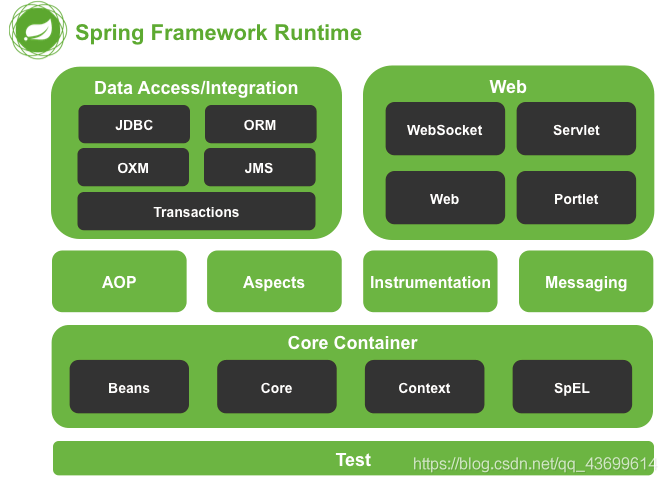
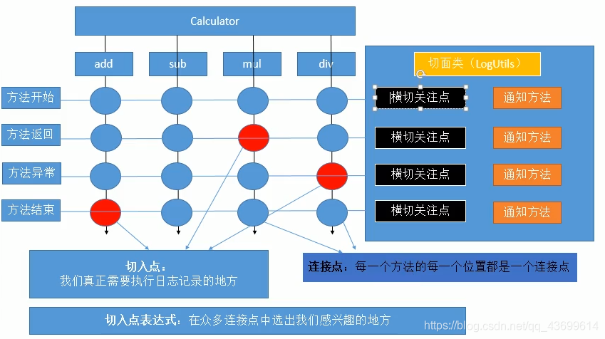
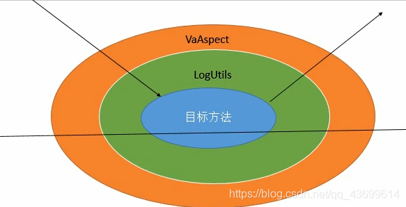

# IOC控制反转、DI依赖注入


## 1. Spring概述

- 开源的免费框架，是一个容器，可以管理所有的组件(类)；
- 轻量级的、非入侵的框架，不依赖于Spring的API
- **控制反转(IOC)和面向切面编程(AOP)**
-   支持事务处理，支持对框架整合
- 组件化、一站式

官网： [https://spring.io](https://spring.io/)

文档：https://docs.spring.io/spring/docs/5.2.5.RELEASE/spring-framework-reference/core.html#spring-core

【总结】：Spring是一个轻量级的、控制反转和面向切面编程的框架

体系结构：


- Test：Spring的单元测试模块
- Core Container：核心容器(IOC)，包括4部分：
  - spring-core：提供了框架的基本组成部分，包括 IoC 和依赖注入功能。
  - spring-beans：提供 BeanFactory，
  - spring-context：模块建立在由core和 beans 模块的基础上建立起来的，它以一种类似于JNDI注册的方式访问对象。Context模块继承自Bean模块，并且添加了国际化（比如，使用资源束）、事件传播、资源加载和透明地创建上下文（比如，通过Servelet容器）等功能
  - spring-expression：提供了强大的表达式语言，用于在运行时查询和操作对象图。它是JSP2.1规范中定义的统一表达式语言的扩展，支持set和get属性值、属性赋值、方法调用、访问数组集合及索引的内容、逻辑算术运算、命名变量、通过名字从Spring IoC容器检索对象，还支持列表的投影、选择以及聚合等
- AOP+Aspects：面向切面编程模块
- Data Access：数据访问模块
- Web：Spring开发Web引用模块

导入依赖：spring-webmvc 包含的最广泛

```xml
<!-- https://mvnrepository.com/artifact/org.springframework/spring-webmvc -->
<dependency>
    <groupId>org.springframework</groupId>
    <artifactId>spring-webmvc</artifactId>
    <version>5.2.0.RELEASE</version>
</dependency>
```

## 2. HelloWorld案例

### 2.1 IOC和DI

**Inversion of Control：控制反转。**

控制，即资源的获取方式，包括：

- 主动式：要什么资源自己创建，对于复杂对象的创建时比较庞大的工程

- 被动式：资源的获取不是我们自己创建，而是交给容器创建。

  所谓容器，是用来管理所有的组件的(即有功能的类)；容器可以自动探查出哪些组件需要用到另一些组件

**DI：Dependency Injection，依赖注入**，是IOC的一种实现形式。容器能知道哪个组件运行时需要另外一个类，容器通过反射的形式，将容器中准备好的对象注入。

### 2.2 入门案例

HelloWorld：所有的对象交给容器创建，给容器中注册组件

1. 新建一个Person类，**添加set方法**

   ```java
   public class Person {
   
       private String lastName;
       private Integer age;
       private String gender;
       private String email;
   
       public Person() {
       }
   
       public Person(String lastName, Integer age, String gender, String email) {
           this.lastName = lastName;
           this.age = age;
           this.gender = gender;
           this.email = email;
       }
   
       public String getLastName() {
           return lastName;
       }
   
       public void setLastName(String lastName) {
           this.lastName = lastName;
       }
   
       public Integer getAge() {
           return age;
       }
   
       public void setAge(Integer age) {
           this.age = age;
       }
   
       public String getGender() {
           return gender;
       }
   
       public void setGender(String gender) {
           this.gender = gender;
       }
   
       public String getEmail() {
           return email;
       }
   
       public void setEmail(String email) {
           this.email = email;
       }
   
       @Override
       public String toString() {
           return "Person{" +
                   "lastName='" + lastName + '\'' +
                   ", age=" + age +
                   ", gender='" + gender + '\'' +
                   ", email='" + email + '\'' +
                   '}';
       }
   }
   ```
   
2. 新建一个Spring配置文件ApplicationContext.xml，注册bean。

   使用`bean`标签注册一个Person对象，Spring会自动创建这个Person对象

   - class：写要注册的组件的全类名
   - id：这个对象的唯一标识
   - 使用`property`标签为Person对象的属性值，name：指定属性名；value：指定属性值

   ```xml
   <?xml version="1.0" encoding="UTF-8"?>
   <beans xmlns="http://www.springframework.org/schema/beans"
          xmlns:xsi="http://www.w3.org/2001/XMLSchema-instance"
          xsi:schemaLocation="http://www.springframework.org/schema/beans
           https://www.springframework.org/schema/beans/spring-beans.xsd">
   
       <!--注册一个Person对象，Spring会自动创建这个Person对象
           class:写要注册的组件的全类名
           id:这个对象的唯一标识
       -->
       <bean id="person01" class="com.xiao.bean.Person">
           <!--使用property标签为Person对象的属性赋值
               name:指定属性名
               value:指定属性值
            -->
           <property name="lastName" value="zhangsan"/>
           <property name="age" value="20"/>
           <property name="email" value="zhangsan@163.com"/>
           <property name="gender" value="0"/>
       </bean>
   </beans>
   ```
   
1. 测试：
  
```java
      public class IocTest {
      
          @Test
          public void test(){
              ApplicationContext ioc = new ClassPathXmlApplicationContext("ApplicationContext.xml");
             Person bean = (Person) ioc.getBean("person01");
              System.out.println(bean);
          }
      }
```

   【几个细节】：

   1. ApplicationContext：IOC容器的接口
2. **同一个组件在IOC容器中默认是单实例的**
   3. **容器中的对象的创建在容器创建完成的时候就已经创建好了**
   4. 容器中如果没有这个组件，获取组件时会报异常 NoSuchBeanDefinitionException
   5. IOC容器用`property`标签创建这个组件对象的时候，会利用setter方法为其属性赋值，**注意属性名是set方法后的那串的首字母小写**

### 2.3 根据bean类型获取bean实例

ioc.getBean()方法中可以传入bean的id，也可以传入class对象，也可以同时传入。

如果一个类型指只注册了一个，则可以通过`ioc.getBean(....class)`获得该对象

```java
Person bean1 = ioc.getBean(Person.class);

```

但是如果IOC容器中这个类型的bean有多个，则会报异常 NoUniqueBeanDefinitionException

也可以同时传入bean的id和class对象：

```java
Person bean1 = ioc.getBean("person02",Person.class);

```

## 3. 属性的注入方式

- 依赖：bean对象的创建依赖于容器
- 注入：bean对象中所有的属性由容器来注入

### 3.1 setter注入

**需要借助set方法**，使用`propetry`标签

```xml
 <property name="lastName" value="zhangsan"/>

```

### 3.2 通过构造器注入

使用`constructor-arg`标签，则调用构造器进行属性注入，**需要借助有参构造**

- **通过构造函数中的参数名称注入**

```xml
  <bean id="person" class="com.xiao.bean.Person">
        <constructor-arg name="lastName" value="wangwu"/>
        <constructor-arg name="age" value="30"/>
  </bean>

```

- **只写value属性，会默认按顺序寻找构造方法进行匹配**

```xml
  <bean id="person" class="com.xiao.bean.Person">
        <constructor-arg  value="wangwu"/>
        <constructor-arg  value="30"/>
  </bean>
```

- **通过构造函数参数类型**，默认按照顺序

```xml
  <bean id="person" class="com.xiao.bean.Person">
      <constructor-arg type="java.lang.String" value="wangwu"/>
      <constructor-arg type="java.lang.Integer" value="30"/>
  </bean>
```

- **通过构造函数参数索引**，如果有多个重载的构造函数时也可以配合type一起使用

```xml
  <bean id="person" class="com.xiao.bean.Person">
      <constructor-arg index="0" value="wangwu"/>
      <constructor-arg index="1" value="30"/>
  </bean>
```

### 3.3 p名称空间注入

使用p:propertyName直接注入属性的值。本质上还是调用的set方法

导入头文件约束：

```xml
  xmlns:p="http://www.springframework.org/schema/p"
1
<?xml version="1.0" encoding="UTF-8"?>
<beans xmlns="http://www.springframework.org/schema/beans"
       xmlns:xsi="http://www.w3.org/2001/XMLSchema-instance"
       xmlns:p="http://www.springframework.org/schema/p"
       xsi:schemaLocation="http://www.springframework.org/schema/beans
        https://www.springframework.org/schema/beans/spring-beans.xsd">

    <bean id="person01" class="com.xiao.bean.Person">
        <property name="lastName" value="zhangsan"/>
        <property name="age" value="20"/>
        <property name="email" value="zhangsan@163.com"/>
        <property name="gender" value="0"/>
    </bean>

    <bean id="person04" class="com.xiao.bean.Person"
        p:lastName="zhangsan" p:age="30" p:email="zhangsan@qq.com" p:gender="1">
    </bean>

</beans>
```

### 3.4 c命名空间注入

c(构造: Constructor)命名空间注入，使用c:propertyName注入属性值,**本质上使用的是构造器注入**

导入头文件约束：

```xml
 xmlns:c="http://www.springframework.org/schema/c"

  <bean id="person05" class="com.xiao.bean.Person"
          c:lastName="zhangsan" c:age="30" c:email="zhangsan@qq.com" c:gender="1">
  </bean>

```

## 4. 注入不同类型的属性值

新建了一个Student类和一个Address类，来测试不同类型的属性值注入：

Student类：

```java
public class Student {
    private String name;
    private Address address;
    private String[] books;
    private List<String> hobbys;
    private Map card;
    private Set<String> games;
    private String wife;
    private Properties info;
    //get/set方法
    //...  
}
```

Address类：

```java
public class Address {
    private String name;
    private Integer num;
    //get/set方法
    //...  
}
```

### 4.1 注入基本类型值

之前的例子都是注入基本类型的属性。如果不赋值的话，会使用属性的默认值

### 4.2 注入null

如果有属性给了初始值，想注入为null，则在property内部需要使用`null`标签：

```xml
    <bean id="student01" class="com.xiao.bean.Student">
        <property name="name">
            <null/>
        </property>
    </bean>
```

**注意，使用value="null"是不对的：**

```xml
 <bean id="student01" class="com.xiao.bean.Student">
        <property name="name" value="null"/>
  </bean>
```

上面的用法虽然对象的name属性打印出来是null，但是bean.getName()==null是false：

```java
Student bean = ioc.getBean("student01", Student.class);
System.out.println(bean);
System.out.println(bean.getName()==null);  //false
```

结果：

```java
Student{name='null', address=null, books=null, hobbys=null, card=null, games=null, false}
```

### 4.3 注入bean

可以使用`ref`引用外部的值：

```xml
<!--先注册一个Address对象-->
<bean id="address01" class="com.xiao.bean.Address">
    <property name="name" value="beijing"/>
    <property name="num" value="001"/>
</bean>

<bean id="student02" class="com.xiao.bean.Student">
    <!--通过id值引用-->
    <property name="address" ref="address01"/>
</bean>
```

要注意，**ref是严格的引用**，通过容器拿到的Address实例就是Student实例中的Address属性

```java
Address address01 = ioc.getBean("address01", Address.class);
Student student02 = ioc.getBean("student02", Student.class);
System.out.println(student02);
System.out.println(student02.getAddress() == address01);  //true
```

也可以**引用内部bean**，在`property`标签体中再定义bean，这个Address和外面的没有关系，**只能内部使用，外面获取不到**：

```xml
<bean id="student03" class="com.xiao.bean.Student">
    <property name="address">
        <bean class="com.xiao.bean.Address">
            <property name="name" value="tianijng"/>
            <property name="num" value="002"/>
        </bean>
    </property>
</bean>
```

### 4.3 集合类型赋值

#### 01 数组

`array`标签+`value`标签：

```xml
<property name="books">
    <array>
        <value>西游记</value>
        <value>红楼梦</value>
        <value>水浒传</value>
    </array>
</property>
```

#### 02 List

`list`标签+`value`标签：

```xml
<property name="hobbys">
    <list>
        <value>玩游戏</value>
        <value>看电影</value>
    </list>
</property>
```

#### 03 Map

`map`标签+`entry`标签，`entry`也可以使用ref引用：

```xml
<property name="card">
    <map>
        <entry key="中行" value="001"/>
        <entry key="邮政" value="002"/>
        <entry key-ref="..." value-ref="...."/>
    </map>
</property>
```

#### 04 Properties

`props`标签：

```xml
 <property name="info">
     <props>
         <prop key="学号">20190604</prop>
         <prop key="性别">男</prop>
         <prop key="姓名">小明</prop>
     </props>
 </property>
```

#### 05 util名称空间

util名称空间可以创建集合类型的bean，以便别的地方引用。

头文件约束：

```xml
xmlns:util="http://www.springframework.org/schema/util"

xsi:schemaLocation= "http://www.springframework.org/schema/util
http://www.springframework.org/schema/util/spring-util-4.1.xsd"

<!--util名称空间 提取出通用的集合-->
    <util:list id="myList">
        <value>玩游戏</value>
        <value>看电影</value>
    </util:list>
<!--使用ref直接引用util提取出来的集合id即可-->
    <bean id="student05" class="com.xiao.bean.Student">
        <property name="hobbys" ref="myList"/>
    </bean>
```

### 4.4 级联属性赋值

`propetry`标签中的name标签，可以使用级联属性，修改属性的属性，但是原来属性的值会被修改。

```xml
<bean id="address01" class="com.xiao.bean.Address">
     <property name="name" value="beijing"/>
     <property name="num" value="001"/>
</bean>

<bean id="student02" class="com.xiao.bean.Student">
    <property name="address" ref="address01"/>
    <!--将address01中的num属性进行了修改-->
    <property name="address.num" value="00005"/>
</bean>
```

### 4.5 继承实现配置信息重用

指定parent属性为要重用的bean的id值，不写的属性就沿用，也可以重写定义属性

```xml
<bean id="person01" class="com.xiao.bean.Person">
    <property name="lastName" value="zhangsan"/>
    <property name="age" value="20"/>
    <property name="email" value="zhangsan@163.com"/>
    <property name="gender" value="0"/>
    <property name="flag" value="true"/>
</bean>

    <!--parent：要重用的配置信息 -->
<bean id="person001" class="com.xiao.bean.Person" parent="person01">
    <!--单独修改name属性的值 -->
    <property name="lastName" value="zhang"/>
</bean>
```

还可以指定属性abstract=“true”，这样的bean只能被用来继承信息，不能获取实例。否则会报异常 BeanIsAbstractException

```xml
<bean id="person01" class="com.xiao.bean.Person" abstract="true">
    <!--使用property标签为Person对象的属性赋值
        name:指定属性名
        value:指定属性值
     -->
    <property name="lastName" value="zhangsan"/>
    <property name="age" value="20"/>
    <property name="email" value="zhangsan@163.com"/>
    <property name="gender" value="0"/>
    <property name="flag" value="true"/>
</bean>
```

## 5 bean的一些性质

### 5.1 bean之间依赖

多个bean的默认创建顺序，是按照配置顺序创建的。

```xml
<bean id="student" class="com.xiao.bean.Student"></bean>
<bean id="address" class="com.xiao.bean.Address"></bean>
<bean id="person" class="com.xiao.bean.Person"></bean>

Student创建了
Address创建了
Person创建了
```

可以用depends-on属性进行设置：

```xml
<bean id="student" class="com.xiao.bean.Student" depends-on="person,address"></bean>
<bean id="address" class="com.xiao.bean.Address"></bean>
<bean id="person" class="com.xiao.bean.Person"></bean>

Person创建了
Address创建了
Student创建了
```

### 5.2 bean的作用域scope

在bean配置中可以设置作用域属性scope：

- single： 单例模式，是默认模式。**在容器启动完成之前就已经创建好对象保存在容器中了。**
- prototype ：原型模式，容器启动会不去创建，**每次从容器中get的时候才会产生一个新对象**
- request：在web环境下，同一次请求创建一个bean实例(没用)
- session：在web环境下，同一次会话创建一个bean实例(没用)

### 5.3 静态工厂与实例工厂

静态工厂：工厂本身不用创建对象，通过静态方法调用，对象 = 工厂类.工厂方法名( )

实例工厂：工厂本身需要创建对象，先创建工厂对象，再通过工厂对象创建所需对象

新建三个类Air、AirStaticFactory和AirInstanceFactory：

```java
public class Air {
    private String name;
    private Double weight;
    private Double length;
    private Integer PersonNum;
    //get/set...
}

public class AirStaticFactory {
    //提供一个静态方法获取Air对象
    public static Air getAir(String name){
        System.out.println("AirStaticFactory正在造飞机！");
        Air air = new Air();
        air.setName(name);
        air.setLength(100.0);
        air.setWeight(100.0);
        air.setPersonNum(200);
        return air;
    }
}

public class AirInstanceFactory {

    //提供一个方法获取Air对象
    public Air getAir(String name){
        System.out.println("AirInstanceFactory正在造飞机！");
        Air air = new Air();
        air.setName(name);
        air.setLength(100.0);
        air.setWeight(100.0);
        air.setPersonNum(200);
        return air;
    }
}

```

**静态工厂：**不需要创建工厂本身，class指定静态工厂的全类名，factory-method指定工厂方法

```xml
<!--静态工厂，不需要创建工厂本身,class指定静态工厂的全类名-->
<bean id="air01" class="com.xiao.AirStaticFactory" factory-method="getAir">
    <constructor-arg name="name" value="林青霞"/>
</bean>

//获取到的就是Air的实例
Air air01 = ioc.getBean("air01",Air.class);

```

**实例工厂：**先创建示例工厂本身，再创建对象，指定当前对象的创建需要哪个工厂factory-bean和哪个方法factory-method

```xml
 <!--实例工厂，需要先创建示例工厂本身-->
<bean id="airInstanceFactory" class="com.xiao.AirInstanceFactory">
</bean>
<!--指定当前对象的创建需要哪个工厂和哪个方法，不需要指定class了-->
<bean id="air02" factory-bean="airInstanceFactory" factory-method="getAir">
    <constructor-arg name="name" value="张学友"/>
</bean>

Air air02 = ioc.getBean("air02",Air.class);
```

### 5.4 自定义工厂

**实现了FactoryBean接口的类**，是Spring可以认识的工厂类，Spring会自动调用工厂方法创建对象。

```java
public class MyFactoryBeanImpl implements FactoryBean<Air> {

    //工厂方法，Spring会自动调用这个方法来创建对象并返回
    @Override
    public Air getObject() throws Exception {
        Air air = new Air();
        air.setName("zhangsan");
        return air;
    }

    //返回对象的类型,Spring会自动调用这个方法来确认创建的对象是什么类型
    @Override
    public Class<?> getObjectType() {
        return Air.class;
    }

    //是单例模式吗？
    @Override
    public boolean isSingleton() {
        return true;
    }
}
```

注册工厂对象，会自动调用工厂方法返回对象：

```xml
<!--注册工厂对象，会自动调用工厂方法返回对象-->
<bean id="air03" class="com.xiao.MyFactoryBeanImpl">
</bean>

Air air03 = ioc.getBean("air03");
```

这种类型，IOC容器启动时不会创建实例，使用getBean时才会创建

### 5.5 bean的生命周期方法

可以为bean自定义一些生命周期方法，Spring在创建或销毁bean时调用。`init-method`，`destroy-method`，不能有参数。

IOC容器中注册的bean：

- 单实例bean：容器启动的时候就会创建好，容器关闭也会销毁创建的bean

  (容器启动)构造器 —> 初始化方法 —> （容器关闭)销毁方法

- 多实例bean：获取的时候才去创建

  (容器启动)构造器 —> 初始化方法 ，容器关闭不会调用bean的销毁方法

在Air类中新增两个方法：

```java
public class Air {
    private String name;
    private Double weight;
    private Double length;
    private Integer PersonNum;

    public void destroy(){
        System.out.println("销毁方法被调用了！");
    }

    public void init(){
        System.out.println("初始方法被调用了");
    }
}

```

```xml
<bean id="air04" class="com.xiao.Air" init-method="init" destroy-method="destroy"> </bean>
```


### 5.6 bean的后置处理器

定义一个类实现BeanPostProcessor接口，其中两个方法`postProcessBeforeInitialization`和`postProcessAfterInitialization`会在调用初始化方法前后调用。需要注册这个实现类

即使没有定义初始化方法，这两个方法也会被调用。

```java
public class MyBeanPostProcessor implements BeanPostProcessor {

    /**
     * 前置处理器，在初始化方法之前调用
     * @param bean 传递过来的，将要初始化的bean
     * @param beanName
     * @return 经该方法处理之后可以返回一个新的bean
     * @throws BeansException
     */
    @Override
    public Object postProcessBeforeInitialization(Object bean, String beanName) throws BeansException {
        System.out.println("【"+beanName+"】将要调用初始化方法了..BeforeInitialization..这个bean是这样的：+【"+bean+"】");
        return bean;
    }

    /**
     * 后置处理器，在初始化方法之后调用
     * @param bean
     * @param beanName
     * @return 经该方法处理后返回给IOC容器保存的bean
     * @throws BeansException
     */
    @Override
    public Object postProcessAfterInitialization(Object bean, String beanName) throws BeansException {
        System.out.println("【"+beanName+"】初始化方法调用完了..AfterInitialization..这个bean是这样的：+【"+bean+"】");
        return bean;
    }
}

<bean id="air04" class="com.xiao.Air" init-method="init" destroy-method="destroy">
</bean>
<bean id="myBeanPostProcessor" class="com.xiao.MyBeanPostProcessor"/>

```

结果：

```
【air04】将要调用初始化方法了..BeforeInitialization..这个bean是这样的：+【Air{name='null', weight=null, length=null, PersonNum=null}】
初始方法被调用了
【air04】初始化方法调用完了..AfterInitialization..这个bean是这样的：+【Air{name='null', weight=null, length=null, PersonNum=null}】
```

## 6. bean的装配

### 6.1 Spring管理连接池

配置C3P0的数据库连接池，注册一个ComboPooledDataSource对象即可

```xml
<bean id="dataSource" class="com.mchange.v2.c3p0.ComboPooledDataSource">
    <property name="user" value="root"/>
    <property name="password" value="root"/>
    <property name="jdbcUrl" value="jdbc:mysql://localhost:3306/mybatis"/>
    <property name="driverClass" value="com.mysql.jdbc.Driver"/>
</bean>
```

### 6.2 引入外部配置文件

首先新建一个数据库连接池的配置文件db.properties：

```properties
jdbc.driver=com.mysql.jdbc.Driver
jdbc.url=jdbc:mysql://localhost:3306/mybatis?useSSL=false&useUnicode=true&characterEncoding=utf8
jdbc.username=root
jdbc.password=root
```

需要用到context命名空间：

```xml
 xmlns:context="http://www.springframework.org/schema/context"
 xsi:schemaLocation="
       http://www.springframework.org/schema/context
       https://www.springframework.org/schema/context/spring-context.xsd"
```

使用`context:property-placeholder location=" ... "`标签导入数据库配置文件db.properties，就可以用$取出对应的属性了：

```xml
<bean id="dataSource" class="com.mchange.v2.c3p0.ComboPooledDataSource">
    <property name="driverClass" value="${jdbc.driver}"/>
    <property name="jdbcUrl" value="${jdbc.url}"/>
    <property name="user" value="${jdbc.username}"/>
    <property name="password" value="${jdbc.password}"/>
</bean>

<context:property-placeholder location="classpath:db.properties"/>
```

【一个小坑】：Spring内部已经定义过一个username了，${username}就是系统的用户名，所以这里定义的是jdbc.username

### 6.3 基于XML的自动装配

自动装配是Spring满足bean依赖的一种方式。Spring会在上下文中自动寻找，并给bean自动装配属性。

Spring中的三种装配方式：

1. 在xml显示配置
2. 在Java中显示配置
3. 隐式的自动装配bean

在`bean`标签中设置`autowire`属性：

```xml
<bean id="air05" class="com.xiao.Air" autowire="byName" ></bean>
```

- `autowire="default/no"`：不自动装配
- `autowire="byName"`：按照名字，以属性名作为id去容器中找到这个组件，为其赋值；如果找不到就装配null
- `autowire="byType"`：按照类型，以属性的类型作为查找依据去容器中找到这个组件，为其赋值，**该类型必须只有一个**，否则会报异常NoUniqueBeanDifinetionException；如果找不到就装配null
- `autowire="construction"`：按照构造器进行赋值：先按照有参构造器的参数类型进行装，如果没有就直接为组件装配null即可；如果按照类型有多个，就会把参数名作为id继续匹配，匹配到就自动装配，匹配不到就装配null。不会报错

## 7. 注解开发

### 7.1 不同层组件

1. 通过给bean上添加注解，可以快速的将bean加入到IOC容器中。创建Dao、Service、Controller层所需要用到的注解：
   - `@Component`：组件，放在类上，将某个类注册到Spring中，**id是类名首字母小写**。相当于：``
   - `@Repository`：Dao持久化层
   - `@Servic`：Service业务逻辑层
   - `@Controller`：Controller控制器层。后面三个含义更清晰
2. 还需要告诉Spring，自动扫描加了注解的组件：**添加context名称空间，``**。还需要有AOP包的依赖。
3. **组件的id默认是类名首字母小写，作用于默认是单例**，可以修改。

```java
@Repository(value = "book")
@Scope(value = "prototype")
public class BookDao {
	public void saveBook(){
        System.out.println("保存图书！");
    }
}
```

- `@Value`：注入值，注入基本数据类型和String类型数据

- `@Scope`：标注作用域。singleton, prototype…

  细节：如果注解中有且只有一个属性要赋值时，且名称是value，value在赋值是可以不写。

### 7.2 context扫描包的配置

指定要扫描的包：

```xml
<context:component-scan base-package="com.xiao"/>
```

指定扫描包时指定排除一些不要的组件：

```xml
<context:component-scan base-package="com.xiao">
    <!--指定排除不要的组件-->
    <context:exclude-filter type="..." expression="..."/>
</context:component-scan>
```

- `type="annotation"`：按照注解进行排除，`expression`属性中指定要排除的注解的全类名
- `type="assignable"`：按照类名进行排除，`expression`属性中指定要排除的类的全类名

只扫描进入指定的组件，默认都是全部扫描进来，`use-default-filters`需要设置为false：

```xml
<context:component-scan base-package="com.xiao" use-default-filters="false">
    <context:include-filter type="..." expression="..."/>
</context:component-scan>
```

### 7.3 Autowired自动装配

#### 01 基本使用

直接在成员上添加`@Autowired`完成自动装配。

Dao层：

```java
@Repository
public class BookDao {
	//声明一个方法
    public void readBook() {
        System.out.println("读了一本书！");
    }
}
```

Service层，使用注解`@Autowired`完成成员BookDao的自动装配，调用dao层的方法：

```java
@Service
public class BookService {
	//使用@Autowired完成成员BookDao的自动装配
    @Autowired
    private BookDao bookDao;

    public void read() {
        this.bookDao.readBook();
    }
}
```

Controller层，使用注解`@Autowired`完成成员BookService的自动装配，调用service层的方法：：

```java
@Controller
public class BookController {

    @Autowired
    private BookService bookService;

    public void one() {
        this.bookService.read();
    }
}
```

#### 02 Autowired的执行流程

`@Autowired`可以直接用在属性上，执行流程：

1. 首先按照类型去容器中找对应的组件，如果找到一个就赋值，找不到就抛异常；
2. 如果有多个类型匹配时，会使用要注入的对象变量名称作为bean的id，在spring容器查找，找到了也可以注入成功，找不到就报错。
3. 结合注解`@Qualifer`，指定一个id：在自动按照类型注入的基础之上，再按照指定的bean的id去查找。它在给字段注入时不能独立使用，必须和`@Autowired`一起使用；但是给方法参数注入时，可以独立使用。

`@Autowired`标注的属性如果找不到就会报错，可以指定required属性，找不到就自动装配null

```java
 @Autowired(required = false )
```

#### 03 注解加在方法上

`@Autowired`：也可以使用在set方法上，执行流程跟上面一样；

`@Qualifer`：还可以用在方法的参数，指定按照哪个id去装配。

`@Nullable`：标记的属性可以null

```java
@Service
public class BookService {


    private BookDao bookDao;

    @Autowired
    private void setBookDao(BookDao bookDao) {
        this.bookDao = bookDao;
    }

    public void read() {
        this.bookDao.readBook();
    }
}
```

#### 04 @Resource

`@Resource：`直接按照Bean的id注入，是Java自带的注解。执行流程：

1. 如果同时指定了name和type，则从Spring上下文中找到唯一匹配的bean进行装配，找不到则抛出异常

　　2. 如果指定了name，则从上下文中查找id匹配的bean进行装配，找不到则抛出异常
　　3. 如果指定了type，则从上下文中找到类型匹配的唯一bean进行装配，找不到或者找到多个，都会抛出异常
　　4. 如果既没有指定name，又没有指定type，则自动按照byName方式（类名首字母小写比如BookDao->bookDao）进行装配；如果没有匹配，则回退为一个原始类型进行匹配，如果匹配则自动装配；

### 7.4 Spring的单元测试

使用Spring的单元测试，不需要用ioc.getBean()来获取组件了，直接Autowired组件，Spring自动装配

导入依赖：

```xml
<dependency>
    <groupId>org.springframework</groupId>
    <artifactId>spring-test</artifactId>
    <version>5.2.0.RELEASE</version>
    <scope>test</scope>
</dependency>

<!--Junit-->
<dependency>
    <groupId>junit</groupId>
    <artifactId>junit</artifactId>
    <version>4.12</version>
</dependency>
```

添加注解：

- @ContextConfiguration：指定Spring配置文件的位置
- @RunWith：指定用哪种驱动进行单元测试，默认是junit，这里指定用Spring的单元测试模块来执行标了@Test注解的测试方法

```java
/*
 *@ContextConfiguration:指定Spring配置文件的位置
 *@RunWith：指定用哪种驱动进行单元测试，默认是junit,这里指定用Spring的单元测试模块来执行标了@Test注解的测试方法
 *
 */
@ContextConfiguration(locations = "classpath:ApplicationContext.xml")
@RunWith(SpringJUnit4ClassRunner.class)
public class Test02 {
    @Autowired
    private BookController bookController;

    @Test
    public void test01() {
        this.bookController.one();
    }
}
```

@Autowired好处：不用ioc.getBean();获取组件了，直接Autowired组件为我们自动装配


# 动态代理、AOP

Spring基础知识学习笔记(二)，内容包括：

1. 代理模式：静态代理和动态代理
2. AOP实现：注解实现+配置文件实现
3. 切面、通知、切入点、切入点表达式
4. 环绕通知

OOP：(Object Oriented Programming) 面向对象编程。

AOP：(Aspect Oriented Programming) 面向切面编程，基于OOP基础之上的编程思想，在程序运行期间，将某段代码动态的切入到指定方法的指定位置进行运算。

应用场景：计算器运行计算方法的时候进行日志记录，不推荐直接在方法内部，修改维护麻烦。

## 1. 代理模式

### 1.1 静态代理

**静态代理角色分析**：

- 抽象角色 : 一般使用接口或者抽象类来实现
- 真实角色 : 被代理的角色
- 代理角色 : 代理真实角色 ; 代理真实角色后 , 一般会做一些附属的操作 .
- 客户 : 使用代理角色来进行一些操作

案例：房东有房子，交给中介代理，客户直接找中介，中介在租房前后带客户看房子和收中介费。

租房接口Renet：

```java
//抽象角色：租房接口
public interface Rent {
   public void rent();
}
```

真实角色房东：Host，实现了Rent接口，可以出租房子

```java
//真实角色: 房东，房东要出租房子
public class Host implements Rent{
   public void rent() {
       System.out.println("房屋出租");
  }
}
```

代理角色Proxy：

```java
public class Proxy implements Rent {
    
    private Host host;

    public Proxy() {
    }

    public Proxy(Host host) {
        this.host = host;
    }

    @Override
    public void rent() {
        //中介在出租房屋前带客户看房子
        seeHouse();
        this.host.rent();
        //中介在出租房屋后收中介费
        fare();
    }
    
    public void seeHouse() {
        System.out.println("带客户看房子");
    }
    
    public void fare() {
        System.out.println("收中介费");
    }
}

```

客户Client，找中介租房：

```java
public class Client {

    public static void main(String[] args) {
        //房东
        Host host = new Host();
        //中介来代理房东
        Proxy proxy = new Proxy(host);
        //客户找中介，中介出租房屋
        proxy.rent();
    }
}
```

结果：

```java
带客户看房子
房屋出租！
收中介费
123
```

**静态代理的好处:**

- 使得真实角色更加纯粹，不再去关注一些公共的事情
- 公共的业务由代理来完成，实现了业务的分工
- 公共业务发生扩展时变得更加集中和方便

**缺点 :**

- 类多了 , 多了代理类 , 工作量变大了 ，开发效率降低

### 1.2 动态代理

动态代理的角色和静态代理的一样 ，区别是动态代理的代理类是动态生成的 ，静态代理的代理类是提前写好的。

动态代理分为两类 : 一类是基于接口动态代理 , 一类是基于类的动态代理

- 基于接口的动态代理----JDK动态代理，**代理对象和被代理对象唯一能产生的关联就是实现了同一个接口。如果目标对象没有实现任何接口，是无法为其创建代理对象的。**
- 基于类的动态代理–cglib

JDK动态代理需要两个核心类：**Proxy**代理和**InvocationHandler**调用处理程序。

**Proxy：**

`Proxy.newProxyInstance()`方法为目标对象创建代理对象，返回代理对象。三个参数：

- ClassLoader loader：和被代理对象使用相同的类加载器。
- Class<?>[] interfaces：和被代理对象具有相同的行为。实现相同的接口。
- InvocationHandler：如何代理，方法执行器。

**InvocationHandler**：

调用其`invoke()`方法，执行被代理对象的任何方法，都会经过该方法，三个参数：被代理对象、方法、参数

- Object proxy：被代理的对象
- Method method：方法
- Object[] args：执行方法的参数

代码实现：

1. 定义一个出租房子的接口Rent
2. 房东类实现Rent，具有出租房子的功能
3. 定义一个类实现InvocationHandler接口，来创建动态代理对象，增强功能
4. 动态代理对象调用方法

```java
/**
@Description: 定义一个类实现InvocationHandler接口，来创建动态代理对象
 */
public class ProxyInvocationHandler implements InvocationHandler {
    private Rent rent;
    
	//设置要代理的接口
    public void setRent(Rent rent) {
        this.rent = rent;
    }

    //声明一个生成代理类的方法
    public Object getProxy() {
        //Proxy.newProxyInstance()传入三个参数：类加载器，类实现的接口，InvocationHandler对象
        return Proxy.newProxyInstance(this.getClass().getClassLoader(), rent.getClass().getInterfaces(), this);
    }

    //处理实例，并返回结果
    @Override
    public Object invoke 
		//先看房
        seeHouse();
        //使用反射机制invoke方法，传入被代理的接口和参数。使用真实对象的方法
        Object result = method.invoke(rent, args);
        fare();
        return result;
    }

    public void seeHouse() {
        System.out.println("中介带看房子");
    }
    public void fare(){
        System.out.println("中介收费");
    }
}

/**
 * @Description:测试类
 */
public class ProxyTest {
    public static void main(String[] args) {
        //真实角色
        Host host = new Host();
        ProxyInvocationHandler proxyInvocationHandler = new ProxyInvocationHandler();

        //传入要代理的接口
        proxyInvocationHandler.setRent(host);

        //获得代理对象
        Rent proxy = (Rent) proxyInvocationHandler.getProxy();
        //代理对象使用真实对象的方法，方法被增强了
        proxy.rentHouse();
    }
}

```

### 1.3 动态代理实现日志功能

1. 定义一个Calculator接口，声明加减乘除方法
2. 定义一个MyCalculator类实现Calculator接口，完成方法体
3. 定义一个生成代理对象的类CalculatorProxy，获取代理对象
4. 重写InvocationHandler的invoke方法，在执行目标方法前后，添加相应的日志输出，也可以处理异常信息

Calculator接口：

```java
public interface Calculator {

    //加减乘除方法
    public int add(int i, int j);
    public int subtract(int i, int j);
    public int multiply(int i, int j);
    public int divide(int i, int j);

}
```

MyCalculator类：

```java
public class MyCalculator implements Calculator {
    @Override
    public int add(int i, int j) {
        return i + j;
    }

    @Override
    public int subtract(int i, int j) {
        return i - j;
    }

    @Override
    public int multiply(int i, int j) {
        return i * j;
    }

    @Override
    public int divide(int i, int j) {
        return i / j;
    }
}
```

日志工具类LogUtils：

```java
public class LogUtils {
    //执行前
    public static void before(Method method,Object... args) {
        System.out.println("【"+method.getName()+"】方法开始执行了，用的参数列表是【"+ Arrays.asList(args)+"】");
    }
    //执行后
    public static void after(Method method,Object result) {
        System.out.println("【"+method.getName()+"】方法执行完成了，计算结果是【"+ result+"】");
    }
    //出现异常
    public static void exception(Method method,Exception e) {
        System.out.println("【"+method.getName()+"】方法出现异常了,异常信息是："+e.getCause());
    }
    //方法结束
    public  static void end(Method method) {
        System.out.println("【"+method.getName()+"】方法最终结束了");
    }

}
```

生成代理对象的类CalculatorProxy：

```java
public class CalculatorProxy {

    /**
     * Proxy.newProxyInstance()
     * 为传入的参数对象创建一个动态代理对象
     * @param calculator 被代理的对象
     * @return
     */
    public static Calculator getProxy(Calculator calculator) {

        Object proxy = Proxy.newProxyInstance(
            calculator.getClass().getClassLoader(),
            calculator.getClass().getInterfaces(),
                new InvocationHandler() {
                    /**
                     * @param proxy 代理对象，给JDK使用的
                     * @param method 当前将要执行的目标对象的方法
                     * @param args 参数
                     * @return
                     * @throws Throwable
                     */
                    @Override
                    public Object invoke(Object proxy, Method method, Object[] args) throws Throwable {
                        Object result = null;

                        try {
                            //目标方法执行前
                            LogUtils.before(method,args);
             
                            System.out.println("动态代理要帮你执行方法！");
                            //利用反射执行目标方法
                            result = method.invoke(calculator, args);

                            //目标方法执行后
                            LogUtils.after(method,result);
                        } catch (Exception e) {
                           //目标方法出现异常
                            LogUtils.exception(method,e);
                        } finally {
                            //目标方法结束后
                            LogUtils.end(method);
                        }
                        //返回值必须返回出去，外界才能拿到真正执行后的返回值
                        return result;
                    }
                });

        //返回代理对象
        return (Calculator) proxy;
    }
}
```

测试：

```java
public class CalculatorTest {

    @Test
    public void test(){
        Calculator calculator = new MyCalculator();
        Calculator proxy = CalculatorProxy.getProxy(calculator);
        proxy.add(1,2);
        proxy.divide(2,0);
    }
}
```

结果：

```java
【add】方法开始执行了，用的参数列表是【[1, 2]】
动态代理要帮你执行方法！
【add】方法执行完成了，计算结果是【3】
【add】方法最终结束了
【divide】方法开始执行了，用的参数列表是【[2, 0]】
动态代理要帮你执行方法！
【divide】方法出现异常了,异常信息是：java.lang.ArithmeticException: / by zero
【divide】方法最终结束了
```

## 2. AOP

AOP：(Aspect Oriented Programming) 面向切面编程，将某段代码动态的切入到指定方法的指定位置(方法的开始、结束、异常…)。

使用场景：

- 加日志保存到数据库
- 做权限验证
- 做安全检查
- 做事务控制

### 2.1 几个专业术语



- 横切关注点：与业务逻辑无关的，但是需要关注的部分，就是横切关注点，方法的开始、返回、异常、结束等。
- 切面（ASPECT）类：在上面例子中相当于自己定义的一个日志工具类。
- 通知（Advice）：切面必须要完成的工作，是类中的一个方法。
- 目标（Target）：被通知对象。
- 代理（Proxy）：向目标对象应用通知之后创建的对象。
- 连接点（JointPoint）：每一个方法的每一个位置都是一个连接点
- 切入点（PointCut）：切面通知执行的 “地点”，即真正需要执行日志记录的地方
- 切入点表达式：在众多连接点中选出我们感兴趣的地方

### 2.2 注解实现步骤

需要AOP织入，要导入依赖：

```xml
<dependency>
    <groupId>org.aspectj</groupId>
    <artifactId>aspectjweaver</artifactId>
    <version>1.9.4</version>
</dependency>
```

步骤：

1. 将目标类和切面类(封装了通知方法的类)加入到IOC容器中，注解`@Component`，配置文件开启context:component-scan包扫描

   ```xml
   <context:component-scan base-package="com.chenhui"></context:component-scan>
   ```

2. 告诉Spring到底哪个是切面类，在类上注解`@Aspect`

   ```java
   @Aspect
   @Component
   public class LogUtils {
   	...
   }
   ```

3. 告诉Spring切面中的方都是何时何地运行，方法上注解

4. 在注解中写切入点表达式：**execution(访问权限符 返回值类型 方法全类名(参数表))**

   ```java
   @Aspect
   @Component
   public class LogUtils {
       //执行前
       @Before("execution(public int com.xiao.MyProxy02.MyCalculator.*(int,int))")
       public static void before() {
           System.out.println("方法开始执行了");
       }
       //执行后
       @AfterReturning("execution(public int com.xiao.MyProxy02.MyCalculator.*(int,int))")
       public static void after() {
           System.out.println("方法执行完成了");
       }
       //出现异常
       @AfterThrowing("execution(public int com.xiao.MyProxy02.MyCalculator.*(int,int))")
       public static void exception() {
           System.out.println("方法出现异常了");
       }
       //方法结束
       @After("execution(public int com.xiao.MyProxy02.MyCalculator.*(int,int))")
       public  static void end() {
           System.out.println("方法最终结束了");
       }
   }
   ```

   

   - @Before：在目标方法之前运行；前置通知
   - @After：在目标方法之后运行；后置通知
   - @AfterReturning：在目标方法正常返回之后；返回通知
   - @AfterThrowing：在目标方法抛出异常之后；异常通知
   - @Around：环绕通知

   

5. 配置文件中开启基于注解的AOP功能

   AOP名称空间头文件

   ```xml
   xmlns:aop="http://www.springframework.org/schema/aop"
   
   xsi:schemaLocation="http://www.springframework.org/schema/aop https://www.springframework.org/schema/aop/spring-aop.xsd"
   ```

```xml
   <!--开启注解支持-->
   <aop:aspectj-autoproxy/>
   
```

代码实现：

目标类：

```java
@Component
public class MyCalculator implements Calculator {
...
}
```

切面类：

```java
@Aspect
@Component
public class LogUtils {
    //执行前
    @Before("execution(public int com.xiao.MyProxy02.MyCalculator.*(int,int))")
    public static void before() {
        System.out.println("方法开始执行了");
    }
    //执行后
    @AfterReturning("execution(public int com.xiao.MyProxy02.MyCalculator.*(int,int))")
    public static void after() {
        System.out.println("方法执行完成了");
    }
    //出现异常
    @AfterThrowing("execution(public int com.xiao.MyProxy02.MyCalculator.*(int,int))")
    public static void exception() {
        System.out.println("方法出现异常了");
    }
    //方法结束
    @After("execution(public int com.xiao.MyProxy02.MyCalculator.*(int,int))")
    public  static void end() {
        System.out.println("方法最终结束了");
    }
}
```

测试，获取到目标对象的bean，执行方法

```java
public class AopTest {

    ApplicationContext ioc = new ClassPathXmlApplicationContext("ApplicationContext.xml");

    @Test
    public void test() {
        //注意这里是根据接口类型获取的
        Calculator bean = ioc.getBean(Calculator.class);
        System.out.println(bean);//com.xiao.MyProxy02.MyCalculator@3c9bfddc
        System.out.println(bean.getClass());//class com.sun.proxy.$Proxy22
        bean.add(1,2);
    }

}
```

配置文件：

```xml
<?xml version="1.0" encoding="UTF-8"?>
<beans xmlns="http://www.springframework.org/schema/beans"
       xmlns:xsi="http://www.w3.org/2001/XMLSchema-instance"
       xmlns:context="http://www.springframework.org/schema/context"
       xmlns:aop="http://www.springframework.org/schema/aop"
       xsi:schemaLocation="http://www.springframework.org/schema/beans
       http://www.springframework.org/schema/beans/spring-beans.xsd
       http://www.springframework.org/schema/context
       https://www.springframework.org/schema/context/spring-context.xsd
    http://www.springframework.org/schema/aop https://www.springframework.org/schema/aop/spring-aop.xsd">
    
 	<!--包扫描-->
    <context:component-scan base-package="com.xiao.MyProxy02"/>

    <!--开启注解支持-->
    <aop:aspectj-autoproxy/>

</beans>
```

### 2.3 注解实现的几个细节

#### 01 获取组件

IOC容器中保存的是组件的代理对象。ioc.getBean()中使用的接口类型，也可以用id名

```java
Calculator bean = ioc.getBean(Calculator.class);
System.out.println(bean);//com.xiao.MyProxy02.MyCalculator@3c9bfddc
System.out.println(bean.getClass());//class com.sun.proxy.$Proxy22
```

#### 02 cglib

有一个proxy-target-class属性，默认为false，表示使用jdk动态代理织入增强，当配为`true`时，表示使用CGLib动态代理技术织入增强。不过即使proxy-target-class设置为false，如果目标类没有声明接口，则spring将自动使用CGLib动态代理。

cglib可以为没有实现接口的组件创建代理对象，通过本类类型或者id名获取到：

```java
class com.xiao.MyProxy02.MyCalculator$$EnhancerBySpringCGLIB$$5ef61d8e
```

#### 03 切入点表达式的写法

固定格式：**execution(访问权限符 返回值类型 方法全类名(参数表))**，表达式中支持 && 、||、 ！

`"execution(* *.*(..))"`：表示任意返回值类型，任意包下的任意类的任意方法，任意参个数

通配符：

- `*` 可以匹配一个或多个字符；匹配一个参数；匹配一层路径；权限位置不写就行
- `..` 匹配任意多个参数，任意类型参数，任意多层路径

#### 04 通知方法的执行顺序

正常执行：Before →方法执行 →After → AfterReturning(正常返回)

出现异常：Before →方法执行 →After → AfterThrowing

#### 05 拿到目标方法的详细信息

从JoinPoint对象中可以拿到方法的详细信息，joinPoint.getArgs()，joinPoint.getSignature()

也可以接收异常和返回值，需要自己传入对应的参数Object result、Exception exception，并且要告诉Spring指定返回值**returning** ，指定异常**throwing**

```java
    //执行前
    @Before("execution(public int com.xiao.MyProxy02.MyCalculator.*(int,int))")
    public static void before(JoinPoint joinPoint) {
        System.out.println("【"+ joinPoint.getSignature().getName()+"】方法开始执行了，用的参数列表是【"+ Arrays.asList(joinPoint.getArgs())+"】");

    }
    //执行后
    @AfterReturning(value = "execution(public int com.xiao.MyProxy02.MyCalculator.*(int,int))",returning = "result")
    public static void after(JoinPoint joinPoint,Object result) {
        System.out.println("【"+ joinPoint.getSignature().getName()+"】方法执行完成了，执行结果是【"+ result +"】");
    }
    //出现异常
    @AfterThrowing(value = "execution(public int com.xiao.MyProxy02.MyCalculator.*(int,int))",throwing = "exception")
    public static void exception(JoinPoint joinPoint,Exception exception) {
        System.out.println("【"+joinPoint.getSignature().getName()+"】方法出现异常了,异常信息是："+exception);
    }
    //方法结束
    @After("execution(public int com.xiao.MyProxy02.MyCalculator.*(int,int))")
    public  static void end(JoinPoint joinPoint) {
        System.out.println("【"+joinPoint.getSignature().getName()+"】方法最终结束了");
    }
```

#### 06 抽取可重用的切入点表达式

自定义一个没有返回值和参数的方法，加上`@Pointcut`注解，声明切入点表达式，别的地方可以直接使用其方法名进行引用

```java
@Pointcut("execution(public int com.xiao.MyProxy02.MyCalculator.*(int,int))")
public static void myPoint(){

}

//执行前
@Before("myPoint()")
public static void before(JoinPoint joinPoint) {
...
}
```

#### 07 环绕通知

`@Around`：就是利用反射调用目标方法，可以在其中定义环绕前置、环绕返回、环绕异常和环绕后置通知。环**绕通知是优先于普通通知执行的。**

环绕通知只作用在自己的切面内。

```java
@Around("myPoint()")
public Object myAround(ProceedingJoinPoint point) throws Throwable {
    //获取参数
    Object[] args = point.getArgs();
    //获取方法名
    String name = point.getSignature().getName();
    Object proceed = null;

    try {
        // @Before
        System.out.println("【环绕前置通知】..【" + name + "】方法开始，用的参数列表是" + Arrays.asList(args));
        //就是利用反射调用目标方法，类似于method.invoke(obj,args)
        proceed = point.proceed(args);
        // @AfterReturning
        System.out.println("【环绕返回通知】..【" + name + "】方法返回，返回值是" + proceed);
    } catch (Exception e) {
        // @AfterThrowing
        System.out.println("【环绕异常通知】..【" + name + "】方法出现异常，异常信息是" + e);
        //为了让外界知道这个异常，将其抛出
         throw new RuntimeException(e);
    } finally {
        // @After
        System.out.println("【环绕后置通知】..【" + name + "】方法结束");
    }
    //反射调用后的返回值也一定返回出去
    return proceed;
}
```

结果：

```java
【环绕前置通知】..【add】方法开始，用的参数列表是[1, 2]
【add】方法开始执行了，用的参数列表是【[1, 2]】
【环绕返回通知】..【add】方法返回，返回值是3
【环绕后置通知】..【add】方法结束
【add】方法最终结束了
【add】方法执行完成了，执行结果是【3】
```

执行顺序：

(环绕前置 —> 普通前置) —> 目标方法执行 —> 环绕正常返回/出现异常 —> 环绕后置 —> 普通后置 —> 普通返回或者异常

#### 08 多切面情况

执行顺序按照类名顺序，前置1–>前置2–>目标方法 -->后置2–>后置1



在切面上使用`@Order`注解，给一个int值，值越小，优先级越高

### 2.4 配置文件实现

在容器中注册bean，相当于`@component`

- 进行配置。

```
aop:aspect ref="logUtils"：`指定谁是切面类，相当于`@Aspect
```

- 指定切入点和切入表达式

`aop:before/after/after-returning/after-throwing：指定怎么切入，切在哪里，相当于`@Before等，该标签中也可以指定返回值、异常等信息。

```xml
<!--注册bean-->
<bean id="logUtils" class="com.xiao.MyProxy02.LogUtils"/>
<bean id="myCalculator" class="com.xiao.MyProxy02.MyCalculator"/>

<aop:config>
    <!--自定义切面aspect，ref:要引用的类-->
  <aop:aspect ref="logUtils">
      <!--切入点-->
      <aop:pointcut id="point" expression="execution(public int com.xiao.MyProxy02.MyCalculator.*(int,int))"/>
      <!--前置-->
      <aop:before method="before" pointcut-ref="point"/>
      <!--返回-->
      <aop:after-returning method="after" pointcut-ref="point" returning="result" />
      <!--异常-->
      <aop:after-throwing method="exception" pointcut-ref="point" throwing="exception"/>
      <!--后置-->
      <aop:after method="end" pointcut-ref="point"/>
  </aop:aspect>
</aop:config>
```

# 声明式事务

Spring的声明式事务，内容包括：

1. 注解实现声明式事务
2. 事务的隔离级别
3. 事务的传播行为
4. 配置文件实现

参考视频：
[B站 尚硅谷雷丰阳大神的Spring、Spring MVC、MyBatis课程](https://www.bilibili.com/video/BV1d4411g7tv)

## 1. 环境搭建

### 1.1 数据库环境

三张表：账户表account，书籍价格表，书籍库存表

```sql
CREATE TABLE account (
username VARCHAR(50) PRIMARY KEY,
balance INT(10) NOT NULL
)ENGINE=INNODB DEFAULT CHARSET=utf8;


INSERT INTO account VALUES 
("Tom",1000),
("Jerry",1000);

CREATE TABLE book (
isbn VARCHAR(50) PRIMARY KEY,
book_name VARCHAR(50) NOT NULL,
price INT(10)
)ENGINE	= INNODB DEFAULT CHARSET=utf8;

INSERT INTO book VALUES	
("ISBN-001","book01",100),
("ISBN-002","book02",200),
("ISBN-003","book03",300),
("ISBN-004","book04",400),
("ISBN-005","book05",500);

CREATE TABLE book_stock (
isbn VARCHAR(50) PRIMARY KEY,
stock INT(10) NOT NULL
)ENGINE= INNODB DEFAULT CHARSET = utf8;

INSERT INTO book_stock	VALUES 
("ISBN-001",10),
("ISBN-002",10),
("ISBN-003",10),
("ISBN-004",10),
("ISBN-005",10);
```

### 1.2 减余额、减库存的方法

1. 新建一个BookDao类，用于操作数据库，包括减账户余额、减图书库存方法

```java
@Repository
public class BookDao {

    @Autowired
    private JdbcTemplate jdbcTemplate;

    //减去某个用户的账户余额
    public void updateBalance(String userName,int price) {
        String sql = "UPDATE account SET balance = balance - ? WHERE username = ?";
        this.jdbcTemplate.update(sql,price,userName);
    }

    //按照图书的isbn获取图书的价格
    public Integer getPrice(String isbn) {
        String sql = "SELECT price FROM book WHERE isbn = ?";
        return this.jdbcTemplate.queryForObject(sql,Integer.class,isbn);
    }

    //减去图书的库存,每次减去1
    public void updateStock(String isbn) {
        String sql = "UPDATE book_stock SET stock = stock-1 WHERE isbn = ?";
        this.jdbcTemplate.update(sql,isbn);
    }
}
```

1. 新建一个BookService类，结账方法，调用减账户余额和减图书库存两个方法

```java
@Service
public class BookService {

    @Autowired
    private BookDao bookDao;

    //结账方法，分为减库存，减余额两步操作
    public void checkOut(String username,String isbn) {
        //1.减库存
        this.bookDao.updateStock(isbn);
        System.out.println("减库存完成！");
        //故意引入异常
        int a = 1/0;
        //根据isbn查询价格
        Integer price = this.bookDao.getPrice(isbn);
        //2.减账户余额
        this.bookDao.updateBalance(username,price);
        System.out.println("结账完成!");

    }
}
```

1. 数据库配置文件db.properties和Spring配置文件applicationContext.xml：

```properties
jdbc.driver=com.mysql.jdbc.Driver
jdbc.url=jdbc:mysql://localhost:3306/spring?useSSL=false&useUnicode=true&characterEncoding=utf8
jdbc.username=root
jdbc.password=root
```


```properties


<?xml version="1.0" encoding="UTF-8"?>
<beans xmlns="http://www.springframework.org/schema/beans"
       xmlns:xsi="http://www.w3.org/2001/XMLSchema-instance"
       xmlns:context="http://www.springframework.org/schema/context"
       xsi:schemaLocation="http://www.springframework.org/schema/beans
       http://www.springframework.org/schema/beans/spring-beans.xsd
       http://www.springframework.org/schema/context
       https://www.springframework.org/schema/context/spring-context.xsd">

    <!--包扫描-->
    <context:component-scan base-package="com.xiao"/>

    <!--引入数据库配置文件-->
    <context:property-placeholder location="classpath:db.properties"/>

    <!--数据库连接信息-->
    <bean id="dataSource" class="com.mchange.v2.c3p0.ComboPooledDataSource">
        <property name="driverClass" value="${jdbc.driver}"/>
        <property name="jdbcUrl" value="${jdbc.url}"/>
        <property name="user" value="${jdbc.username}"/>
        <property name="password" value="${jdbc.password}"/>
    </bean>

    <!--注册jdbcTemplate，传入一个数据源即可-->
    <bean id="jdbcTemplate" class="org.springframework.jdbc.core.JdbcTemplate">
    	<constructor-arg name="dataSource" ref="dataSource"/>
    </bean>
    
</beans>
```


1. 测试：

```java
   public class Transaction {
       ApplicationContext ioc = new ClassPathXmlApplicationContext("applicationContext.xml");
   
       @Test
       public void test() {
           BookService bookService = ioc.getBean(BookService.class);
           bookService.checkOut("Tom","ISBN-001");
       }
   }
```

如果在减账户余额和减图书库存之间故意插入异常，则只会执行减余额操作，减库存未执行。

## 2. 声明式事务

### 2.1 事务的ACID原则

- **原子性（Atomicity）：** 事务是最小的执行单位，不允许分割。事务的原子性确保动作要么全部完成，要么完全不起作用；
- **一致性（Consistency）：** 执行事务前后，数据保持一致，多个事务对同一个数据读取的结果是相同的；
- **隔离性（Isolation）：** 并发访问数据库时，一个用户的事务不被其他事务所干扰，各并发事务之间数据库是独立的；
- **持久性（Durability）：** 一个事务被提交之后。它对数据库中数据的改变是持久的，即使数据库发生故障也不应该对其有任何影响。

### 2.2 声明式事务配置

Spring提供了事务管理器，就可以在目标方法运行前后进行事务控制(事务切面)。这里使用DataSourceTransaction。

步骤：

1. 配置事务管理器让其进行事务控制，传入要控制哪个数据源
2. 开启基于注解的事务控制，依赖于tx名称空间，指定事务管理器的id
3. 给事务方法加注解`@Transactional`

```xml
<?xml version="1.0" encoding="UTF-8"?>
<beans xmlns="http://www.springframework.org/schema/beans"
       xmlns:xsi="http://www.w3.org/2001/XMLSchema-instance"
       xmlns:context="http://www.springframework.org/schema/context"
       xmlns:t="http://www.springframework.org/schema/tx" xmlns:tx="http://www.springframework.org/schema/tx"
       xsi:schemaLocation="http://www.springframework.org/schema/beans
       http://www.springframework.org/schema/beans/spring-beans.xsd
       http://www.springframework.org/schema/context
       https://www.springframework.org/schema/context/spring-context.xsd
       http://www.springframework.org/schema/tx
       http://www.springframework.org/schema/tx/spring-tx.xsd">


    <!--包扫描-->
    <context:component-scan base-package="com.xiao"/>

    <!--引入数据库配置文件-->
    <context:property-placeholder location="classpath:db.properties"/>

    <!--数据库连接信息-->
    <bean id="dataSource" class="com.mchange.v2.c3p0.ComboPooledDataSource">
        <property name="driverClass" value="${jdbc.driver}"/>
        <property name="jdbcUrl" value="${jdbc.url}"/>
        <property name="user" value="${jdbc.username}"/>
        <property name="password" value="${jdbc.password}"/>
    </bean>

    <!--注册jdbcTemplate，传入一个数据源即可-->
    <bean id="jdbcTemplate" class="org.springframework.jdbc.core.JdbcTemplate">
    	<constructor-arg name="dataSource" ref="dataSource"/>
    </bean>

    <!--配置事务管理器(切面)，DataSourceTransactionManager-->
    <bean id="transactionManager" class="org.springframework.jdbc.datasource.DataSourceTransactionManager">
        <!--要控制哪个数据源-->
        <property name="dataSource" ref="dataSource"/>
    </bean>

    <!--开启基于注解的事务控制模式，指定事务管理器的id-->
    <tx:annotation-driven transaction-manager="transactionManager"/>

</beans>

```

方法上加上注解`@Transactional`

```java
@Transactional
public void checkOut(String username,String isbn) {
//....
}

```

## 3. 事务细节

- `Isolation isolation()`：事务的隔离级别，默认为 Isolation.DEFAULT
- `Propagation propagation()`：事务的传播行为，默认为Propagation.REQUIRED
- `Class[] rollbackFor()`：哪些异常事务需要回滚，让本来不回滚的异常进行回滚
- `String[] rollbackForClassName()`：
- `Class[] noRollbackFor()`：哪些异常事务可以不回滚，让本来回滚的异常不回滚
- `String[] noRollbackForClassName()`
- `int timeout()`：事务超出指定执行时长后自动终止并回滚，单位为秒
- `boolean readOnly()`：设置事务为只读事务，加快查询速度，不用管事务那一堆操作。默认为false

### 3.1 超时/只读

```java
@Transactional(timeout = 3,readOnly = false)

```

### 3.2 rollbackFor/noRollbackFor

运行时异常（非检查异常）：可以不用处理，默认都回滚
编译时异常（检查异常）：要么try-catch，要么在方法上声明throws，默认不回滚

- `Class[] rollbackFor()`：哪些异常事务需要回滚，让本来不回滚的异常进行回滚
- `Class[] noRollbackFor()`：哪些异常事务可以不回滚，让本来回滚的异常不回滚

```java
@Transactional(noRollbackFor = {ArithmeticException.class})

```

算术运算异常，是运行时异常，本来默认回滚的，设置noRollbackFor属性后，就不回滚了。

### 3.3 事务的隔离级别

#### 01 事务并发运行带来的问题

多个事务并发运行，经常会操作相同的数据来完成各自的任务，能会导致以下的问题：

- **脏读（Dirty read）:** 当一个事务正在访问数据并且对数据进行了修改，而这种修改还没有提交到数据库中，这时另外一个事务也访问了这个数据，然后使用了这个数据。因为这个数据是还没有提交的数据，那么另外一个事务读到的这个数据是“脏数据”，依据“脏数据”所做的操作可能是不正确的。
- **不可重复读（Unrepeatableread）:** 指在一个事务内多次读同一数据。在这个事务还没有结束时，另一个事务也访问该数据。那么，在第一个事务中的两次读数据之间，由于第二个事务的修改导致第一个事务两次读取的数据可能不太一样。这就发生了在一个事务内两次读到的数据是不一样的情况，因此称为不可重复读。
- **幻读（Phantom read）:** 幻读与不可重复读类似。它发生在一个事务（T1）读取了几行数据，接着另一个并发事务（T2）插入了一些数据时。在随后的查询中，第一个事务（T1）就会发现多了一些原本不存在的记录，就好像发生了幻觉一样，所以称为幻读。

#### 02 SQL的隔离级别

SQL 标准定义了四个隔离级别：

- **READ-UNCOMMITTED(读取未提交)：** 最低的隔离级别，允许读取尚未提交的数据变更，**可能会导致脏读、幻读或不可重复读**。
- **READ-COMMITTED(读取已提交)：** 允许读取并发事务已经提交的数据，**可以阻止脏读，但是幻读或不可重复读仍有可能发生**。
- **REPEATABLE-READ(可重复读)：** 对同一字段的多次读取结果都是一致的，除非数据是被本身事务自己所修改，**可以阻止脏读和不可重复读，但幻读仍有可能发生**。MySQL的InnoDB 存储引擎默认的。
- **SERIALIZABLE(可串行化)：** 最高的隔离级别，完全服从ACID的隔离级别。所有的事务依次逐个执行，这样事务之间就完全不可能产生干扰，也就是说，**该级别可以防止脏读、不可重复读以及幻读**。

#### 03 Spring事务的隔离级别

TransactionDefinition 接口中定义了五个表示隔离级别的常量：

- **TransactionDefinition.ISOLATION_DEFAULT:** 使用后端数据库默认的隔离级别，Mysql 默认采用的 REPEATABLE_READ隔离级别 Oracle 默认采用的 READ_COMMITTED隔离级别.
- **TransactionDefinition.ISOLATION_READ_UNCOMMITTED:** 最低的隔离级别，允许读取尚未提交的数据变更，**可能会导致脏读、幻读或不可重复读**
- **TransactionDefinition.ISOLATION_READ_COMMITTED:** 允许读取并发事务已经提交的数据，**可以阻止脏读，但是幻读或不可重复读仍有可能发生**
- **TransactionDefinition.ISOLATION_REPEATABLE_READ:** 对同一字段的多次读取结果都是一致的，除非数据是被本身事务自己所修改，**可以阻止脏读和不可重复读，但幻读仍有可能发生。**
- **TransactionDefinition.ISOLATION_SERIALIZABLE:** 最高的隔离级别，完全服从ACID的隔离级别。所有的事务依次逐个执行，这样事务之间就完全不可能产生干扰，也就是说，**该级别可以防止脏读、不可重复读以及幻读**。但是这将严重影响程序的性能。通常情况下也不会用到该级别。

### 3.4 事务的传播行为

事务的传播行为，即如果有多个事务进行嵌套运行，子事务是否要和大事务公用一个事务。
当事务方法被另一个事务方法调用时，必须指定事务应该如何传播。

**支持当前事务的情况：**

- **TransactionDefinition.PROPAGATION_REQUIRED：** 如果当前存在事务，则加入该事务；如果当前没有事务，则创建一个新的事务。
- **TransactionDefinition.PROPAGATION_SUPPORTS：** 如果当前存在事务，则加入该事务；如果当前没有事务，则以非事务的方式继续运行。
- **TransactionDefinition.PROPAGATION_MANDATORY：** 如果当前存在事务，则加入该事务；如果当前没有事务，则抛出异常。（mandatory：强制性）

**不支持当前事务的情况：**

- **TransactionDefinition.PROPAGATION_REQUIRES_NEW：** 当前事务总是创建一个新的事务，如果当前存在事务，则把当前事务挂起。
- **TransactionDefinition.PROPAGATION_NOT_SUPPORTED：** 以非事务方式运行，如果当前存在事务，则把当前事务挂起。
- **TransactionDefinition.PROPAGATION_NEVER：** 以非事务方式运行，如果当前存在事务，则抛出异常。

**其他情况：**

- **TransactionDefinition.PROPAGATION_NESTED：** 如果当前存在事务，则创建一个事务作为当前事务的嵌套事务来运行；如果当前没有事务，则该取值等价于TransactionDefinition.PROPAGATION_REQUIRED。

### 3.5 案例

REQUIRED：将之前事务用的connection传递给这个方法使用
REQUIRES_NEW：这个方法直接使用新的connection

在BookDao类中再定义一个修改图书价格的方法：

```java
    //修改图书价格
    public void updatePrice(String isbn,Integer price) {
        String sql = "UPDATE book SET price=? where isbn =?";
        this.jdbcTemplate.update(sql,price,isbn);
    }

```

BookService类：

```java
//改价格方法
@Transactional
public void updatePrice(String isbn,Integer price){
    this.bookDao.updatePrice(isbn, price);
}

```

新建一个MulService类，其中有一个声明了事务的方法，同时调用结账方法和修改价格的方法

```java
@Service
public class MulService {

    @Autowired
    private BookService bookService;

    @Transactional
    public void mulTx() {
        //结账 
        this.bookService.checkOut("Tom", "ISBN-001");
        //修改价格
        this.bookService.updatePrice("ISBN-002", 998);
    
    }
}


```

#### 01 情况一

checkOut()方法和updatePrice()方法默认传播行为是REQUIRED，因为mulTx()方法存在事务，所以就加入它，**所以如果一个方法崩了，则整体都会回滚。**

```java
    //结账 REQUIRED
    this.bookService.checkOut("Tom", "ISBN-001");
    //修改价格 REQUIRED
    this.bookService.updatePrice("ISBN-002", 998);

```

大家都在一车上，一个翻车全翻车。

#### 02 情况二

checkOut()方法传播行为设置为REQUIRES_NEW，即自己去开个新事务，在updatePrice()方法中引入异常。

相当于第一个方法开了新车，第二个方法跟主方法在一车上，翻车了并不影响第一个方法，因此结账执行完成了，修改价格会回滚。

```java
//结账 REQUIRES_NEW
this.bookService.checkOut("Tom", "ISBN-001");
//修改价格 REQUIRED
this.bookService.updatePrice("ISBN-002", 998);
```

## 4. 配置文件实现声明式事务

`aop:config`：告诉Spring哪些方法是事务方法：事务切面按照外面的切入点表达式去切入事务方法

`tx:advice`：配置事务建议，切入上面的切入点

```xml
 <?xml version="1.0" encoding="UTF-8"?>
<beans xmlns="http://www.springframework.org/schema/beans"
       xmlns:xsi="http://www.w3.org/2001/XMLSchema-instance"
       xmlns:context="http://www.springframework.org/schema/context"
       xmlns:tx="http://www.springframework.org/schema/tx"
       xmlns:aop="http://www.springframework.org/schema/aop"
       xsi:schemaLocation="http://www.springframework.org/schema/beans
       http://www.springframework.org/schema/beans/spring-beans.xsd
       http://www.springframework.org/schema/context
       https://www.springframework.org/schema/context/spring-context.xsd
       http://www.springframework.org/schema/tx
       http://www.springframework.org/schema/tx/spring-tx.xsd
       http://www.springframework.org/schema/aop
       http://www.springframework.org/schema/aop/spring-aop.xsd">

    <!--包扫描-->
    <context:component-scan base-package="com.xiao"/>

    <!--引入数据库配置文件-->
    <context:property-placeholder location="classpath:db.properties"/>

    <!--数据库连接信息-->
    <bean id="dataSource" class="com.mchange.v2.c3p0.ComboPooledDataSource">
        <property name="driverClass" value="${jdbc.driver}"/>
        <property name="jdbcUrl" value="${jdbc.url}"/>
        <property name="user" value="${jdbc.username}"/>
        <property name="password" value="${jdbc.password}"/>
    </bean>

    <!--注册jdbcTemplate，传入一个数据源即可-->
    <bean id="jdbcTemplate" class="org.springframework.jdbc.core.JdbcTemplate">
        <constructor-arg name="dataSource" ref="dataSource"/>
    </bean>

    <!--配置事务管理器(切面)，DataSourceTransactionManager-->
    <bean id="transactionManager" class="org.springframework.jdbc.datasource.DataSourceTransactionManager">
        <!--要控制哪个数据源-->
        <property name="dataSource" ref="dataSource"/>
    </bean>

    <!--结合AOP实现事务的织入-->
    <!--配置事务通知-->
    <tx:advice id="myAdvice" transaction-manager="transactionManager">
        <!--配置事务属性，传播特性、超时时间等-->
        <tx:attributes>
            <!--指明哪些方法是事务方法-->
            <tx:method name="*" propagation="REQUIRED"/>
        </tx:attributes>
    </tx:advice>

    <!--配置事务切入，告诉Spring哪些方法是事务方法-->
    <aop:config>
        <!--配置切入点，com.xiao.service包下的所有类的所有方法，只是说事务管理器要切入这些方法-->
        <aop:pointcut id="myPoint" expression="execution(* com.xiao.service.*.*(..))"/>
        <!--事务建议，让事务管理器切面来切入这个切入点表达式-->
        <aop:advisor advice-ref="myAdvice" pointcut-ref="myPoint"/>
    </aop:config>

</beans>
```


