# SpringMVC


## 1.SpringMVC概述

MVC：

- **Model（模型）：** 数据模型，提供要展示的数据，：Value Object（数据Dao） 和 服务层（行为Service），提供数据和业务。
- **View（视图）：** 负责进行模型的展示，即用户界面
- **Controller（控制器）：** 调度员，接收用户请求，委托给模型进行处理（状态改变），处理完毕后把返回的模型数据返回给视图，由视图负责展示。

SpringMVC的特点：

- Spring为展现层提供的基于MVC设计理念的Web框架
- SpirngMVC通过一套MVC注解，让POJO成为处理请求的控制器，而无须实现任何接口
- 支持REST风格的URL请求
- 采用了松散耦合可拔插组件结构，扩展性和灵活性

## 2. HelloWorld

### **1. 导入依赖**

spring-webmvc的maven依赖

```xml
	<dependencies>
        <!-- SpringWeb基础包-->
        <dependency>
            <groupId>org.springframework</groupId>
            <artifactId>spring-web</artifactId>
            <version>4.0.0.RELEASE</version>
        </dependency>

        <dependency>
            <groupId>org.springframework</groupId>
            <artifactId>spring-webmvc</artifactId>
            <version>4.0.0.RELEASE</version>
        </dependency>
        
		<!--        核心包-->
        <dependency>
            <groupId>org.springframework</groupId>
            <artifactId>spring-context</artifactId>
            <version>4.0.0.RELEASE</version>
        </dependency>

        <dependency>
            <groupId>org.springframework</groupId>
            <artifactId>spring-beans</artifactId>
            <version>4.0.0.RELEASE</version>
        </dependency>

        <dependency>
            <groupId>org.springframework</groupId>
            <artifactId>spring-core</artifactId>
            <version>4.0.0.RELEASE</version>
        </dependency>

        <dependency>
            <groupId>org.springframework</groupId>
            <artifactId>spring-expression</artifactId>
            <version>4.0.0.RELEASE</version>
        </dependency>

       <!--       日志包-->
        <dependency>
            <groupId>commons-logging</groupId>
            <artifactId>commons-logging</artifactId>
            <version>1.1.3</version>
        </dependency>
        
		<!--        注解支持包-->
        <dependency>
            <groupId>org.springframework</groupId>
            <artifactId>spring-aop</artifactId>
            <version>4.0.0.RELEASE</version>
        </dependency>
    </dependencies>
```

### **2. 配置web.xml ， 注册DispatcherServlet**

`DispatcherServlet`：前端控制器，负责请求分发。

要绑定Spring的配置文件

```xml
<?xml version="1.0" encoding="UTF-8"?>
<web-app xmlns="http://xmlns.jcp.org/xml/ns/javaee"
         xmlns:xsi="http://www.w3.org/2001/XMLSchema-instance"
         xsi:schemaLocation="http://xmlns.jcp.org/xml/ns/javaee http://xmlns.jcp.org/xml/ns/javaee/web-app_4_0.xsd"
         version="4.0">

    <!--注册DispatcherServlet,请求分发器（前端控制器）-->
    <servlet>
        <servlet-name>springDispatcherServlet</servlet-name>
        <servlet-class>org.springframework.web.servlet.DispatcherServlet</servlet-class>
        <!--绑定Spring配置文件-->
        <init-param>
            <param-name>contextConfigLocation</param-name>
            <param-value>classpath:springmvc-config.xml</param-value>
        </init-param>
        <!--启动级别为1，即服务器启动后就启动-->
        <!--值越小优先级越高，越先创建对象-->
        <load-on-startup>1</load-on-startup>
    </servlet>

    <!-- /  拦截所有的请求；（不包括.jsp，jsp由Tomcat来处理），
		覆盖了父类的DispatcherServlet的pattern，静态资源被拦截。-->
    <!-- *.jsp 拦截jsp请求，覆盖了父类的JspServlet-->
    <!-- /* 拦截所有的请求；（包括.jsp，一旦拦截jsp页面就不能显示了）-->
    <servlet-mapping>
        <servlet-name>springDispatcherServlet</servlet-name>
        <url-pattern>/</url-pattern>
    </servlet-mapping>

</web-app>
```

### **3. 导入Spring配置文件**

Spring的配置文件Springmvc-config.xml。

1. 开启了包扫描，让指定包下的注解生效，由IOC容器统一管理
2. 配置了视图解析器`InternalResourceViewResolver`，这里可以设置前缀和后缀，拼接视图名字

```xml
<?xml version="1.0" encoding="UTF-8"?>
<beans xmlns="http://www.springframework.org/schema/beans"
       xmlns:xsi="http://www.w3.org/2001/XMLSchema-instance"
       xmlns:context="http://www.springframework.org/schema/context"
       xsi:schemaLocation="http://www.springframework.org/schema/beans
       http://www.springframework.org/schema/beans/spring-beans.xsd
       http://www.springframework.org/schema/context
       http://www.springframework.org/schema/context/spring-context.xsd">

    <!--开启包扫描,让指定包下的注解生效,由IOC容器统一管理-->
    <context:component-scan base-package="com.xiao.controller"/>

    <!--配置视图解析器，拼接视图名字，找到对应的视图-->
    <bean id="internalResourceViewResolver" class="org.springframework.web.servlet.view.InternalResourceViewResolver">
        <!--前缀-->
        <property name="prefix" value="/WEB-INF/page/"/>
        <!--后缀-->
        <property name="suffix" value=".jsp"/>
    </bean>
</beans>
```

### **4. 编写controller层**

HelloController类：

1. @Controller：告诉Spirng这是一个控制器，交给IOC容器管理
2. @RequestMapping("/hello01")：/ 表示项目地址，当请求项目中的hello01时，返回一个/WEB-INF/page/success.jsp页面给前端

```java
@Controller
public class HelloController {

    @RequestMapping("/hello01")
    public String toSuccess(){
        System.out.println("请求成功页面");
        return "success";
    }
    @RequestMapping("/hello02")
    public String toError() {
        System.out.println("请求错误页面");
        return "error";
    }
}
```

### **5. 编写跳转的jsp页面**

项目首页 index.jsp，两个超链接，分别发出hello01和hello02的请求

```jsp
<%@ page contentType="text/html;charset=UTF-8" language="java" %>
<html>
  <head>
    <title>$Title$</title>
  </head>
  <body>

  <a href="hello01">点这里去成功页面</a>
  <a href="hello02">点这里去失败页面</a>

  </body>
</html>
```

成功页面success.jsp和失败页面error.jsp，要注意文件的路径/WEB-INF/page/…jsp，与上面的保持一致

```html
<%@ page contentType="text/html;charset=UTF-8" language="java" %>
<html>
<head>
    <title>成功页面</title>
</head>
<body>
	<h1>这里是成功页面</h1>
</body>
</html>
```


```html
<%@ page contentType="text/html;charset=UTF-8" language="java" %>
<html>
<head>
    <title>错误页面</title>
</head>
<body>
    <h1>这里是错误页面</h1>
</body>
</html>
```

**6) 访问**

启动项目：


点击去成功页面，可以看到发出了/hello01请求，页面转发到/WEB-INF/page/success.jsp，控制台输出了请求成功页面。

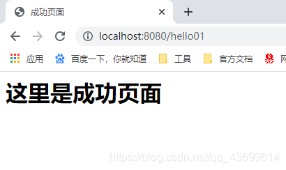

## 3. Url请求

### 3.1 运行流程

1. 客户端点击链接发送请求：http://localhost:8080/hello01；
2. 来到tomcat服务器；
3. SpringMVC的前端控制器收到所有请求；
4. 看请求地址和@RequestMapping标注的哪个匹配，来找到底使用哪个类的哪个方法来处理；
5. 前端控制器找到目标处理器类和目标方法，直接利用反射执行目标方法；
6. 方法执行完后有一个返回值，SpringMVC认为这个返回值就是要去的页面地址；
7. 拿到方法返回值后，视图解析器进行拼串得到完整的页面地址
8. 得到页面地址，前端控制器帮我们转发到页面

### 3.2  @RequestMapping

> #### RequestMapping-url映射

#### 01 标注在方法上

告诉SpringMVC这个方法用来处理什么请求。

`@RequestMapping("/hello01")`中的 `/`可以省略，就是默认从当前项目下开始。

#### 02 标注在类上

表示为当前类中的所有方法的请求地址，指定一个基准路径。toSuccess()方法处理的请求路径是`/haha/hello01`。

```java
@Controller
@RequestMapping("/haha")
public class HelloController {

    @RequestMapping(value = "/hello01")
    public String toSuccess(){
        System.out.println("请求成功页面");
        return "success";
    }
}
```

#### 03 规定请求方式

method属性规定请求方式，默认是所求请求方式都行。method = RequestMethod.GET，method = RequestMethod.POST。

如果方法不匹配会报：**HTTP Status 405 错误 – 方法不被允许**

```java
@RequestMapping(value = "/hello01",method = RequestMethod.GET)
public String toSuccess(){
    System.out.println("请求成功页面");
    return "success";
}
```

**组合用法**

- @GetMapping 等价于 @RequestMapping(method =RequestMethod.GET)
- @PostMapping
- @PutMapping
- @DeleteMapping
- @PatchMapping

#### 04 规定请求参数

params属性规定请求参数。会造成错误：**HTTP Status 400 – 错误的请求**

不携带该参数，表示参数值为null；携带了不给值表示参数值是空串

```java
//必须携带username参数
@RequestMapping(value = "/hello03",params ={"username"})
//必须不携带username参数
@RequestMapping(value = "/hello03",params ={"！username"})
//必须携带username参数，且值必须为123
@RequestMapping(value = "/hello03",params ={"username=123"})
//username参数值必须不为123，不携带或者携带了不是123都行
@RequestMapping(value = "/hello03",params ={"username=！123"})
//username参数值必须不为123，不携带password，携带page
@RequestMapping(value = "/hello03",params ={"username=！123","page","!password"})
```

#### 05 规定请求头

headers属性规定请求头。其中User-Agent：浏览器信息

```java
@RequestMapping(value="/test3",headers= {"Content-Type=application/json"})
```

谷歌浏览器：User-Agent: Mozilla/5.0 (Windows NT 10.0; Win64; x64) AppleWebKit/537.36 (KHTML, like Gecko) Chrome/83.0.4103.97 Safari/537.3

#### 06 Ant风格URL

URL地址可以写模糊的通配符，模糊和精确多个匹配情况下精确优先。

？：**替代任意一个字符**

```java
@RequestMapping( "/hello0?") /
```

*：**替代任意多个字符或一层路径**

```java
@RequestMapping( "/hello0*")   //任意多个字符
@RequestMapping( "/a/*/hello01")  //一层路径
```

```java
	@RequestMapping(value = "/test/*/a")
    public String myMethodTest01() {
        System.out.println("post01");
        return "success"; 
    }
	// test/[^\/]+/b ->post01
	// /test/*/b ->post02
    @RequestMapping(value = "/test/**/a")
    public String myMethodTest02() {
        System.out.println("post02");
        return "success";
    }
```

**：替代任意多层路径

```java
@RequestMapping( "/a/**/hello01")  //任意多层路径
```

#### 07  PathVariable

可以用/test/{paramsName1}/{paramsName2}来获取Url上传的参数值

```java
@RequestMapping(value = "/test/{id}", method = RequestMethod.GET)
    public String myMethodTest03(@PathVariable("id") String id) {
        System.out.println(id);
        return "success";
    }
```

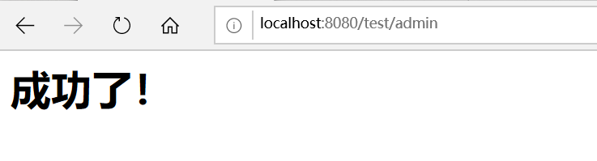

```
admin  //打印
```


### 3.3 Spring配置文件的默认位置

默认位置是 /WEB-INF/**xxx**-servlet.xml，其中**xxx**是自己在web.xml文件中配置的**servlet-name**属性。

例如：

`dispatcherServlet-servlet.xml`

当然也可以手动指定文件位置。

```xml
<servlet>
        <servlet-name>dispatcherServlet</servlet-name>
        <servlet-class>org.springframework.web.servlet.DispatcherServlet</servlet-class>
        <init-param>
            <param-name>contextConfigLocation</param-name>
            <param-value>classpath:applicationContext.xml</param-value>
        </init-param>
        <load-on-startup>1</load-on-startup>
</servlet>
```


### 3.4 url-pattern

/ 拦截所有的请求，不拦截jsp

/* **拦截所有的请求**，包括*.jsp，一旦拦截jsp页面就不能显示了。. jsp是tomcat处理的事情

看Tomcat的配置文件web.xml中，有DefaultServlet和JspServlet，

- DefaultServlet是Tomcat中处理静态资源的，Tomcat会在服务器下找到这个资源并返回。如果我们自己配置`url-pattern=/`，相当于禁用了Tomcat服务器中的DefaultServlet，这样如果请求静态资源，就会去找前端控制器找@RequestMapping，**这样静态资源就不能访问了**。解决办法：

  ```xml
  <!-- 告诉Spring MVC自己映射的请求就自己处理，不能处理的请求直接交给tomcat -->
  <mvc:default-servlet-handler />
  <!--开启MVC注解驱动模式，保证动态请求和静态请求都能访问-->
  <mvc:annotation-driven/>
  ```
  
- JspServlet，保证了jsp可以正常访问

```xml
<servlet>
    <servlet-name>default</servlet-name>
    <servlet-class>org.apache.catalina.servlets.DefaultServlet</servlet-class>
    <init-param>
        <param-name>debug</param-name>
        <param-value>0</param-value>
    </init-param>
    <init-param>
        <param-name>listings</param-name>
        <param-value>false</param-value>
    </init-param>
    <load-on-startup>1</load-on-startup>
</servlet>

    <servlet-mapping>
        <servlet-name>default</servlet-name>
        <url-pattern>/</url-pattern>
    </servlet-mapping>


<servlet>
     <servlet-name>jsp</servlet-name>
     <servlet-class>org.apache.jasper.servlet.JspServlet</servlet-class>
     <init-param>
         <param-name>fork</param-name>
         <param-value>false</param-value>
      </init-param>
      <init-param>
          <param-name>xpoweredBy</param-name>
          <param-value>false</param-value>
      </init-param>
      <load-on-startup>3</load-on-startup>
</servlet>

    <servlet-mapping>
        <servlet-name>jsp</servlet-name>
        <url-pattern>*.jsp</url-pattern>
        <url-pattern>*.jspx</url-pattern>
    </servlet-mapping>
```

## 4. REST风格

### 4.1 概述

REST就是一个资源定位及资源操作的风格。不是标准也不是协议，只是一种风格。基于这个风格设计的软件可以更简洁，更有层次，更易于实现缓存等机制。其强调HTTP应当以资源为中心，并且规范了URI的风格；规范了HTTP请求动作（GET/PUT/POST/DELETE/HEAD/OPTIONS）的使用，具有对应的语义。

- 资源（Resource）：网络上的一个实体，每种资源对应一个特定的URI，即URI为每个资源的独一无二的识别符；
- 表现层（Representation）：把资源具体呈现出来的形式，叫做它的表现层。比如txt、HTML、XML、JSON格式等；
- 状态转化（State Transfer）：每发出一个请求，就代表一次客户端和服务器的一次交互过程。GET用来获取资源，POST用来新建资源，PUT用来更新资源，DELETE用来删除资源。

在参数上使用 @PathVariable 注解，可以获取到请求路径上的值，也可以写多个

```java
    @RequestMapping(value = "/hello04/username/{id}")
    public String test2(@PathVariable("id") int id){
        System.out.println(id);
        return "success";
    }
12345
```

### 4.2 页面上发出PUT请求

**对一个资源的增删改查用请求方式来区分：**

- /book/1 GET：查询1号图书
- /book/1 DELETE：删除1号图书
- /book/1 PUT：修改1号图书
- /book POST：新增图书

页面上只能发出GET请求和POST请求。将POST请求转化为put或者delete请求的步骤：

1. 把前端发送方式改为post 。
2. 在web.xml中配置一个filter：HiddenHttpMethodFilter过滤器
3. 必须携带一个键值对，key=_method, value=put或者delete

```xml
<!--这个过滤器的作用 ：就是将post请求转化为put或者delete请求-->
<filter>
    <filter-name>HiddenHttpMethodFilter</filter-name>
    <filter-class>org.springframework.web.filter.HiddenHttpMethodFilter</filter-class>
</filter>
<filter-mapping>
    <filter-name>HiddenHttpMethodFilter</filter-name>
    <url-pattern>/*</url-pattern>
</filter-mapping>

<form action="hello03" method="post">
  <input type="hidden" name="_method" value="delete">
  <input type="submit" name="提交">
</form>

```

**注意**

高版本Tomcat会出现问题：JSPs only permit GET POST or HEAD，在页面上加上异常处理即可

```jsp
<%@ page contentType="text/html;charset=UTF-8" language="java"  isErrorPage="true" %>
1
```

## 5 请求参数处理

### 5.1 传入参数

**1. 如果提交的参数名称和处理方法的参数名一致，则无需处理，直接使用**

提交数据 : http://localhost:8080/hello05?username=zhangsan，控制台会输出zhangsan

```java
@RequestMapping("/hello05")
public String test03(String username) {
    System.out.println(username);
    return "success";
}
```

**2. 提交的参数名称和处理方法的参数名不一致，使用@RequestParam注解**

注解`@RequestParam`可以获取请求参数，默认必须携带该参数，也可以指定`required=false`，和没携带情况下的默认值`defaultValue`

```java
@RequestMapping("/hello05")
public String test03(@RequestParam(value = "username",required = false, defaultValue ="hehe" ) String name) {
    System.out.println(name);
    return "success";
}
```

还有另外两个注解：

- `@RequestHeader`：获取请求头中的信息，比如User-Agent：浏览器信息

  ```java
  @RequestMapping("/hello05")
  public String test03(@RequestHeader("User-Agent" ) String name) {
      System.out.println(name);
      return "success";
  }
  ```
  
- `@CookieValue`：获取某个cookie的值

  ```java
  @RequestMapping("/hello05")
  public String test03(@CookieValue("JSESSIONID" ) String name) {
       System.out.println(name);
       return "success";
  }
  ```

### 5.2 传入一个对象

传入POJO，SpringMVC会自动封装，**提交的表单域参数必须和对象的属性名一致，否则就是null，请求没有携带的字段，值也会是null。**同时也还可以级联封装。

新建两个对象User和Address：

```java
public class User {
    private String username;
    private Integer age;
    private Address address;
    //....
}

public class Address {
    private String name;
    private Integer num;
        //....
}

```

前端请求：

```jsp
<form action="hello06" method="post">
    姓名： <input type="text" name="username"> <br>
    年龄： <input type="text" name="age"><br>
    地址名：<input type="text" name="address.name"><br>
    地址编号：<input type="text" name="address.num"><br>
    <input type="submit" name="提交">
</form>
```

后端通过对象名也能拿到对象的值，没有对应的值则为null

```java
@RequestMapping("/hello06")
public String test03(User user) {
    System.out.println(user);
    return "success";
}
```


### 5.3 传入原生ServletAPI

处理方法还可以传入原生的ServletAPI：

```java
@RequestMapping("/hello07")
public String test04(HttpServletRequest request, HttpSession session) {
    session.setAttribute("sessionParam","我是session域中的值");
    request.setAttribute("reqParam","我是request域中的值");
    return "success";
}
```

通过EL表达式获取到值，`${requestScope.reqParam}`：

```jsp
<%@ page contentType="text/html;charset=UTF-8" language="java"  isErrorPage="true" %>
<html>
<head>
    <title>成功页面</title>
</head>

<body>

<h1>这里是成功页面</h1>
${requestScope.reqParam}
${sessionScope.sessionParam}
</body>
</html>
```

### 5.4 乱码问题

**一定要放在在其他Filter前面。**

```xml
<filter>
   <filter-name>encoding</filter-name>
   <filter-class>org.springframework.web.filter.CharacterEncodingFilter</filter-class>
    <!--解决请求乱码-->
   <init-param>
       <param-name>encoding</param-name>
       <param-value>utf-8</param-value>
   </init-param>
    <!--解决响应乱码-->
   <init-param>
        <param-name>forceEncoding</param-name>
        <param-value>true</param-value>
   </init-param>
</filter>
<filter-mapping>
   <filter-name>encoding</filter-name>
   <url-pattern>/*</url-pattern>
</filter-mapping>

<!--在Tomcat的server.xml中的8080处 URLEncoding="UTF-8"-->
```


## 6. 数据输出

### 6.1 Map、Model、ModelMap

实际上都是调用的 **BindingAwareModelMap**(隐含模型)，将数据放在**请求域(requestScope)中**进行转发，用EL表达式可以取出对应的值。

​		

```java
/**
 * SpringMVC除过在方法上传入原生的request和session外还能怎么样把数据带给页面
 *
 * 1）、可以在方法处传入Map、或者Model或者ModelMap。
 *      给这些参数里面保存的所有数据都会放在请求域中。可以在页面获取
 *   关系：
 *      Map，Model，ModelMap：最终都是BindingAwareModelMap在工作；
 *      相当于给BindingAwareModelMap中保存的东西都会被放在请求域中；
 *
 *      Map(interface(jdk))      Model(interface(spring)) 
 *          ||                          //
 *          ||                         //
 *          \/                        //
 *      ModelMap(class)               //
 *                  \\              //
 *                   \\            //
 *                  ExtendedModelMap
 *                          ||
 *                          \/
 *                  BindingAwareModelMap
 *
 * 2）、方法的返回值可以变为ModelAndView类型；
 *          既包含视图信息（页面地址）也包含模型数据（给页面带的数据）；
 *          而且数据是放在请求域中；
 *          request、session、application；
 *          
 *
 * @author lfy
 *
 */
```

- Map

```java
@RequestMapping("/Api2")
    public String api2(Map<String,Object> map){
        map.put("msg","hello");
        return "map";
    }
```

- Model

```java
@RequestMapping("/Api3")
    public String api3(Model model){
        model.addAttribute("msg","hello2");
        return "map";
    }
```

- ModelMap

```java
@RequestMapping("/Api4")
    public String api4(ModelMap modelMap){
        modelMap.addAttribute("msg","hello3");
        return "map";
    }
```

map页面：

```jsp
<%@ page contentType="text/html;charset=UTF-8" language="java" %>
<html>

<head>
    <title>Title</title>
</head>

<body>

pageScope:  ${pageScope.msg}

requestScope :   ${requestScope.msg}

sessionScope:     ${sessionScope.msg}

applicationScope:   ${applicationScope.msg}

</body>
</html>
```

**【补充】jsp的4个作用域 pageScope、requestScope、sessionScope、applicationScope的区别：**

- **page**指当前页面有效。在一个jsp页面里有效
- **request** 指在一次请求的全过程中有效，即从http请求到服务器处理结束，返回响应的整个过程，存放在**HttpServletRequest**对象中。在这个过程中可以使用forward方式跳转多个jsp。在这些页面里都可以使用这个变量。
- **Session**是用户全局变量，在整个会话期间都有效。只要页面不关闭就一直有效（或者直到用户一直未活动导致会话过期，默认session过期时间为30分钟，或调用HttpSession的invalidate()方法）。存放在HttpSession对象中
- **application**是程序全局变量，对每个用户每个页面都有效。存放在ServletContext对象中。它的存活时间是最长的，如果不进行手工删除，它们就一直可以使用

### 6.2 ModelAndView

返回一个模型视图对象ModerAndView， 既包含视图信息(页面地址)，也包含模型数据(给页面带的数据)

```java
@RequestMapping("/hello04")
public ModelAndView test04 (){
   //新建一个模型视图对象，也可以直接传入名字
   ModelAndView mv = new ModelAndView();
   //封装要显示到视图中的数据
   //相当于req.setAttribute("msg",HelloWorld!);
   mv.addObject("msg","HelloWorld!");
   //设置视图的名字，相当于之前的return "success";
   mv.setViewName("success");
   return mv;
}
```

### 6.3 @SessionAttributes

给Session域中携带数据使用注解`@SessionAttributes`，只能标在类上，value属性指定key，type可以指定保存类型。这个注解会引发异常**一般不用，就用原生API**

`@SessionAttributes(value = "msg")`：表示给BindingAwareModelMap中保存key为msg的数据时，在session中也保存一份；

`@SessionAttributes(types = {String.class})`：表示只要保存String类型的数据时，给session中也放一份。

```java
//表示给BindingAwareModelMap中保存key为msg的数据时，在session中也保存一份
@SessionAttributes(value = "msg")
@Controller
public class outputController {
    @RequestMapping("/hello01")
    public String test01 (Map<String,Object> map){
        map.put("msg","HelloWorld!");
        return "success";
    }
}
```

### 6.4 @ModelAttribute

```shell
ModelAttribute：
使用场景：
1）、页面：form提交更新
2）、dao：全字段更新。没带的字段会在数据库中更新为null；

/**
 * 测试ModelAttribute注解；
 * 使用场景：书城的图书修改为例；
 * 1）页面端；
 *      显示要修改的图书的信息，图书的所有字段都在
 * 2）servlet收到修改请求，调用dao；
 *      String sql="update bs_book set title=?,
 *                  author=?,price=?,
 *                  sales=?,stock=?,img_path=?
 *              where id=?";
 * 3）实际场景？
 *      并不是全字段修改；只会修改部分字段，以修改用户信息为例；
 *      username  password  address;
 *      1）、不修改的字段可以在页面进行展示但是不要提供修改输入框；
 *      2）、为了简单，Controller直接在参数位置来写Book对象
 *      3）、SpringMVC为我们自动封装book；（没有带的值是null）
 *      4）、如果接下来调用了一个全字段更新的dao操作；会将其他的字段可能变为null；
 *          sql = "update bs_book set"
 *          if(book.getBookName()){
 *              sql +="bookName=?,"
 *          }
 *          if(book.getPrice()){
 *              sql +="price=?"
 *          }
 *
 * 4）、如何能保证全字段更新的时候，只更新了页面携带的数据；
 *      1）、修改dao；代价大？
 *      2）、Book对象是如何封装的？
 *          1）、SpringMVC创建一个book对象，每个属性都有默认值，bookName就是null；
 *              1、让SpringMVC别创建book对象，直接从数据库中先取出一个id=100的book对象的信息
 *              2、Book [id=100, bookName=西游记, author=张三, stock=12, sales=32, price=98.98]
 *
 *          2）、将请求中所有与book对应的属性一一设置过来；
 *              3、使用刚才从数据库取出的book对象，给它 的里面设置值；（请求参数带了哪些值就覆盖之前的值）
 *              4、带了的字段就改为携带的值，没带的字段就保持之前的值
 *          3）、调用全字段更新就有问题；
 *              5、将之前从数据库中查到的对象，并且封装了请求参数的对象。进行保存；
 *
 * @author lfy
 */
```

方法入参标注该注解后，入参的对象就会放到数据模型中，会提前于控制方法先执行，并发方法允许的结果放在隐含模型中。

处理这样的场景：

前端传来数据，SpringMVC自动封装成对象，实际上是创建了一个对象，每个属性都有默认值，然后将请求参数中对应是属性设置过来，但是如果没有的值将会是null，如果拿着这个数据去更新数据库，会造成其他字段也变为null。因此希望使用`@ModelAttribute`，会在目标方法执行前先做一些处理

```java
@ModelAttribute
public void  myModelAttribute(ModelMap modelMap){
    System.out.println("modelAttribute方法执行了");
    //提前做一些处理
    User user = new User("zhangsan",20);
    //保存一个数据到BindingAwareModelMap中，目标方法可以从中取出来
    modelMap.addAttribute("user",user);
}

@RequestMapping("/hello05")
public void  test05(@ModelAttribute("user") User user){
    System.out.println("目标方法执行了");
    //在参数上加上@ModelAttribute注解，可以拿到提前存入的数据
    System.out.println(user);

}
```

### 6.5 @ResponseBody

在控制器类中，在方法上使用**@ResponseBody**注解可以不走视图解析器，如果返回值是字符串，那么直接将字符串写到客户端；如果是一个对象，会将对象转化为JSON串，然后写到客户端。

或者在类上加 **@RestController**注解，可以让类中的所有方法都不走视图解析器，直接返回JSON字符串


## 7. 视图源码执行流程

### 7.0 SpringMVC的九大组件

- multipartResolver：文件上传解析器
- localeResolver：区域信息解析器，和国际化有关
- themeResolver：主题解析器
- handlerMappings：handler的映射器
- handlerAdapters：handler的适配器
- handlerExceptionResolvers：异常解析功能
- viewNameTranslator：请求到视图名的转换器
- flashMapManager：SpringMVC中允许重定向携带数据的功能
- viewResolvers：视图解析器

```java
     /** 文件上传解析器*/
    private MultipartResolver multipartResolver;
    /** 区域信息解析器；和国际化有关 */
    private LocaleResolver localeResolver;
    /** 主题解析器；强大的主题效果更换 */
    private ThemeResolver themeResolver;
    /** Handler映射信息；HandlerMapping */
    private List<HandlerMapping> handlerMappings;
    /** Handler的适配器 */
    private List<HandlerAdapter> handlerAdapters;
    /** SpringMVC强大的异常解析功能；异常解析器 */
    private List<HandlerExceptionResolver> handlerExceptionResolvers;
    /**  */
    private RequestToViewNameTranslator viewNameTranslator;
    /** FlashMap+Manager：SpringMVC中运行重定向携带数据的功能 */
    private FlashMapManager flashMapManager;
    /** 视图解析器； */
    private List<ViewResolver> viewResolvers;
```

 onRefresh()->initStrategies() DispatcherServlet中：

```java
protected void initStrategies(ApplicationContext context) {
        initMultipartResolver(context);
        initLocaleResolver(context);
        initThemeResolver(context);
        initHandlerMappings(context);
        initHandlerAdapters(context);
        initHandlerExceptionResolvers(context);
        initRequestToViewNameTranslator(context);
        initViewResolvers(context);
        initFlashMapManager(context);
    }

```

例：初始化HandlerMapping

```java
private void initHandlerMappings(ApplicationContext context) {
        this.handlerMappings = null;

        if (this.detectAllHandlerMappings) {
            // Find all HandlerMappings in the ApplicationContext, including ancestor contexts.
            Map<String, HandlerMapping> matchingBeans =
                    BeanFactoryUtils.beansOfTypeIncludingAncestors(context, HandlerMapping.class, true, false);
            if (!matchingBeans.isEmpty()) {
                this.handlerMappings = new ArrayList<HandlerMapping>(matchingBeans.values());
                // We keep HandlerMappings in sorted order.
                OrderComparator.sort(this.handlerMappings);
            }
        }
        else {
            try {
                HandlerMapping hm = context.getBean(HANDLER_MAPPING_BEAN_NAME, HandlerMapping.class);
                this.handlerMappings = Collections.singletonList(hm);
            }
            catch (NoSuchBeanDefinitionException ex) {
                // Ignore, we'll add a default HandlerMapping later.
            }
        }

        // Ensure we have at least one HandlerMapping, by registering
        // a default HandlerMapping if no other mappings are found.
        if (this.handlerMappings == null) {
            this.handlerMappings = getDefaultStrategies(context, HandlerMapping.class);
            if (logger.isDebugEnabled()) {
                logger.debug("No HandlerMappings found in servlet '" + getServletName() + "': using default");
            }
        }
    }
```

​	组件的初始化：   有些组件在容器中是使用类型找的，有些组件是使用id找的；
   去容器中找这个组件，如果没有找到就用默认的配置；

### 7.1 前端控制器DisatcherServlet


### 7.2 SpringMVC执行流程

```java
protected void doDispatch(HttpServletRequest request, HttpServletResponse response) throws Exception {
        HttpServletRequest processedRequest = request;
        HandlerExecutionChain mappedHandler = null;
        boolean multipartRequestParsed = false;
        WebAsyncManager asyncManager = WebAsyncUtils.getAsyncManager(request);
        try {
            ModelAndView mv = null;
            Exception dispatchException = null;
            try {
                
                //1、检查是否文件上传请求
                
                processedRequest = checkMultipart(request);
                multipartRequestParsed = processedRequest != request;
                
                // Determine handler for the current request.
                //2、根据当前的请求地址找到那个类能来处理；
                
                mappedHandler = getHandler(processedRequest);

                //3、如果没有找到哪个处理器（控制器）能处理这个请求就404，或者抛异常
                
                if (mappedHandler == null || mappedHandler.getHandler() == null) {
                    noHandlerFound(processedRequest, response);
                    return;
                }

                // Determine handler adapter for the current request.
                //4、拿到能执行这个类的所有方法的适配器；（反射工AnnotationMethodHandlerAdapter）
                
                HandlerAdapter ha = getHandlerAdapter(mappedHandler.getHandler());
                
                // Process last-modified header, if supported by the handler.
                
                String method = request.getMethod();
                boolean isGet = "GET".equals(method);
                if (isGet || "HEAD".equals(method)) {
                    long lastModified = ha.getLastModified(request, mappedHandler.getHandler());
                    if (logger.isDebugEnabled()) {
                        String requestUri = urlPathHelper.getRequestUri(request);
                        logger.debug("Last-Modified value for [" + requestUri + "] is: " + lastModified);
                    }
                    if (new ServletWebRequest(request, response).checkNotModified(lastModified) && isGet) {
                        return;
                    }
                }
                if (!mappedHandler.applyPreHandle(processedRequest, response)) {
                    return;
                }
                try {
                    
                    // Actually invoke the handler.处理（控制）器的方法被调用
                    //控制器（Controller），处理器（Handler）
                    //5、适配器来执行目标方法；
                    //将目标方法执行完成后的返回值作为视图名，设置保存到ModelAndView中
                    //目标方法无论怎么写，最终适配器执行完成以后都会将执行后的信息封装成ModelAndView
                    
                    mv = ha.handle(processedRequest,response,mappedHandler.getHandler());
                } finally {
                    if (asyncManager.isConcurrentHandlingStarted()) {
                        return;
                    }
                }
                applyDefaultViewName(request, mv);//如果没有视图名设置一个默认的视图名；
                mappedHandler.applyPostHandle(processedRequest, response, mv);
            } catch (Exception ex) {
                dispatchException = ex;
            }
            
            //转发到目标页面；
            //6、根据方法最终执行完成后封装的ModelAndView；
            //转发到对应页面，而且ModelAndView中的数据可以从请求域中获取
            processDispatchResult(processedRequest, response, mappedHandler, 
                                  mv, dispatchException);
        } catch (Exception ex) {
            triggerAfterCompletion(processedRequest, response, mappedHandler, ex);
        } catch (Error err) {
            triggerAfterCompletionWithError(processedRequest, response, mappedHandler, err);
        } finally {
            if (asyncManager.isConcurrentHandlingStarted()) {
                
                // Instead of postHandle and afterCompletion
                mappedHandler.applyAfterConcurrentHandlingStarted(processedRequest, response);
                return;
            }
            // Clean up any resources used by a multipart request.
            if (multipartRequestParsed) {
                cleanupMultipart(processedRequest);
            }
        }
    }
```


#### 总体概览

1. ##### 用户发出请求，DispatcherServlet接收请求并拦截请求。

2. ##### 调用doDispatch()方法进行处理：

   1. getHandler()：根据当前请求地址中找到能处理这个请求的目标处理器类(处理器)；
      - 根据当前请求在HandlerMapping中找到这个请求的映射信息，获取到目标处理器类
      - mappedHandler = getHandler(processedRequest);
   2. getHandlerAdapter()：根据当前处理器类找到能执行这个处理器方法的适配器；
      - 根据当前处理器类，找到当前类的HandlerAdapter（适配器）
      - HandlerAdapter ha = getHandlerAdapter(mappedHandler.getHandler());
   3. 使用刚才获取到的适配器(AnnotationMethodHandlerAdapter)执行目标方法；
      -  mv = ha.handle(processedRequest,response,mappedHandler.getHandler());
   4. 目标方法执行后，会返回一个ModerAndView对象
      - **mv** = ha.handle(processedRequest,response,mappedHandler.getHandler());
   5. 根据ModerAndView的信息转发到具体页面，并可以在请求域中取出ModerAndView中的模型数据
      - processDispatchResult(processedRequest, response, mappedHandler, 
                                          mv, dispatchException);

   > HandlerMapping为处理器映射器，保存了每一个处理器能处理哪些请求的映射信息，handlerMap
   >
   > HandlerAdapter为处理器适配器，能解析注解方法的适配器，其按照特定的规则去执行Handler

#### 具体细节

##### 步骤一：

**getHandler():**

> ​	**怎么根据当前请求就能找到哪个类能来处理？**

- getHandler()会返回目标处理器类的执行链

   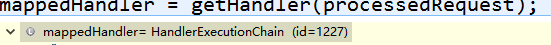  

- HandlerMapping：处理器映射：他里面保存了每一个处理器能处理哪些请求的映射信息

  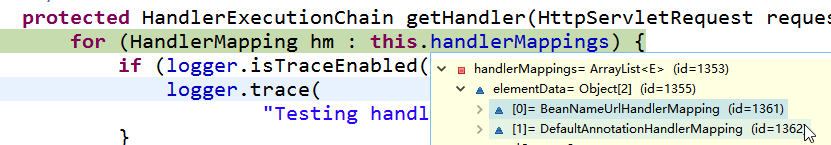

- handlerMap：ioc容器启动创建Controller对象的时候扫描每个处理器都能处理什么请求，保存在HandlerMapping的handlerMap属性中；下一次请求过来，就来看哪个HandlerMapping中有这个请求映射信息就行了

  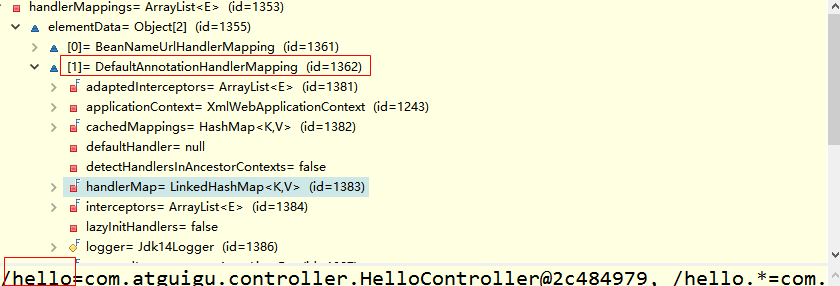 


循环遍历拿到能处理url的类

```java
protected HandlerExecutionChain getHandler(HttpServletRequest request) throws Exception {
        for (HandlerMapping hm : this.handlerMappings) {
            if (logger.isTraceEnabled()) {
                logger.trace(
                        "Testing handler map [" + hm + "] in DispatcherServlet with name '" + getServletName() + "'");
            }
            HandlerExecutionChain handler = hm.getHandler(request);
            if (handler != null) {
                return handler;
            }
        }
        return null;
    }
```

##### 步骤二：

**getHandlerAdapter():**

> **如何找到目标处理器类的适配器。要拿适配器才去执行目标方法**

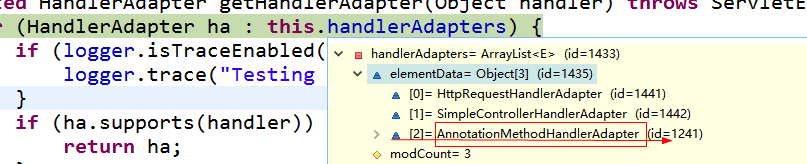

**AnnotationMethodHandlerAdapter**：

- 能解析注解方法的适配器；
- 处理器类中只要有标了注解的这些方法就能用；

```java
protected HandlerAdapter getHandlerAdapter(Object handler) throws ServletException {
        for (HandlerAdapter ha : this.handlerAdapters) {
            if (logger.isTraceEnabled()) {
                logger.trace("Testing handler adapter [" + ha + "]");
            }
            if (ha.supports(handler)) {
                return ha;
            }
        }
        throw new ServletException("No adapter for handler [" + handler +
                "]: The DispatcherServlet configuration needs to include a HandlerAdapter that supports this handler");
    }
```

##### 步骤三： 	

执行目标方法的细节；  

mv = ha.handle(processedRequest, response, mappedHandler.getHandler());

↓

**return** invokeHandlerMethod(request, response, handler);

```java
protected ModelAndView invokeHandlerMethod(HttpServletRequest request, HttpServletResponse response, Object handler)
            throws Exception {
          //拿到方法的解析器
        ServletHandlerMethodResolver methodResolver = getMethodResolver(handler);
          //方法解析器根据当前请求地址找到真正的目标方法
        Method handlerMethod = methodResolver.resolveHandlerMethod(request);
          //创建一个方法执行器；
        ServletHandlerMethodInvoker methodInvoker = new ServletHandlerMethodInvoker(methodResolver);
          //包装原生的request, response，
        ServletWebRequest webRequest = new ServletWebRequest(request, response);
          //创建了一个，隐含模型
    
        ExtendedModelMap implicitModel = new BindingAwareModelMap();//**重点

         //真正执行目标方法；目标方法利用反射执行期间确定参数值，提前执行modelattribute等所有的操作都在这个方法中；
        Object result = methodInvoker.invokeHandlerMethod(handlerMethod, handler, webRequest, implicitModel);
    	//=======================看后边补充的代码块===========================
        ModelAndView mav =
                methodInvoker.getModelAndView(handlerMethod, handler.getClass(), result, implicitModel, webRequest);
    
        methodInvoker.updateModelAttributes(handler, (mav != null ? mav.getModel() : null), implicitModel, webRequest);
    
        return mav;
    }
```

↓

```java
Object result = methodInvoker.invokeHandlerMethod(handlerMethod, handler, webRequest, implicitModel);
```

 ```java
publicfinal Object invokeHandlerMethod(Method handlerMethod, Object handler,
            NativeWebRequest webRequest, ExtendedModelMap implicitModel) throws Exception {
        Method handlerMethodToInvoke = BridgeMethodResolver.findBridgedMethod(handlerMethod);
        try {
            boolean debug = logger.isDebugEnabled();
            for (String attrName : this.methodResolver.getActualSessionAttributeNames()) {
                Object attrValue = this.sessionAttributeStore.retrieveAttribute(webRequest, attrName);
                if (attrValue != null) {
                    implicitModel.addAttribute(attrName, attrValue);
                }
            }
               
          //找到所有@ModelAttribute注解标注的方法；
            for (Method attributeMethod : this.methodResolver.getModelAttributeMethods()) {
                Method attributeMethodToInvoke = BridgeMethodResolver.findBridgedMethod(attributeMethod);
                //先确定modelattribute方法执行时要使用的每一个参数的值；
               Object[] args = resolveHandlerArguments(attributeMethodToInvoke, handler, webRequest, implicitModel);
       //==========================看后边补充的代码块=====================================
                if (debug) {
                    logger.debug("Invoking model attribute method: " + attributeMethodToInvoke);
                }
                String attrName = AnnotationUtils.findAnnotation(attributeMethod, ModelAttribute.class).value();
                
                if (!"".equals(attrName) && implicitModel.containsAttribute(attrName)) {
                    continue;
                }
                
                ReflectionUtils.makeAccessible(attributeMethodToInvoke);
               
               //提前运行ModelAttribute，
                Object attrValue = attributeMethodToInvoke.invoke(handler, args);
                if ("".equals(attrName)) {
                    Class<?> resolvedType = GenericTypeResolver.resolveReturnType(attributeMethodToInvoke, handler.getClass());
                    attrName = Conventions.getVariableNameForReturnType(attributeMethodToInvoke, resolvedType, attrValue);
                }
                
                /*
                
                方法上标注的ModelAttribute注解如果有value值   
				@ModelAttribute("abc")
				hahaMyModelAttribute()
				
                标了:	attrName="abc"
                没标:	attrName="";attrName就会变为返回值类型首字母小写，
                     比如void ,或者book;
                     
                     【  
                        @ModelAttribute标在方法上的另外一个作用；
                        可以把方法运行后的返回值按照方法上@ModelAttribute("abc")
                        指定的key放到隐含模型中；
                        如果没有指定这个key；就用返回值类型的首字母小写
                      】
                        
                        {
                            haha=Book [id=100, bookName=西游记, author=吴承恩, stock=98, 									sales=10, price=98.98], 
                            void=null
                      	}
                */
                //把提前运行的ModelAttribute方法的返回值也放在隐含模型中
                if (!implicitModel.containsAttribute(attrName)) {
                    implicitModel.addAttribute(attrName, attrValue);
                }
            }

               //再次解析目标方法参数是哪些值
            Object[] args = resolveHandlerArguments(handlerMethodToInvoke, handler, webRequest, implicitModel);
            if (debug) {
                logger.debug("Invoking request handler method: " + handlerMethodToInvoke);
            }
            ReflectionUtils.makeAccessible(handlerMethodToInvoke);

            
            //执行目标方法
            return handlerMethodToInvoke.invoke(handler, args);
        }
        catch (IllegalStateException ex) {
            // Internal assertion failed (e.g. invalid signature):
            // throw exception with full handler method context...
            throw new HandlerMethodInvocationException(handlerMethodToInvoke, ex);
        }
        catch (InvocationTargetException ex) {
            // User-defined @ModelAttribute/@InitBinder/@RequestMapping method threw an exception...
            ReflectionUtils.rethrowException(ex.getTargetException());
            return null;
        }
    }
 ```

**确定方法运行时使用的每一个参数的值**

Object[] args = resolveHandlerArguments(attributeMethodToInvoke, handler, webRequest, implicitModel);

```java
@RequestMapping("/updateBook")
    public String updateBook
           (
                @RequestParam(value="author")String author,
                Map<String, Object> model,
                HttpServletRequest request,
                @ModelAttribute("haha")Book book
            )
```

 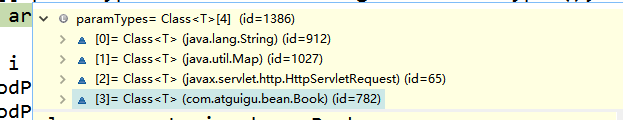 

------

```m
标了注解：
          保存时哪个注解的详细信息；
          如果参数有ModelAttribute注解；
               拿到ModelAttribute注解的值让attrName保存
                    attrName="haha"

没标注解：
          1）、先看是否普通参数（是否原生API）
               再看是否Model或者Map，如果是就传入隐含模型；
          2）、自定义类型的参数没有ModelAttribute 注解
                    1）、先看是否原生API
                    2）、再看是否Model或者Map
                    3）、再看是否是其他类型的比如SessionStatus、HttpEntity、Errors
           			4）、再看是否简单类型的属性；比如是否Integer，String，基本类型
                    		如果是paramName=“”
           			5)、attrName=""；
           			
如果是自定义类型对象，最终会产生两个效果；
     1）、如果这个参数标注了ModelAttribute注解就给attrName赋值为这个注解的value值
     2）、如果这个参数没有标注ModelAttribute注解就给attrName赋值""；
```

------


```java
private Object[] resolveHandlerArguments(Method handlerMethod, Object handler,
            NativeWebRequest webRequest, ExtendedModelMap implicitModel) throws Exception {
        Class<?>[] paramTypes = handlerMethod.getParameterTypes();
          //创建了一个和参数个数一样多的数组，会用来保存每一个参数的值
        Object[] args = new Object[paramTypes.length];

                      
        for (int i = 0; i < args.length; i++) {
            MethodParameter methodParam = new MethodParameter(handlerMethod, i);
            methodParam.initParameterNameDiscovery(this.parameterNameDiscoverer);
            GenericTypeResolver.resolveParameterType(methodParam, handler.getClass());
            String paramName = null;
            String headerName = null;
            boolean requestBodyFound = false;
            String cookieName = null;
            String pathVarName = null;
            String attrName = null;
            boolean required = false;
            String defaultValue = null;
            boolean validate = false;
            Object[] validationHints = null;
            int annotationsFound = 0;
            Annotation[] paramAnns = methodParam.getParameterAnnotations();
            
            //找到目标方法这个参数的所有注解，如果有注解就解析并保存注解的信息；
            for (Annotation paramAnn : paramAnns) {
                if (RequestParam.class.isInstance(paramAnn)) {
                    RequestParam requestParam = (RequestParam) paramAnn;
                    paramName = requestParam.value();
                    required = requestParam.required();
                    defaultValue = parseDefaultValueAttribute(requestParam.defaultValue());
                    annotationsFound++;
                }
                else if (RequestHeader.class.isInstance(paramAnn)) {
                    RequestHeader requestHeader = (RequestHeader) paramAnn;
                    headerName = requestHeader.value();
                    required = requestHeader.required();
                    defaultValue = parseDefaultValueAttribute(requestHeader.defaultValue());
                    annotationsFound++;
                }
                else if (RequestBody.class.isInstance(paramAnn)) {
                    requestBodyFound = true;
                    annotationsFound++;
                }
                else if (CookieValue.class.isInstance(paramAnn)) {
                    CookieValue cookieValue = (CookieValue) paramAnn;
                    cookieName = cookieValue.value();
                    required = cookieValue.required();
                    defaultValue = parseDefaultValueAttribute(cookieValue.defaultValue());
                    annotationsFound++;
                }
                else if (PathVariable.class.isInstance(paramAnn)) {
                    PathVariable pathVar = (PathVariable) paramAnn;
                    pathVarName = pathVar.value();
                    annotationsFound++;
                }
                else if (ModelAttribute.class.isInstance(paramAnn)) {
                    ModelAttribute attr = (ModelAttribute) paramAnn;
                    attrName = attr.value();
                    annotationsFound++;
                }
                else if (Value.class.isInstance(paramAnn)) {
                    defaultValue = ((Value) paramAnn).value();
                }
                else if (paramAnn.annotationType().getSimpleName().startsWith("Valid")) {
                    validate = true;
                    Object value = AnnotationUtils.getValue(paramAnn);
                    validationHints = (value instanceof Object[] ? (Object[]) value : new Object[] {value});
                }
            }
            if (annotationsFound > 1) {
                throw new IllegalStateException("Handler parameter annotations are exclusive choices - " +
                        "do not specify more than one such annotation on the same parameter: " + handlerMethod);
            }

             //没有找到注解的情况；
            if (annotationsFound == 0) {
                
                //解析普通参数
                Object argValue = resolveCommonArgument(methodParam, webRequest);
                //=====================看后边补充的代码块=========================
                 //会进入resolveStandardArgument（解析标准参数）
                
                
                if (argValue != WebArgumentResolver.UNRESOLVED) {
                    args[i] = argValue;
                }
                else if (defaultValue != null) {
                    args[i] = resolveDefaultValue(defaultValue);
                }
                else {
                    
               //判断是否是Model或者是Map旗下的，如果是将之前创建的隐含模型直接赋值给这个参数
                    Class<?> paramType = methodParam.getParameterType();
                    if (Model.class.isAssignableFrom(paramType) || Map.class.isAssignableFrom(paramType)) {
                        if (!paramType.isAssignableFrom(implicitModel.getClass())) {
                            throw new IllegalStateException("Argument [" + paramType.getSimpleName() + "] is of type " +
                                    "Model or Map but is not assignable from the actual model. You may need to switch " +
                                    "newer MVC infrastructure classes to use this argument.");
                        }
                        args[i] = implicitModel;
                    }
                    else if (SessionStatus.class.isAssignableFrom(paramType)) {
                        args[i] = this.sessionStatus;
                    }
                    else if (HttpEntity.class.isAssignableFrom(paramType)) {
                        args[i] = resolveHttpEntityRequest(methodParam, webRequest);
                    }
                    else if (Errors.class.isAssignableFrom(paramType)) {
                        throw new IllegalStateException("Errors/BindingResult argument declared " +
                                "without preceding model attribute. Check your handler method signature!");
                    }
                    else if (BeanUtils.isSimpleProperty(paramType)) {
                        paramName = "";
                    }
                    else {
                        attrName = "";
                    }
                }
            }


               //确定值的环节
            if (paramName != null) {
                args[i] = resolveRequestParam(paramName, required, defaultValue, methodParam, webRequest, handler);
            }
            else if (headerName != null) {
                args[i] = resolveRequestHeader(headerName, required, defaultValue, methodParam, webRequest, handler);
            }
            else if (requestBodyFound) {
                args[i] = resolveRequestBody(methodParam, webRequest, handler);
            }
            else if (cookieName != null) {
                args[i] = resolveCookieValue(cookieName, required, defaultValue, methodParam, webRequest, handler);
            }
            else if (pathVarName != null) {
                args[i] = resolvePathVariable(pathVarName, methodParam, webRequest, handler);
            }

            
            //确定自定义类型参数的值；还要将请求中的每一个参数赋值给这个对象
            else if (attrName != null) {
                WebDataBinder binder = resolveModelAttribute(attrName, methodParam, implicitModel, webRequest, handler);
                //=====================看后边代码补充============================
                boolean assignBindingResult = (args.length > i + 1 && Errors.class.isAssignableFrom(paramTypes[i + 1]));
                if (binder.getTarget() != null) {
                    doBind(binder, webRequest, validate, validationHints, !assignBindingResult);
                }
                args[i] = binder.getTarget();
                if (assignBindingResult) {
                    args[i + 1] = binder.getBindingResult();
                    i++;
                }
                implicitModel.putAll(binder.getBindingResult().getModel());
            }
        }
        return args;
    }
```

如果没有注解：

resolveCommonArgument）**就是确定当前的参数是否是原生API**；

```java
		@Override
        protected Object resolveStandardArgument(Class<?> parameterType, NativeWebRequest webRequest) throws Exception {
            HttpServletRequest request = webRequest.getNativeRequest(HttpServletRequest.class);
            HttpServletResponse response = webRequest.getNativeResponse(HttpServletResponse.class);

            if (ServletRequest.class.isAssignableFrom(parameterType) ||
                    MultipartRequest.class.isAssignableFrom(parameterType)) {
                Object nativeRequest = webRequest.getNativeRequest(parameterType);
                if (nativeRequest == null) {
                    throw new IllegalStateException(
                            "Current request is not of type [" + parameterType.getName() + "]: " + request);
                }
                return nativeRequest;
            }
            else if (ServletResponse.class.isAssignableFrom(parameterType)) {
                this.responseArgumentUsed = true;
                Object nativeResponse = webRequest.getNativeResponse(parameterType);
                if (nativeResponse == null) {
                    throw new IllegalStateException(
                            "Current response is not of type [" + parameterType.getName() + "]: " + response);
                }
                return nativeResponse;
            }
            else if (HttpSession.class.isAssignableFrom(parameterType)) {
                return request.getSession();
            }
            else if (Principal.class.isAssignableFrom(parameterType)) {
                return request.getUserPrincipal();
            }
            else if (Locale.class.equals(parameterType)) {
                return RequestContextUtils.getLocale(request);
            }
            else if (InputStream.class.isAssignableFrom(parameterType)) {
                return request.getInputStream();
            }
            else if (Reader.class.isAssignableFrom(parameterType)) {
                return request.getReader();
            }
            else if (OutputStream.class.isAssignableFrom(parameterType)) {
                this.responseArgumentUsed = true;
                return response.getOutputStream();
            }
            else if (Writer.class.isAssignableFrom(parameterType)) {
                this.responseArgumentUsed = true;
                return response.getWriter();
            }
            return super.resolveStandardArgument(parameterType, webRequest);
        }
```


 **resolveModelAttribute**

```
SpringMVC确定POJO值的三步；
1、如果隐含模型中有这个key（标了ModelAttribute注解就是注解指定的value，没标就是参数类型的首字母小写）指定的值；
     如果有将这个值赋值给bindObject；
2、如果是SessionAttributes标注的属性，就从session中拿；
3、如果都不是就利用反射创建对象；
```


```java
private WebDataBinder resolveModelAttribute(String attrName, MethodParameter methodParam,
            ExtendedModelMap implicitModel, NativeWebRequest webRequest, Object handler) throws Exception {

        // Bind request parameter onto object...  
        String name = attrName;
     
        if ("".equals(name)) {
               //如果attrName是空串；就将参数类型的首字母小写作为值 
            	//Book book2121 -> name=book
            name = Conventions.getVariableNameForParameter(methodParam);
        }
        Class<?> paramType = methodParam.getParameterType();
        Object bindObject;
    
   		 //确定目标对象的值
        if (implicitModel.containsKey(name)) {
            bindObject = implicitModel.get(name);
        }
        else if (this.methodResolver.isSessionAttribute(name, paramType)) {
            bindObject = this.sessionAttributeStore.retrieveAttribute(webRequest, name);
            if (bindObject == null) {
                raiseSessionRequiredException("Session attribute '" + name + "' required - not found in session");
            }
        }
        else {
            bindObject = BeanUtils.instantiateClass(paramType);
        }
    
    
        WebDataBinder binder = createBinder(webRequest, bindObject, name);
        initBinder(handler, name, binder, webRequest);
        return binder;
    }
```

**总结：**

1. 运行流程简单版；
2. 确定方法每个参数的值；
   1. 标注解：保存注解的信息；最终得到这个注解应该对应解析的值；
   2. 没标注解：
      1. 看是否是原生API；
      2. 看是否是Model或者是Map，SessionStatus、HttpEntity、Errors...
      3. 看是否是简单类型；paramName=""
      4. 给attrName赋值；attrName（参数标了@ModelAttribute("")就是指定的，没标就是""）
         1. attrName使用**参数的类型**首字母小写；或者使用之前@ModelAttribute("")的值
         2. 先看隐含模型中有每个这个attrName作为key对应的值；如果有就从隐含模型中获取并赋值
         3. 看是否是@SessionAttributes(value="haha")；标注的属性，如果是从session中拿；
         4. 不是@SessionAttributes标注的，利用反射创建一个对象；
      5. 不是@SessionAttributes标注的，利用反射创建一个对象；

##### 步骤四：

1. 任何方法的返回值，最终都会被包装成ModelAndView对象

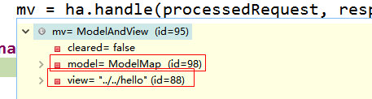

##### 步骤五：

**SpringMVC视图解析：**

> 1、方法执行后的返回值会作为页面地址参考，转发或者重定向到页面
>
> 2、视图解析器可能会进行页面地址的拼串 

```
processDispatchResult(processedRequest, response, mappedHandler, 
    mv, dispatchException);
```

1. 调用processDispatchResult(processedRequest, response, mappedHandler, mv, dispatchException)

   - 来到页面的方法视图渲染流程
   - 将域中的数据在页面展示
   - 页面就是用来渲染模型数据的

2. 调用render(mv, request, response)

   - 渲染页面

3. View与ViewResolver

   -  ViewResolver的作用是根据视图名（方法的返回值）得到View对象
   -  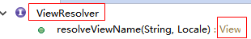 

4. 怎么能根据方法的返回值（视图名）得到View对象？

   

   ```java
   protected View resolveViewName(String viewName, Map<String, Object> model, Locale locale,
               HttpServletRequest request) throws Exception {
   
             //遍历所有的ViewResolver；
           for (ViewResolver viewResolver : this.viewResolvers) {
               
               
             //viewResolver视图解析器根据方法的返回值，得到一个View对象；
               View view = viewResolver.resolveViewName(viewName, locale);
               
               
               if (view != null) {
                   return view;
               }
           }
           return null;
       }
   ```

   - resolveViewName实现

     ```java
     @Override
         public View resolveViewName(String viewName, Locale locale) throws Exception {
             if (!isCache()) {
                 return createView(viewName, locale);
             }
             else {
                 Object cacheKey = getCacheKey(viewName, locale);
                 View view = this.viewAccessCache.get(cacheKey);
                 if (view == null) {
                     synchronized (this.viewCreationCache) {
                         view = this.viewCreationCache.get(cacheKey);
                         if (view == null) {
                             
                             
                             // Ask the subclass to create the View object.
                              //根据方法的返回值创建出视图View对象；
                             view = createView(viewName, locale);
                             
                             
                             if (view == null && this.cacheUnresolved) {
                                 view = UNRESOLVED_VIEW;
                             }
                             if (view != null) {
                                 this.viewAccessCache.put(cacheKey, view);
                                 this.viewCreationCache.put(cacheKey, view);
                                 if (logger.isTraceEnabled()) {
                                     logger.trace("Cached view [" + cacheKey + "]");
                                 }
                             }
                         }
                     }
                 }
                 return (view != UNRESOLVED_VIEW ? view : null);
             }
         }
     ```

   - 创建View对象

       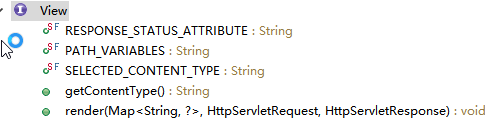 

     

     ```java
     @Override
         protected View createView(String viewName, Locale locale) throws Exception {
             // If this resolver is not supposed to handle the given view,
             // return null to pass on to the next resolver in the chain.
             if (!canHandle(viewName, locale)) {
                 return null;
             }
             // Check for special "redirect:" prefix.
             if (viewName.startsWith(REDIRECT_URL_PREFIX)) {
                 String redirectUrl = viewName.substring(REDIRECT_URL_PREFIX.length());
                 RedirectView view = new RedirectView(redirectUrl, isRedirectContextRelative(), isRedirectHttp10Compatible());
                 return applyLifecycleMethods(viewName, view);
             }
             // Check for special "forward:" prefix.
             if (viewName.startsWith(FORWARD_URL_PREFIX)) {
                 String forwardUrl = viewName.substring(FORWARD_URL_PREFIX.length());
                 return new InternalResourceView(forwardUrl);
             }
             // Else fall back to superclass implementation: calling loadView.
             //如果没有前缀就使用父类默认创建一个View；
             return super.createView(viewName, locale);
         }
     ```

      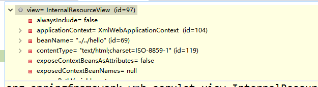 

       

   - 返回View对象

     - 视图解析器得到View对象的流程就是，所有配置的视图解析器都来尝试根据视图名（返回值）得到View（视图）对象；如果能得到就返回，得不到就换下一个视图解析器；
     - 调用View对象的render方法

     ```java
     
     @Override
         public void render(Map<String, ?> model, HttpServletRequest request, HttpServletResponse response) throws Exception {
             if (logger.isTraceEnabled()) {
                 logger.trace("Rendering view with name '" + this.beanName + "' with model " + model +
                     " and static attributes " + this.staticAttributes);
             }
     
             Map<String, Object> mergedModel = createMergedOutputModel(model, request, response);
     
             prepareResponse(request, response);
             
             
             //渲染要给页面输出的所有数据
             renderMergedOutputModel(mergedModel, request, response);
         }
     ```

   - InternalResourceView有这个方法renderMergedOutputModel；

     ```java
     @Override
         protected void renderMergedOutputModel(
                 Map<String, Object> model, HttpServletRequest request, HttpServletResponse response) throws Exception {
     
             // Determine which request handle to expose to the RequestDispatcher.
             HttpServletRequest requestToExpose = getRequestToExpose(request);
     
             // Expose the model object as request attributes.
             
             
             //将模型中的数据放在请求域中
             exposeModelAsRequestAttributes(model, requestToExpose);
     
             
             
             // Expose helpers as request attributes, if any.
             exposeHelpers(requestToExpose);
     
             // Determine the path for the request dispatcher.
             String dispatcherPath = prepareForRendering(requestToExpose, response);
     
             // Obtain a RequestDispatcher for the target resource (typically a JSP).
             RequestDispatcher rd = getRequestDispatcher(requestToExpose, dispatcherPath);
             if (rd == null) {
                 throw new ServletException("Could not get RequestDispatcher for [" + getUrl() +
                         "]: Check that the corresponding file exists within your web application archive!");
             }
     
             // If already included or response already committed, perform include, else forward.
             if (useInclude(requestToExpose, response)) {
                 response.setContentType(getContentType());
                 if (logger.isDebugEnabled()) {
                     logger.debug("Including resource [" + getUrl() + "] in InternalResourceView '" + getBeanName() + "'");
                 }
                 rd.include(requestToExpose, response);
             }
     
             else {
                 // Note: The forwarded resource is supposed to determine the content type itself.
                 if (logger.isDebugEnabled()) {
                     logger.debug("Forwarding to resource [" + getUrl() + "] in InternalResourceView '" + getBeanName() + "'");
                 }
                 
                 //转发页面
                 rd.forward(requestToExpose, response);
             }
         }
     ```

   - 将模型中的所有数据取出来全放在request域中

     ```java
     protected void exposeModelAsRequestAttributes(Map<String, Object> model, HttpServletRequest request) throws Exception {
             for (Map.Entry<String, Object> entry : model.entrySet()) {
                 String modelName = entry.getKey();
                 Object modelValue = entry.getValue();
                 if (modelValue != null) {
                     
                     //将ModelMap中的数据放到请求域中
                     request.setAttribute(modelName, modelValue);
                     
                     
                     if (logger.isDebugEnabled()) {
                         logger.debug("Added model object '" + modelName + "' of type [" + modelValue.getClass().getName() +
                                 "] to request in view with name '" + getBeanName() + "'");
                     }
                 }
                 else {
                     request.removeAttribute(modelName);
                     if (logger.isDebugEnabled()) {
                         logger.debug("Removed model object '" + modelName +
                                 "' from request in view with name '" + getBeanName() + "'");
                     }
                 }
             }
         }
     ```

     总结：

     - 视图解析器只是为了得到视图对象
     - 视图对象才能真正的转发（将模型数据全部放在请求域中）或者重定向到页面视图对象才能真正的渲染视图

   - ViewResolver

      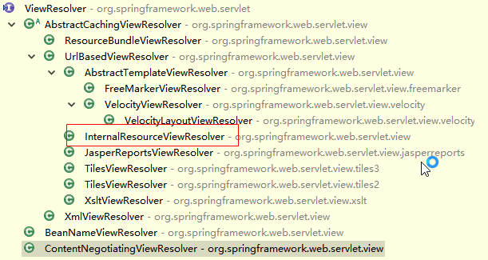 

   - View:

      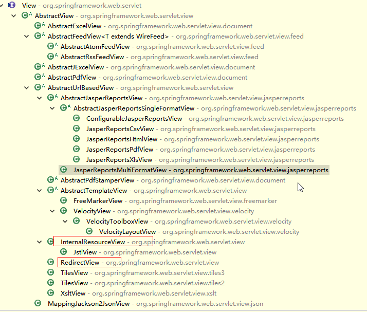 

## 8. 视图解析

### 8.1 forward和redirect前缀

通过SpringMVC来实现转发和重定向。

- 直接 return “success”，会走视图解析器进行拼串
- 转发：return “forward:/succes.jsp”；直接写绝对路径，/表示当前项目下，不走视图解析器
- 重定向：return “redirect:/success.jsp”；不走视图解析器

```java
@Controller
public class ResultSpringMVC {
   @RequestMapping("/hello01")
   public String test1(){
       //转发
       //会走视图解析器
       return "success";
  }

   @RequestMapping("/hello02")
   public String test2(){
       //转发二
       //不走视图解析器
       return "forward:/success.jsp";
  }

   @RequestMapping("/hello03")
   public String test3(){
       //重定向
       //不走视图解析器
       return "redirect:/success.jsp";
  }
}
```

使用原生的ServletAPI时要注意，**/路径需要加上项目名才能成功**

```java
   @RequestMapping("/result/t2")
   public void test2(HttpServletRequest req, HttpServletResponse resp) throwsIOException {	
       //重定向
       resp.sendRedirect("/index.jsp");
  }

   @RequestMapping("/result/t3")
   public void test3(HttpServletRequest req, HttpServletResponse resp) throwsException {
       //转发
       req.setAttribute("msg","/result/t3");
       req.getRequestDispatcher("/WEB-INF/jsp/test.jsp").forward(req,resp);
  }
```

### 8.2 jstlView

导包导入了jstl的时候会自动创建为一个jstlView；可以快速方便的支持国际化功能；

可以支持快速国际化；

javaWeb国际化步骤；

1. 得得到一个Locale对象；
2. 使用ResourceBundle绑定国际化资源文件
3. 使用ResourceBundle.getString("key")；获取到国际化配置文件中的值
4. web页面的国际化，fmt标签库来做
   - `<fmt:setLocale>`
   - `<fmt:setBundle>`
   - `<fmt:message>`

有了JstlView以后

1. 让Spring管理国际化资源就行

   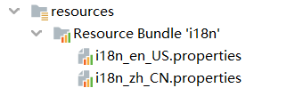

   

   ```xml
   <bean class="org.springframework.web.servlet.view.InternalResourceViewResolver">
           <property name="prefix" value="/WEB-INF/pages/"></property>
           <property name="suffix" value=".jsp"></property>
           <property name="viewClass" value="org.springframework.web.servlet.view.JstlView">			
           </property>
   </bean>
   
   <bean id="messageSource" class="org.springframework.context.support.ResourceBundleMessageSource">
           <property name="basename" value="i18n"></property>
   </bean>
   ```

2. 直接在页面使用`<fmt:message>`

```xml
<%@ taglib prefix="fmt" uri="http://java.sun.com/jsp/jstl/fmt" %>@%>
    ...
<h1>
	<fmt:message key="welcomeinfo"/>
</h1>
<form action="">
    <fmt:message key="username"/>:<input /><br/>
    <fmt:message key="password"/>:<input /><br/>
    <input type="submit" value='<fmt:message key="loginBtn"/>'/>
</form>
    ...
```

**注意：**

一定要过SpringMVC的视图解析流程，人家会创建一个jstlView帮你快速国际化；

- 不能写redirect:
- 不能写forward:

```java
		if (viewName.startsWith(FORWARD_URL_PREFIX)) {
            String forwardUrl = viewName.substring(FORWARD_URL_PREFIX.length());
            return new InternalResourceView(forwardUrl);
        }
```

### 8.3 mvc:view-controller

`mvc:view-controller`：

直接将请求映射到某个页面，不需要写方法了：

**注意：会走视图解析的功能**

在ioc.xml中加入

```xml
<mvc:view-controller path="/toLogin" view-name="login"/>
<!--开启MVC注解驱动模式-->
<mvc:annotation-driven/>
```

### 8.4 自定义视图解析器

扩展：加深视图解析器和视图对象；

- 视图解析器根据方法的返回值得到视图对象
- 多个视图解析器都会尝试能否得到视图对象
- 视图对象不同就可以具有不同功能

```java
 for (ViewResolver viewResolver : this.viewResolvers) {
     //viewResolver视图解析器根据方法的返回值，得到一个View对象；
     View view = viewResolver.resolveViewName(viewName, locale);
     if (view != null) {
         return view;
     }
 }
```

- 让我们的视图解析器工作
- 得到我们的视图对象
- 我们的视图对象自定义渲染逻辑

**自定义视图和视图解析器的步骤**

1.  编写自定义的视图解析器，和视图实现类  

   ```java
   public class MyViewResolver implements ViewResolver {
       public View resolveViewName(String viewName, Locale locale) throws Exception {
           if (viewName.startsWith("myView:")){
              return new MyView();
           }else{
               return null;
           }
       }
   }
   ```

   ```java
   public class MyView implements View {
       public String getContentType() {
           return "text/html";
       }
   
       public void render(Map<String, ?> model, HttpServletRequest request, HttpServletResponse response) throws Exception {
           System.out.println("保存的数据："+model);
           response.getWriter().write("即将展现内容:");
       }
   }
   ```

   

2.  视图解析器必须放在ioc容器中，让其工作，能创建出我们的自定义视图对象

   ```xml
   <bean class="com.chenhui.view.MyViewResolver"></bean>
   ```

   在源码中看到我们的编写的解析器

   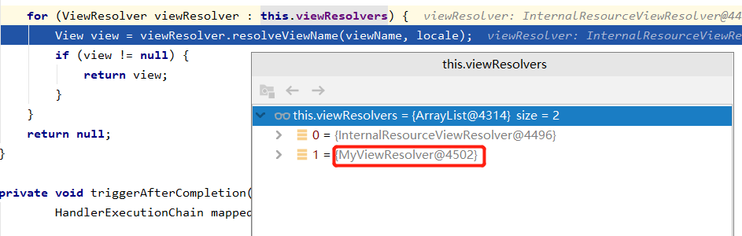

   但是被InternalResourceViewResolver先拦截了执行了render

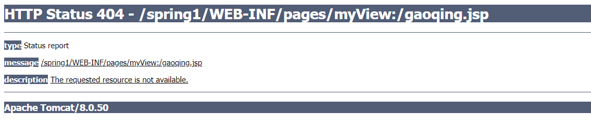

MyViewResolver要实现Ordered接口

```java
public class MyViewResolver implements ViewResolver, Ordered {

    private Integer order = 0;

    public View resolveViewName(String viewName, Locale locale) throws Exception {
        if (viewName.startsWith("myView:")) {
            return new MyView();
        } else {
            return null;
        }
    }

    public int getOrder() {
        return this.order;
    }

    public void setOrder(Integer order) {
        this.order = order;
    }
}

```

```xml
	<bean class="com.chenhui.view.MyViewResolver">
        <property name="order" value="1"></property>
    </bean>
```

发现顺序已经改变

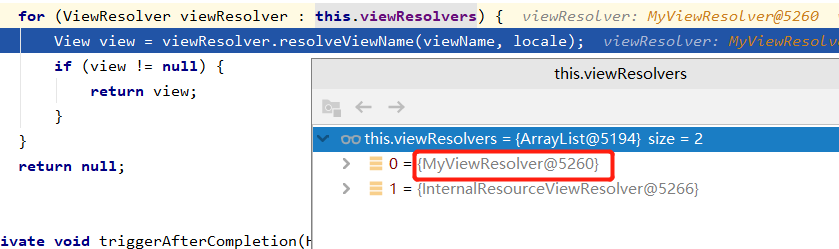

到了我们的页面（虽然乱码），需要设置ContentType

response.setContentType("text/html ");

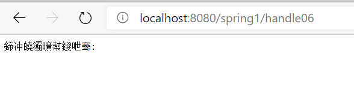

```java
public void render(Map<String, ?> model, HttpServletRequest request, HttpServletResponse response) throws Exception {
        System.out.println("保存的数据："+model);
        response.setContentType("text/html ");
        response.getWriter().write("即将展现内容:");
    }
```

成功！ 

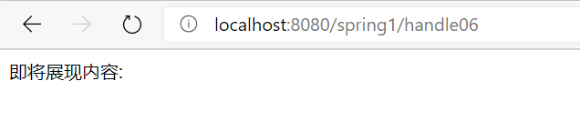

## 9. ResetCRUD

###  9.1 环境搭建

#### 	配置文件

##### 	ioc.xml

```xml
<?xml version="1.0" encoding="UTF-8"?>
<beans xmlns="http://www.springframework.org/schema/beans"
       xmlns:xsi="http://www.w3.org/2001/XMLSchema-instance"
       xmlns:context="http://www.springframework.org/schema/context"
       xsi:schemaLocation="http://www.springframework.org/schema/beans http://www.springframework.org/schema/beans/spring-beans.xsd http://www.springframework.org/schema/context http://www.springframework.org/schema/context/spring-context.xsd">

    <context:component-scan base-package="com.chenhui"></context:component-scan>

    <bean class="org.springframework.web.servlet.view.InternalResourceViewResolver">
        <property name="prefix" value="/WEB-INF/pages/"></property>
        <property name="suffix" value=".jsp"></property>
    </bean>


</beans>
```

##### web.xml

```xml
<?xml version="1.0" encoding="UTF-8"?>
<web-app xmlns="http://xmlns.jcp.org/xml/ns/javaee"
         xmlns:xsi="http://www.w3.org/2001/XMLSchema-instance"
         xsi:schemaLocation="http://xmlns.jcp.org/xml/ns/javaee http://xmlns.jcp.org/xml/ns/javaee/web-app_4_0.xsd"
         version="4.0">


    <servlet>
        <servlet-name>dispatcherServlet</servlet-name>
        <servlet-class>org.springframework.web.servlet.DispatcherServlet</servlet-class>
        <init-param>
            <param-name>contextConfigLocation</param-name>
            <param-value>classpath:ioc.xml</param-value>
        </init-param>
        <load-on-startup>1</load-on-startup>
    </servlet>
    <servlet-mapping>
        <servlet-name>dispatcherServlet</servlet-name>
        <url-pattern>/</url-pattern>
    </servlet-mapping>
    
    <filter>
        <filter-name>CharacterEncodingFilter</filter-name>
        <filter-class>org.springframework.web.filter.CharacterEncodingFilter</filter-class>
        <init-param>
            <param-name>encoding</param-name>
            <param-value>UTF-8</param-value>
        </init-param>
        <init-param>
            <param-name>forceEncoding</param-name>
            <param-value>true</param-value>
        </init-param>
    </filter>
    <filter-mapping>
        <filter-name>CharacterEncodingFilter</filter-name>
        <url-pattern>/*</url-pattern>
    </filter-mapping>

    <filter>
        <filter-name>HiddenHttpMethodFilter</filter-name>
        <filter-class>org.springframework.web.filter.HiddenHttpMethodFilter</filter-class>
    </filter>
    <filter-mapping>
        <filter-name>HiddenHttpMethodFilter</filter-name>
        <url-pattern>/*</url-pattern>
    </filter-mapping>
</web-app>
```


#### 	bean

##### 		Employee

```java
package com.chenhui.bean;


import java.util.Date;

public class Employee {

    private Integer id;
    private String lastName;

    private String email;
    //1 male, 0 female
    private Integer gender;

    private Department department;

    public Integer getId() {
        return id;
    }

    public void setId(Integer id) {
        this.id = id;
    }

    public String getLastName() {
        return lastName;
    }

    public void setLastName(String lastName) {
        this.lastName = lastName;
    }

    public String getEmail() {
        return email;
    }

    public void setEmail(String email) {
        this.email = email;
    }

    public Integer getGender() {
        return gender;
    }

    public void setGender(Integer gender) {
        this.gender = gender;
    }

    public Department getDepartment() {
        return department;
    }

    public void setDepartment(Department department) {
        this.department = department;
    }

    public Employee(Integer id, String lastName, String email, Integer gender,
                    Department department) {
        super();
        this.id = id;
        this.lastName = lastName;
        this.email = email;
        this.gender = gender;
        this.department = department;
    }

    public Employee() {
    }

    @Override
    public String toString() {
        return "Employee [id=" + id + ", lastName=" + lastName + ", email="
                + email + ", gender=" + gender + ", department=" + department
                + "]";
    }


}
```

##### Department

```java
package com.chenhui.bean;


import java.util.Date;

public class Employee {

    private Integer id;
    private String lastName;

    private String email;
    //1 male, 0 female
    private Integer gender;

    private Department department;

    public Integer getId() {
        return id;
    }

    public void setId(Integer id) {
        this.id = id;
    }

    public String getLastName() {
        return lastName;
    }

    public void setLastName(String lastName) {
        this.lastName = lastName;
    }

    public String getEmail() {
        return email;
    }

    public void setEmail(String email) {
        this.email = email;
    }

    public Integer getGender() {
        return gender;
    }

    public void setGender(Integer gender) {
        this.gender = gender;
    }

    public Department getDepartment() {
        return department;
    }

    public void setDepartment(Department department) {
        this.department = department;
    }

    public Employee(Integer id, String lastName, String email, Integer gender,
                    Department department) {
        super();
        this.id = id;
        this.lastName = lastName;
        this.email = email;
        this.gender = gender;
        this.department = department;
    }

    public Employee() {
    }

    @Override
    public String toString() {
        return "Employee [id=" + id + ", lastName=" + lastName + ", email="
                + email + ", gender=" + gender + ", department=" + department
                + "]";
    }


}

```

#### dao

##### DepartmentDao

```java
package com.chenhui.dao;

import java.util.Collection;
import java.util.HashMap;
import java.util.Map;

import com.chenhui.bean.Department;
import org.springframework.stereotype.Repository;


@Repository
public class DepartmentDao {

    private static Map<Integer, Department> departments = null;

    static{
        departments = new HashMap<Integer, Department>();

        departments.put(101, new Department(101, "D-AA"));
        departments.put(102, new Department(102, "D-BB"));
        departments.put(103, new Department(103, "D-CC"));
        departments.put(104, new Department(104, "D-DD"));
        departments.put(105, new Department(105, "D-EE"));
    }

    public Collection<Department> getDepartments(){
        return departments.values();
    }

    public Department getDepartment(Integer id){
        return departments.get(id);
    }

}
```

EmployeeDao

```java
package com.chenhui.dao;


import java.util.Collection;
import java.util.HashMap;
import java.util.Map;
import com.chenhui.bean.Department;
import com.chenhui.bean.Employee;
import org.springframework.stereotype.Repository;
import org.springframework.beans.factory.annotation.Autowired;


@Repository
public class EmployeeDao {

    private static Map<Integer, Employee> employees = null;

    @Autowired
    private DepartmentDao departmentDao;

    static{
        employees = new HashMap<Integer, Employee>();

        employees.put(1001, new Employee(1001, "E-AA", "aa@163.com", 1, new Department(101, "D-AA")));
        employees.put(1002, new Employee(1002, "E-BB", "bb@163.com", 1, new Department(102, "D-BB")));
        employees.put(1003, new Employee(1003, "E-CC", "cc@163.com", 0, new Department(103, "D-CC")));
        employees.put(1004, new Employee(1004, "E-DD", "dd@163.com", 0, new Department(104, "D-DD")));
        employees.put(1005, new Employee(1005, "E-EE", "ee@163.com", 1, new Department(105, "D-EE")));
    }

    private static Integer initId = 1006;

    public void save(Employee employee){
        if(employee.getId() == null){
            employee.setId(initId++);
        }

        employee.setDepartment(departmentDao.getDepartment(employee.getDepartment().getId()));
        employees.put(employee.getId(), employee);
    }

    public Collection<Employee> getAll(){
        return employees.values();
    }

    public Employee get(Integer id){
        return employees.get(id);
    }

    public void delete(Integer id){
        employees.remove(id);
    }
}

```

### 9.2 Controller编写

#### EmployeeController

```java
package com.chenhui.controller;

import com.chenhui.bean.Department;
import com.chenhui.bean.Employee;
import com.chenhui.dao.DepartmentDao;
import com.chenhui.dao.EmployeeDao;
import org.springframework.beans.factory.annotation.Autowired;
import org.springframework.stereotype.Controller;
import org.springframework.ui.Model;
import org.springframework.web.bind.annotation.*;

import java.util.Collection;

@Controller
public class EmployeeController {

    @Autowired
    EmployeeDao employees;

    @Autowired
    DepartmentDao departments;

    @RequestMapping(value = "/emp", method = RequestMethod.GET)
    public String getEmps(Model model) {
        Collection<Employee> all = employees.getAll();
        model.addAttribute("emps", all);
        return "list";
    }

    @RequestMapping(value = "/emp", method = RequestMethod.POST)
    public String addEmp(Employee employee, Model model) {

        employees.save(employee);

        return "redirect:/emp";
    }

    @RequestMapping(value = "/emp/{id}", method = RequestMethod.GET)
    public String getEmp(@PathVariable("id") Integer id, Model model) {
        Employee employee = employees.get(id);
        Collection<Department> departments = this.departments.getDepartments();
        //此处给spring表单添加一个employee对象，以免发生command未找到的异常
        model.addAttribute("employee", employee);
        model.addAttribute("departments", departments);
        return "editEmp";
    }

    @RequestMapping(value = "/emp/{id}", method = RequestMethod.PUT)
    public String updateEmp(@ModelAttribute("employee") Employee employee, @PathVariable("id") Integer integer) {
        System.out.println("要修改的：" + employee);
        employees.save(employee);
        return "redirect:/emp";
    }

    @RequestMapping(value = "/emp/{id}", method = RequestMethod.DELETE)
    public String deleteEmp(@PathVariable("id") Integer id) {
        employees.delete(id);
        return "redirect:/emp";
    }

    @ModelAttribute
    public void myMethodAttribute(@RequestParam(value = "id", required = false) Integer id, Model model) {
        System.out.println("modelAttribute");
        if (id != null) {
            Employee employee = employees.get(id);
            model.addAttribute("employee", employee);
        }

    }


    @RequestMapping("/toaddpage")
    public String toAddPage(Model model) {
        Collection<Department> all = departments.getDepartments();

        model.addAttribute("departments", all);
        model.addAttribute("command", new Employee());
        return "addEmp";
    }

}
```

### 9.3 Jsp编写

#### list.jsp

```jsp
<%@ taglib prefix="c" uri="http://java.sun.com/jsp/jstl/core" %>
<%--
  Created by IntelliJ IDEA.
  User: admin
  Date: 2020/11/13
  Time: 9:18
  To change this template use File | Settings | File Templates.
--%>
<%@ page contentType="text/html;charset=UTF-8" language="java" %>
<html>
<head>
    <title>员工列表</title>
</head>
<body>
<% pageContext.setAttribute("ctp", request.getContextPath());
//    System.out.println(request.getContextPath());
%>
<h1>员工列表</h1>
<table border="1" cellpadding="5px" cellspacing="0">
    <%--
        private Integer id;
        private String lastName;
        private String email;
        //1 male, 0 female
        private Integer gender;

        private Department department;--%>
    <thead>
    <tr>
        <th>ID</th>
        <th>lastName</th>
        <th>email</th>
        <th>gender</th>
        <th>departmentName</th>
        <th>EDIT</th>
        <th>DELETE</th>
    </tr>
    </thead>
    <tbody>
    <c:forEach items="${emps}" var="emp">
        <tr>
            <td>${emp.id}</td>
            <td>${emp.lastName}</td>
            <td>${emp.email}</td>
            <td>${emp.gender==0?"女":"男"}</td>
            <td>${emp.department.departmentName}</td>
            <td><a href="${ctp}/emp/${emp.id}">修改</a></td>
            <!--删除操作可以绑定单击事件，使用ajax发送delete请求-->
            <td>
                <form action="${ctp}/emp/${emp.id}" method="post">
                    <input type="hidden" name="_method" value="DELETE">
                    <input type="submit" value="delete">
                </form>
            </td>
        </tr>
    </c:forEach>
    </tbody>

</table>
<a href="toaddpage">添加员工</a>
</body>
</html>
```

#### addEmp.jsp

```jsp
<%@ taglib prefix="c" uri="http://java.sun.com/jsp/jstl/core" %>
<%@ taglib prefix="form" uri="http://www.springframework.org/tags/form" %>
<%--
  Created by IntelliJ IDEA.
  User: admin
  Date: 2020/11/13
  Time: 9:42
  To change this template use File | Settings | File Templates.
--%>
<%@ page contentType="text/html;charset=UTF-8" language="java" %>
<html>
<head>
    <title>添加员工</title>
</head>
<body>
原生表单：<br>

<%
    pageContext.setAttribute("ctp",request.getContextPath());
%>
<form action="${ctp}/emp" method="post">
    姓名：<input type="text" name="lastName"><br>
    邮箱：<input type="text" name="email"><br>
    性别：<br>
    男：<input type="radio" name="gender" value="1"><br>
    女：<input type="radio" name="gender" value="0"><br>
    部门：<select name="department.id">
    <c:forEach items="${departments}" var="department">
        <option value="${department.id}">${department.departmentName}</option>
    </c:forEach>
</select>
    <input type="submit" value="提交">
</form>

SpringMVC表单：<br>
<form:form action="${ctp}/emp" method="post">
    姓名：<form:input path="lastName"></form:input><br>
    邮箱：<form:input path="email"></form:input><br>
    性别：<br>
    男：<form:radiobutton path="gender" value="1"></form:radiobutton>
    女：<form:radiobutton path="gender" value="0"></form:radiobutton><br>
    部门：<form:select path="department.id" items="${departments}"
                    itemLabel="departmentName" itemValue="id">
        </form:select>
    <input type="submit" value="提交">
</form:form>
</body>
</html>
```

Spring表单需要在model中添加command：

```xml
<form:form action="" modelAttribute="xxxx">
```

也可以用modelAttribute替换command变量名

- command对象的信息会放在SpringForm中

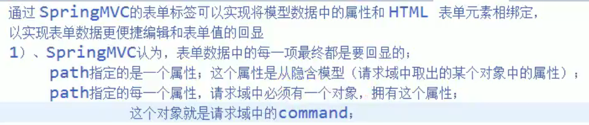

```java
@RequestMapping("/toaddpage")
    public String toAddPage(Model model) {
        Collection<Department> all = departments.getDepartments();

        model.addAttribute("departments", all);
        model.addAttribute("command", new Employee());
        return "addEmp";
    }
```

不然Spring表单会报错：

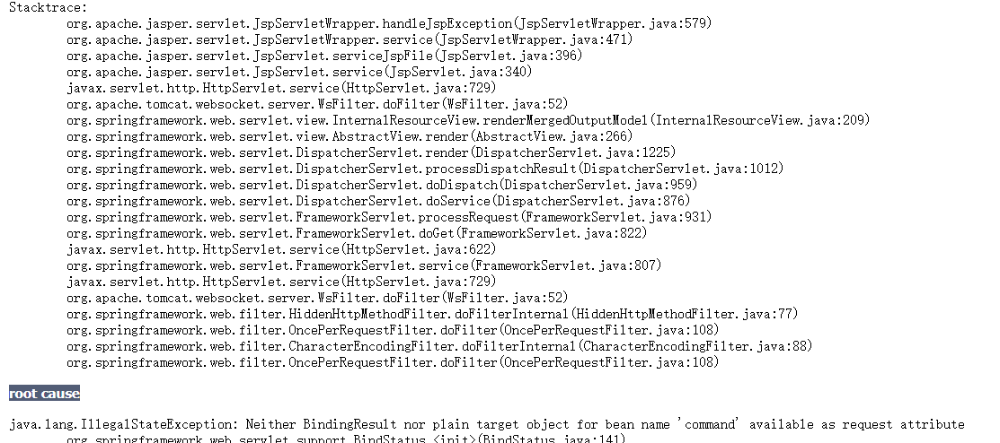

#### editEmp.jsp

```jsp
<%@ taglib prefix="form" uri="http://www.springframework.org/tags/form" %>
<%--
  Created by IntelliJ IDEA.
  User: admin
  Date: 2020/11/13
  Time: 11:34
  To change this template use File | Settings | File Templates.
--%>
<%@ page contentType="text/html;charset=UTF-8" language="java" %>
<%
    pageContext.setAttribute("ctp", request.getContextPath());
%>
<html>
<head>
    <title>编辑员工</title>
</head>
<body>

<form:form action="${ctp}/emp/${employee.id}" method="post" modelAttribute="employee">
    <input type="hidden" name="_method" value="put">
    <input type="hidden" name="id" value="${employee.id}">

    姓名：<form:input path="lastName"></form:input><br>
    邮箱：<form:input path="email"></form:input><br>
    性别：<br>
    男：<form:radiobutton path="gender" value="1"></form:radiobutton>
    女：<form:radiobutton path="gender" value="0"></form:radiobutton><br>
    部门：
    <form:select path="department.id" items="${departments}"
                 itemLabel="departmentName" itemValue="id">
    </form:select>
    <input type="submit" value="修改">
</form:form>
</body>
</html>

```

### 9.4 解决DispatcherServlet拦截静态文件

**让Tomcat托管js文件**

- 在ioc.xml文件中加入

```xml
   <mvc:default-servlet-handler/>
   <mvc:annotation-driven/>
```

## 10. 数据转换 & 数据格式化 & 数据校验

### 10.1 数据转换

> ```markdown
> SpringMVC封装自定义类型对象的时候？
> javaBean要和页面提交的数据进行一一绑定？
> 1）、页面提交的所有数据都是字符串？
> 2）、Integer age,Date birth;
>        employName=zhangsan&age=18&gender=1
>        String age = request.getParameter("age");
> 牵扯到以下操作；
> 1）、数据绑定期间的数据类型转换？String--Integer String--Boolean,xxx
> 2）、数据绑定期间的数据格式化问题？比如提交的日期进行转换
>             birth=2017-12-15----->Date    2017/12/15  2017.12.15  2017-12-15
> 3）、数据校验？
>             我们提交的数据必须是合法的？
>             前端校验：js+正则表达式；
>             后端校验：重要数据也是必须的；
>             1）、校验成功！数据合法
>             2）、校验失败？
> ```

bindRequestParameters方法将请求参数于JavaBean进行绑定，为自定义对象赋值。

```java
ModelAttributeMethodProcessor
public final Object resolveArgument(
            MethodParameter parameter, ModelAndViewContainer mavContainer,
            NativeWebRequest request, WebDataBinderFactory binderFactory)
            throws Exception {
        String name = ModelFactory.getNameForParameter(parameter);
        Object attribute = (mavContainer.containsAttribute(name)) ?
                mavContainer.getModel().get(name) : createAttribute(name, parameter, binderFactory, request);
    
    	//WebDataBinder
        WebDataBinder binder = binderFactory.createBinder(request, attribute, name);
    
    
        if (binder.getTarget() != null) {
            
               //将页面提交过来的数据封装到javaBean的属性中
            bindRequestParameters(binder, request);
               //+++++++++
            
            validateIfApplicable(binder, parameter);
            if (binder.getBindingResult().hasErrors()) {
                if (isBindExceptionRequired(binder, parameter)) {
                    throw new BindException(binder.getBindingResult());
                }
            }
        }

```

#### WebDataBinder：

**数据绑定器有什么用？**

1. 数据绑定器负责数据绑定工作
2. 数据绑定期间产生的类型转换、格式化、数据校验等问题

  

- conversionService组件：

  - 负责数据类型的转换以及格式化功能；     
  - ConversionService中有非常多的**converter；**   
  - 不同类型的转换和格式化用它自己的**converter**

  ```java
      ...
  @org.springframework.format.annotation.DateTimeFormat java.util.Date -> java.lang.String: org.springframework.format.datetime.DateTimeFormatAnnotationFormatterFactory@32abc654
      @org.springframework.format.annotation.NumberFormat java.lang.Double -> java.lang.String: org.springframework.format.number.NumberFormatAnnotationFormatterFactory@140bb45d
      @org.springframework.format.annotation.NumberFormat java.lang.Float -> java.lang.String: org.springframework.format.number.NumberFormatAnnotationFormatterFactory@140bb45d
      ....
  org.springframework.format.number.NumberFormatAnnotationFormatterFactory@140bb45d
      java.lang.String -> @org.springframework.format.annotation.NumberFormat java.math.BigInteger: org.springframework.format.number.NumberFormatAnnotationFormatterFactory@140bb45d
      java.lang.String -> java.lang.Boolean : org.springframework.core.convert.support.StringToBooleanConverter@22f562e2
      java.lang.String -> java.lang.Character : org.springframework.core.convert.support.StringToCharacterConverter@5f2594f5
      java.lang.String -> java.lang.Enum : org.springframework.core.convert.support.StringToEnumConverterFactory@1347a7be
      【java.lang.String -> java.lang.Number : 
  ...
      java...
  ```

  

- validators负责数据校验工作

 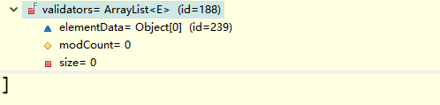 

-  bindingResult负责保存以及解析数据绑定期间数据校验产生的错误

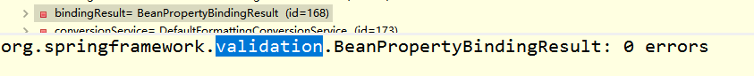 


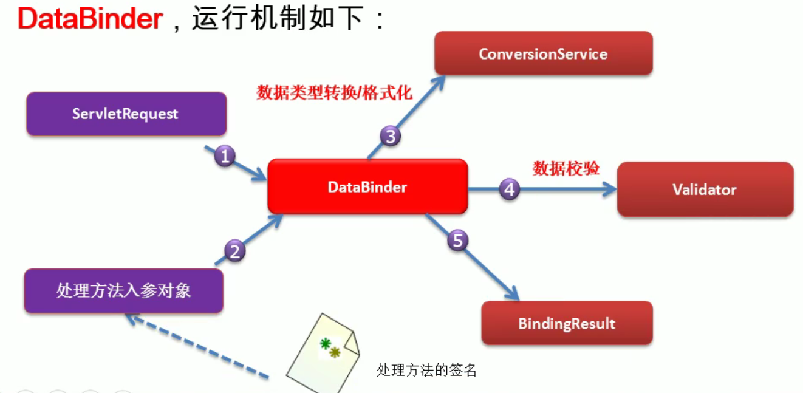

#### 自定义类型转换器：

步骤：

1. ConversionService:：是一个接口

   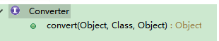 

2. Converter是ConversionService中的组件；

   1. Converter得放进ConversionService 中；
   2. 将WebDataBinder中的ConversionService设置成我们这个加了自定义类型转换器的ConversionService；

3. 配置ConversionService

需要实现的步骤

1. 实现Converter接口，写一个自定义的类型转换器

   ```java
   public class MyStringToEmployeeConverter implements Converter<String, Employee> {
   
       @Autowired
       DepartmentDao departmentDao;
   
       public Employee convert(String source) {
           System.out.println("将要转换的字符串" + source);
           Employee employee = new Employee();
           if (source.contains("-")) {
               String[] split = source.split("-");
               employee.setLastName(split[0]);
               employee.setEmail(split[1]);
               employee.setGender(Integer.parseInt(split[2]));
               employee.setDepartment(departmentDao.getDepartment(Integer.parseInt(split[3])));
           }
           return employee;
       }
   }
   ```

2. 配置出ConversionService

   在ioc.xml中

   ```xml
   
       <bean id="myconversionService"			class="org.springframework.context.support.ConversionServiceFactoryBean">
           <!--
   				ConversionServiceFactoryBean:
   				创建的ConversionService组件是没有格式化器(formatter)存在的；
   				推荐使用：
   		"org.springframework.format.support.FormattingConversionServiceFactoryBean"
   		-->
           <property name="converters">
               <set>
                   <bean class="com.chenhui.component.MyStringToEmployeeConverter"/>	
               </set>
           </property>
       </bean>
   ```

3. 让SpringMVC用我们的ConversionService

   ```xml
   <mvc:annotation-driven conversion-service="myconversionService"></mvc:annotation-driven>
   ```

   

#### 动态资源和静态资源访问

1. `<mvc:default-servlet-handler/> ` 与 `<mvc:annotation-driven/>`

   1. 都没配

      - 动态能访问：

        DefaultAnnotationHandlerMapping中的handlerMap中保存了每一个资源的映射信息

      - 静态不能访问：

        handlerMap中没有保存静态资源映射的请求

         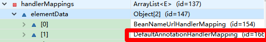 

          

      - handleAdapter

         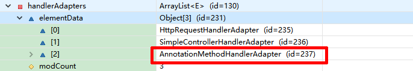 

   2. `<mvc:default-servlet-handler/>`不加`<mvc:annotation-driven/>`

      - 动态不能访问：DefaultAnnotationHandlerMapping被SimpleUrlHandlerMapping替换。

      - 静态能访问的原因：SimpleUrlHandlerMapping把所有请求都映射给tomcat；

         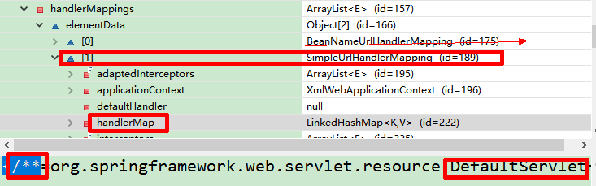 

      - handleAdapter

         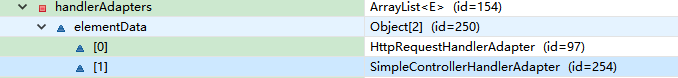 

   3. 都加上

      - 都能访问

        handlerMap

          

      - RequestMappingHandlerMapping:动态资源可以访问

         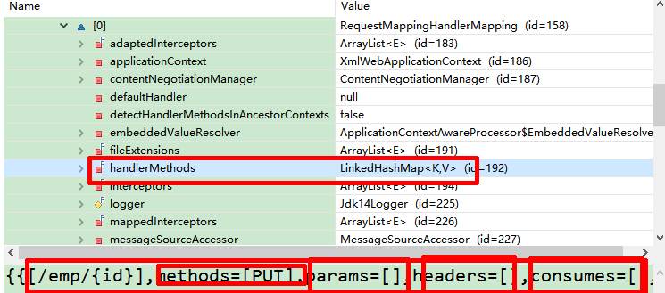 

        > **handleMethods属性保存了每一个请求用哪个方法来处理；**
        >
        > **SimpleUrlHandlerMapping：将请求直接交给tomcat；有他，静态资源就没问题**

      - handleAdapter

         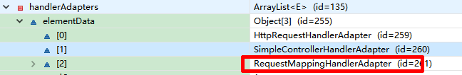 

        原来的AnnotationMethodHandlerAdapter被换成RequestMappingHandlerAdapter

   4. 只加`<mvc:annotation-driven/>`

      - 动态能访问，静态无法访问

### 10.2 数据格式化

在SpringMVC中Controller中方法参数为Date类型想要限定请求传入时间格式时，可以通过@DateTimeFormat来指定，但请求传入参数与指定格式不符时，会返回400错误。

如果在Bean属性中有Date类型字段，想再序列化转为指定格式时，也可用@DateTimeFormat来指定想要的格式。如下：

 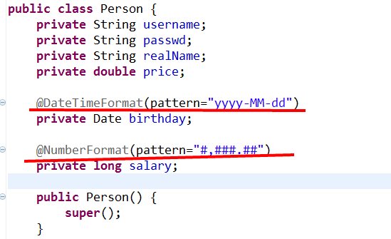 

**使用数据格式化**

1. 在属性上加Format标签

2. 更改转换器

   例：

```java
@DateTimeFormat(pattern = "yyyy-MM-dd")
    private Date birth;
```

```xml
	<bean id="myconversionService" 		class="org.springframework.format.support.FormattingConversionServiceFactoryBean">
        <property name="converters">
            <set>
                <bean class="com.chenhui.component.MyStringToEmployeeConverter"/>
            </set>
        </property>
    </bean>
```

### 10.3 数据校验

#### 步骤

- 导入Jar包

```xml
		<dependency>
            <groupId>javax.validation</groupId>
            <artifactId>validation-api</artifactId>
            <version>1.1.0.Final</version>
        </dependency>

        <dependency>
            <groupId>org.hibernate</groupId>
            <artifactId>hibernate-validator</artifactId>
            <version>5.4.1.Final</version>
        </dependency>
        <dependency>
            <groupId>org.jboss.logging</groupId>
            <artifactId>jboss-logging</artifactId>
            <version>3.3.0.Final</version>
        </dependency>
        <dependency>
            <groupId>com.fasterxml</groupId>
            <artifactId>classmate</artifactId>
            <version>1.3.3</version>
        </dependency>
```

- 在变量上放上注解，错误信息message

```java
	@NotNull
    @Length(min = 5, max = 10,message='xxxx')
    private String lastName;


    @DateTimeFormat(pattern = "yyyy-MM-dd")
    @Past
    private Date birth;

```

- 对SpringMVC封装对象加上@Valid注解
- 校验结果在BindingResult的result中

```java
    @RequestMapping(value = "/emp", method = RequestMethod.POST)
    public String addEmp(@Valid Employee employee, BindingResult result, Model model) {

        if (result.hasErrors()){
            System.out.println("有校验错误");
            return "addEmp";
        }else{
            employees.save(employee);
        }


        return "redirect:/emp";
    }
```

- 来到页面使用form:errors取出错误信息
- 可以把错误信息存到Model中，然后在页面中取Model的对应的key

```jsp
<form:form action="${ctp}/emp" method="post">
    姓名：<form:input path="lastName"></form:input><form:errors path="lastName"></form:errors><br>
    邮箱：<form:input path="email"></form:input><form:errors path="email"></form:errors><br>
    生日：<form:input path="birth"></form:input><form:errors path="birth"></form:errors><br>
    性别：<br>
    男：<form:radiobutton path="gender" value="1"></form:radiobutton>
    女：<form:radiobutton path="gender" value="0"></form:radiobutton><br>
    部门：<form:select path="department.id" items="${departments}"
                    itemLabel="departmentName" itemValue="id">
        </form:select>
    <input type="submit" value="提交">
</form:form>
```

#### 原生Form显示错误：

1）、原生的表单怎么办？   

将错误放在Model中就行了

#### 国际化定制

国际化定制自己的错误消息显示

​	编写国际化的文件

- errors_zh_CN.properties
- errors_en_US.properties

key有规定（精确优先）：

```markdown
 codes
     [
          Email.employee.email,      校验规则.隐含模型中这个对象的key.对象的属性
          Email.email,                       校验规则.属性名
          Email.java.lang.String,      校验规则.属性类型
          Email
    ];

```

1、先编写国际化配置文件

 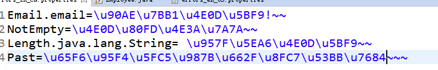 

2、让SpringMVC管理国际化资源文件

```xml
<!-- 管理国际化资源文件 -->
    <bean id="messageSource" class="org.springframework.context.support.ResourceBundleMessageSource">
        <property name="basename" value="errors"></property>
    </bean>
```

3、来到页面取值

4、高级国际化？  

​	 动态传入消息参数；

 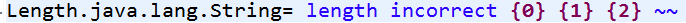 

{0}：永远都是当前属性名；

​		@Length(min = 5, max = 10,message='xxxx')

按照字母排序

{1}为max {2}为min


## 11. 其他数据响应与接受

```markdown
ajax；
1、SpringMVC快速的完成ajax功能？
     1）、返回数据是json就ok；
     2）、页面,$.ajax()；
2、原生javaWeb：
     1）、导入GSON；
     2）、返回的数据用GSON转成json
     3）、写出去；
3、SpringMVC-ajax：
     1、导包
        jackson-annotations-2.1.5.jar
        jackson-core-2.1.5.jar
        jackson-databind-2.1.5.jar
     2、写配置
     3、测试
```

### 11.1 Json数据响应与接受

#### ResponseBody

maven导入包

```xml
		<dependency>
            <groupId>com.fasterxml.jackson.core</groupId>
            <artifactId>jackson-annotations</artifactId>
            <version>2.1.5</version>
        </dependency>
        <dependency>
            <groupId>com.fasterxml.jackson.core</groupId>
            <artifactId>jackson-core</artifactId>
            <version>2.1.5</version>
        </dependency>
        <dependency>
            <groupId>com.fasterxml.jackson.core</groupId>
            <artifactId>jackson-databind</artifactId>
            <version>2.1.5</version>
        </dependency>
```

```java
@Controller
public class AjaxController {
    @Autowired
    EmployeeDao employeeDao;


    @ResponseBody
    @RequestMapping("/getallajax")
    public Collection<Employee> ajaxGetAll() {
        Collection<Employee> all = employeeDao.getAll();
        return all;
    }
}
```

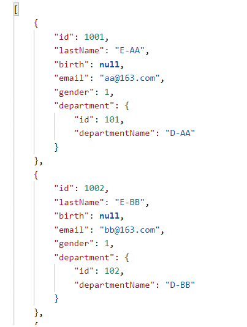


- @JsonIgnore可以忽略字段

- @JsonFormat(pattern="")自定制序列化字段格式

- ```java
      @DateTimeFormat(pattern = "yyyy-MM-dd")
      @Past
      @JsonFormat(pattern = "yyyy-MM-dd")
      private Date birth;
  
      private String email;
      //1 male, 0 female
  
      private Integer gender;
  
      @JsonIgnore
      private Department department;
  ```

  输入：

  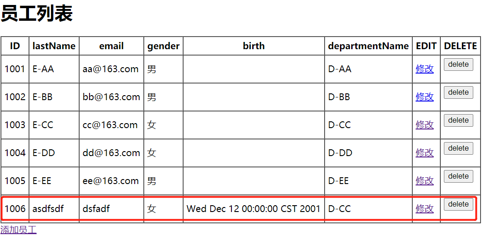

  结果：

  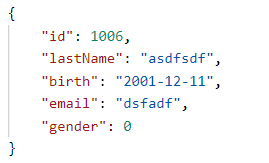


#### RequestBody

- 可以接受json数据


#### HttpEntity<String>

- 代替RequestBody，
- 不仅能拿请求体数据，还能拿请求头数据

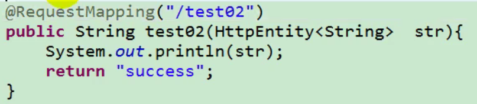

#### ResponseEntity<String>

- 可以设置响应头

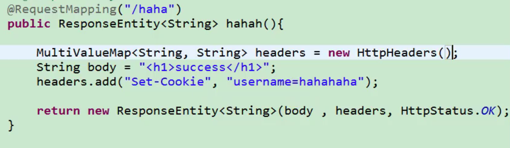

### 11.2 文件上传与下载

#### 文件上传

##### 单文件上传:

maven导入包

```xml
		<dependency>
            <groupId>commons-io</groupId>
            <artifactId>commons-io</artifactId>
            <version>2.0</version>
        </dependency>
        <dependency>
            <groupId>commons-fileupload</groupId>
            <artifactId>commons-fileupload</artifactId>
            <version>1.2.1</version>
        </dependency>
```

编写控制器

```java
package com.chenhui.controller;

import org.springframework.stereotype.Controller;
import org.springframework.ui.Model;
import org.springframework.web.bind.annotation.RequestMapping;
import org.springframework.web.bind.annotation.RequestParam;
import org.springframework.web.multipart.MultipartFile;

import java.io.File;
import java.io.IOException;

@Controller
public class FileUploadController {
    @RequestMapping("/upload")
    public String upload(@RequestParam(value = "username", required = false) String username,
                         @RequestParam(value = "headerImg", required = false) MultipartFile file,
                         Model model){


        System.out.println("上传信息");
        System.out.println("文件名"+file.getName());
        System.out.println("文件初始名"+file.getOriginalFilename());

        try {
            file.transferTo(new File("D:\\upload\\"+file.getOriginalFilename()));
            model.addAttribute("message","文件上传成功");
        } catch (IOException e) {
            e.printStackTrace();
            model.addAttribute("message","文件上传失败"+e.getCause());
        }

        return "list";

    }
}
```

注册文件上传解析器

```xml
    <bean id="multipartResolver" class="org.springframework.web.multipart.commons.CommonsMultipartResolver">
        <property name="maxUploadSize" value="#{1024*1024*20}"></property>
        <property name="defaultEncoding" value="utf-8"></property>
    </bean>
```

编写jsp页面

```jsp
<%@ taglib prefix="c" uri="http://java.sun.com/jsp/jstl/core" %>
<%--
  Created by IntelliJ IDEA.
  User: admin
  Date: 2020/11/13
  Time: 9:18
  To change this template use File | Settings | File Templates.
--%>
<%@ page contentType="text/html;charset=UTF-8" language="java" %>
<html>
<head>
    <title>员工列表</title>
</head>
<body>
<% pageContext.setAttribute("ctp", request.getContextPath());
//    System.out.println(request.getContextPath());
%>
<a href="toaddpage">添加员工</a><br>
<hr>
<h1>${message}</h1>
<form action="${ctp}/upload" method="post" enctype="multipart/form-data">
    头像：<input type="file" name="headerImg">
    昵称：<input type="text" name="username">
    <input type="submit" value="提交">
</form>
</body>
</html>

```

结果

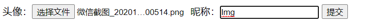

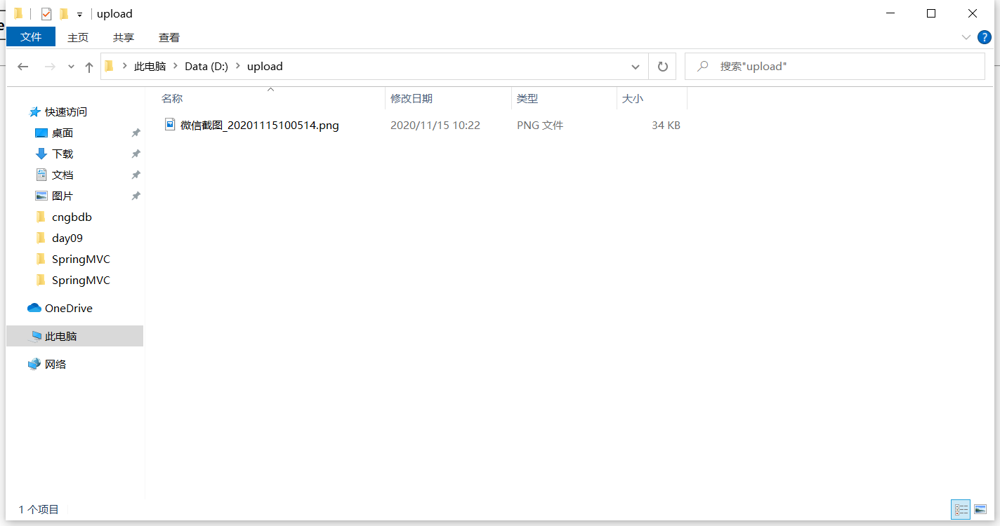

##### 多文件上传:

```java
@Controller
public class FileUploadController {
    @RequestMapping("/upload")
    public String upload(@RequestParam(value = "username", required = false) String username,
                         @RequestParam(value = "headerImg", required = false) MultipartFile[] files,
                         Model model){
		
        for(MultipartFile file: files){
            
            System.out.println("上传信息");
            System.out.println("文件名"+file.getName());
            System.out.println("文件初始名"+file.getOriginalFilename());
			if(!file.isEmpty()){
                try {
                    file.transferTo(new File("D:\\upload\\"+file.getOriginalFilename()));
                    model.addAttribute("message","文件上传成功");
                } catch (IOException e) {
                    e.printStackTrace();
                    model.addAttribute("message","文件上传失败"+e.getCause());
                }
            }
            return "list";                       
        }       
    }
}
```


#### 文件下载

```java
@Controller
public class DownloadController {
    @RequestMapping(value = "/DownLoad/{fileName}/{fileType}", method = RequestMethod.GET)
    public ResponseEntity<byte[]> download(HttpServletRequest request, @PathVariable String fileName, @PathVariable String fileType) throws IOException {
        File file = new File("D:\\Apks\\" + fileName + "." + fileType);
        byte[] body = null;
        InputStream is = new FileInputStream(file);
        body = new byte[is.available()];
        is.read(body);
        HttpHeaders headers = new HttpHeaders();
        headers.add("Content-Disposition", "attchement;filename=" + file.getName());
        HttpStatus statusCode = HttpStatus.OK;
        ResponseEntity<byte[]> entity = new ResponseEntity<>(body, headers, statusCode);
        return entity;
    }
}
```

### 11.3 HttpMessageConverter<T>接口:

>  **Spring3.0 新添加的一个接口，负责**
>
> **将请求信息转换为一个对象（类型为 T）**
>
> **将对象（类型为 T）输出为响应信息**

注意：一般Controller返回String类型是走视图解析（ViewResolver）

​			如果返回其他类型是由HttpMessageConverter负责

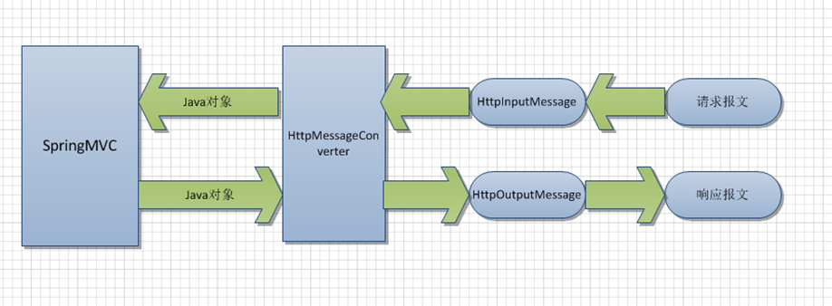

HttpMessageConverter<T>接口定义的方法：

- Boolean canRead(Class<?> clazz,MediaType mediaType): 
  - 指定转换器可以读取的对象类型，即转换器是否可将请求信息转换为 clazz 类型的对象，同时指定支持 MIME 类型(text/html,applaiction/json等)
- Boolean canWrite(Class<?> clazz,MediaType mediaType):
  - 指定转换器是否可将 clazz 类型的对象写到响应流中，响应流支持的媒体类型在MediaType 中定义
- LIst<MediaType> getSupportMediaTypes()：
  - 该转换器支持的媒体类型
- T read(Class<? extends T> clazz,HttpInputMessage inputMessage)：
  - 将请求信息流转换为 T 类型的对象
- void write(T t,MediaType contnetType,HttpOutputMessgae outputMessage):
  - 将T类型的对象写到响应流中，同时指定相应的媒体类型为 contentType

## 12. 拦截器

> SpringMVC提供了拦截器机制：
> 	允许运行目标方法之前进行一些拦截工作，或者目标方法运行之后进行一些其他处理。
> 	
> Filter：javaWeb
> HandlerInterceptor：SpringMVC

**HandlerInterceptor**：

- preHandle：在目标方法运行之前调用：
  - 返回boolean
    - return true；(chain.doFilter())放行；
    -  return false；不放行

- postHandle：在目标方法运行之后调用
- afterCompletion：资源响应之后调用

### 12.1 操作步骤

1. 实现HandlerInterceptor接口

   ```java
   package com.chenhui.interceptor;
   
   import org.springframework.web.servlet.HandlerInterceptor;
   import org.springframework.web.servlet.ModelAndView;
   
   import javax.servlet.http.HttpServletRequest;
   import javax.servlet.http.HttpServletResponse;
   
   public class MyFirstInterceptor implements HandlerInterceptor {
   
       public boolean preHandle(HttpServletRequest request, HttpServletResponse response, Object handler) throws Exception {
           System.out.println("MyFirstInterceptor...preHandle");
           return true;
       }
   
       public void postHandle(HttpServletRequest request, HttpServletResponse response, Object handler, ModelAndView modelAndView) throws Exception {
           System.out.println("MyFirstInterceptor...postHandle");
       }
   
       public void afterCompletion(HttpServletRequest request, HttpServletResponse response, Object handler, Exception ex) throws Exception {
           System.out.println("MyFirstInterceptor...afterCompletion");
       }
   }
   ```

2. 配置拦截器

   ```xml
       <mvc:interceptors>
           <!--默认拦截所有请求↓-->
           <!-- <bean class="com.chenhui.interceptor.MyFirstInterceptor"></bean>-->
   
           <!--拦截具体请求↓-->
           <mvc:interceptor>
               <!--只拦截path所对应的请求-->
               <mvc:mapping path="/testInter"/>
               <bean class="com.chenhui.interceptor.MyFirstInterceptor"></bean>
           </mvc:interceptor>
       </mvc:interceptors>
   ```

   testInter控制器如下

   ```java
   @Controller
   public class InterceptorTestController {
   
       @RequestMapping("/testInter")
       public String testInterceptor(){
           return "hello";
       }
   }
   
   ```

   hello.jsp：

   ```jsp
   <% pageContext.setAttribute("ctp",request.getContextPath());%>
   
   <%@ page contentType="text/html;charset=UTF-8" language="java" pageEncoding="UTF-8" %>
   <html>
     <head>
       <title>$Title$</title>
     </head>
     <body>
     <a href="testInter">测试拦截器</a>
     </body>
   </html>
   <%--<jsp:forward page="/emp"></jsp:forward>--%>
   ```

   

3. 拦截器的运行流程

   1. preHandle
   2. 目标方法
   3. postHandle
   4. 页面渲染
   5. afterCompletion

   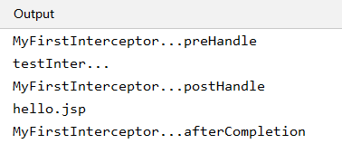

   其他流程：

   1. 只要preHandle不放行就没有以后的流程；

      - preHandle return false

      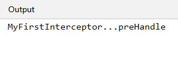

   2. 只要放行了，afterCompletion都会执行；

      - 目标方法出现异常，afterCompletion也会执行

        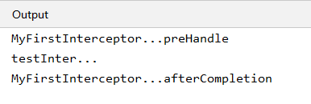

### 12.2 多个拦截器


```
MyFirstInterceptor...preHandle...
MySecondInterceptor...preHandle...
目标方法....
MySecondInterceptor...postHandle...
MyFirstInterceptor...postHandle...
响应页面....
MySecondInterceptor...afterCompletion...
MyFirstInterceptor...afterCompletion
```

**异常流程：**

1. 哪一块Interceptor不放行

   1. 哪一块不放行从此以后都没有

2. MySecondInterceptor不放行

   1. 但是他前面已经放行了的拦截器的afterCompletion总会执行

   ​	

**总结interceptor的流程：**

拦截器的preHandle：是按照顺序执行

拦截器的postHandle：是按照逆序执行

拦截器的afterCompletion：是按照逆序执行

已经放行了的拦截器的afterCompletion总会执行

### 12.3 拦截器源码

在DispatcherServlet中

```java
try {
            ModelAndView mv = null;
            Exception dispatchException = null;

            try {
                processedRequest = checkMultipart(request);
                multipartRequestParsed = processedRequest != request;

                
                // Determine handler for the current request.拿到方法的执行链，包含拦截器
                mappedHandler = getHandler(processedRequest);
                
                
                
                if (mappedHandler == null || mappedHandler.getHandler() == null) {
                    noHandlerFound(processedRequest, response);
                    return;
                }

                
                // Determine handler adapter for the current request.
                HandlerAdapter ha = getHandlerAdapter(mappedHandler.getHandler());

                // Process last-modified header, if supported by the handler.
                String method = request.getMethod();
                boolean isGet = "GET".equals(method);
                if (isGet || "HEAD".equals(method)) {
                    long lastModified = ha.getLastModified(request, mappedHandler.getHandler());
                    if (logger.isDebugEnabled()) {
                        String requestUri = urlPathHelper.getRequestUri(request);
                        logger.debug("Last-Modified value for [" + requestUri + "] is: " + lastModified);
                    }
                    if (new ServletWebRequest(request, response).checkNotModified(lastModified) && isGet) {
                        return;
                    }
                }

                
                
               //拦截器preHandle执行位置;有一个拦截器返回false目标方法以后都不会执行；直接跳到afterCompletion
                if (!mappedHandler.applyPreHandle(processedRequest, response)) {
                    return;
                }

                
                
                try {
                    // Actually invoke the handler.适配器执行目标方法
                    mv = ha.handle(processedRequest, response, mappedHandler.getHandler());
                }
                finally {
                    if (asyncManager.isConcurrentHandlingStarted()) {
                        return;
                    }
                }

                applyDefaultViewName(request, mv);
                
                
                
                 //目标方法只要正常就会走到postHandle;任何期间有异常
                mappedHandler.applyPostHandle(processedRequest, response, mv);
                
                
                
            }
            catch (Exception ex) {
                dispatchException = ex;
            }

    
    
            //页面渲染；如果完蛋也是直接跳到afterCompletion；
            processDispatchResult(processedRequest, response, mappedHandler, mv, dispatchException);
    
    
    
        }
        catch (Exception ex) {
            triggerAfterCompletion(processedRequest, response, mappedHandler, ex);
        }
        catch (Error err) {
            triggerAfterCompletionWithError(processedRequest, response, mappedHandler, err);
        }
        finally {
            if (asyncManager.isConcurrentHandlingStarted()) {
                // Instead of postHandle and afterCompletion
                mappedHandler.applyAfterConcurrentHandlingStarted(processedRequest, response);
                return;
            }
            // Clean up any resources used by a multipart request.
            if (multipartRequestParsed) {
                cleanupMultipart(processedRequest);
            }
        }
    }
```

顺序遍历所有拦截器的preHandle方法

```java
boolean applyPreHandle(HttpServletRequest request, HttpServletResponse response) throws Exception {
        if (getInterceptors() != null) {
            for (int i = 0; i < getInterceptors().length; i++) {
                HandlerInterceptor interceptor = getInterceptors()[i];

                //preHandle-true-false
                if (!interceptor.preHandle(request, response, this.handler)) {
                    //执行完afterCompletion（）;
                    triggerAfterCompletion(request, response, null);
                    //返回一个false
                    return false;
                }
               //记录一下索引
               //this.interceptorIndex = i;
            }
        }
        return true;
    }
```

逆序遍历所有拦截器的postHandle方法

```java
void applyPostHandle(HttpServletRequest request, HttpServletResponse response, ModelAndView mv) throws Exception {
        if (getInterceptors() == null) {
            return;
        }
        //逆向执行每个拦截器的postHandle
        for (int i = getInterceptors().length - 1; i >= 0; i--) {
            HandlerInterceptor interceptor = getInterceptors()[i];
            interceptor.postHandle(request, response, this.handler, mv);
        }
    }
```

页面渲染方法

```java
private void processDispatchResult(HttpServletRequest request, HttpServletResponse response,
            HandlerExecutionChain mappedHandler, ModelAndView mv, Exception exception) throws Exception {

        boolean errorView = false;

        if (exception != null) {
            if (exception instanceof ModelAndViewDefiningException) {
                logger.debug("ModelAndViewDefiningException encountered", exception);
                mv = ((ModelAndViewDefiningException) exception).getModelAndView();
            }
            else {
                Object handler = (mappedHandler != null ? mappedHandler.getHandler() : null);
                mv = processHandlerException(request, response, handler, exception);
                errorView = (mv != null);
            }
        }

        // Did the handler return a view to render?
        if (mv != null && !mv.wasCleared()) {
            
             //页面渲染
            render(mv, request, response);
            if (errorView) {
                WebUtils.clearErrorRequestAttributes(request);
            }
        }
        else {
            if (logger.isDebugEnabled()) {
                logger.debug("Null ModelAndView returned to DispatcherServlet with name '" + getServletName() +
                        "': assuming HandlerAdapter completed request handling");
            }
        }

        if (WebAsyncUtils.getAsyncManager(request).isConcurrentHandlingStarted()) {
            // Concurrent handling started during a forward
            return;
        }

    
        if (mappedHandler != null) {
               //页面正常执行afterCompletion；即使没走到这，afterCompletion总会执行；
            mappedHandler.triggerAfterCompletion(request, response, null);
        }
    }
```

afterCompletion：

```java
void triggerAfterCompletion(HttpServletRequest request, HttpServletResponse response, Exception ex)
            throws Exception {

        if (getInterceptors() == null) {
            return;
        }
         
          //有记录最后一个放行拦截器的索引，从他开始把之前所有放行的拦截器的afterCompletion都执行
        for (int i = this.interceptorIndex; i >= 0; i--) {
            HandlerInterceptor interceptor = getInterceptors()[i];
            try {
                interceptor.afterCompletion(request, response, this.handler, ex);
            }
            catch (Throwable ex2) {
                logger.error("HandlerInterceptor.afterCompletion threw exception", ex2);
            }
        }
    }
```

第二个拦截器不放行的情况：

preHandle：

 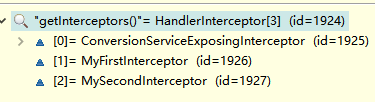 

```markdown
第一次：ConversionServiceExposingInterceptor  interceptorIndex=0；
第二次：MyFirstInterceptor                    interceptorIndex=1
第三次；MySecondInterceptor          执行afterCompletion()
已经放行了的拦截器的afterCompletion总会执行
```

从记录的索引开始倒叙执行afterCompletion方法：

```java
 for (int i = this.interceptorIndex; i >= 0; i--) {
            HandlerInterceptor interceptor = getInterceptors()[i];
            try {
                interceptor.afterCompletion(request, response, this.handler, ex);
            }
            catch (Throwable ex2) {
                logger.error("HandlerInterceptor.afterCompletion threw exception", ex2);
            }
	}
```


## 13. 国际化

### 13.1 步骤

1. 写好国际化资源文件

   ```properties
   username=UserName
   password=PassWord
   login=Login
   ```

   ```properties
   username=用户名
   password=密码
   login=登录
   ```

   

2. 让Spring的ResourceBundleMessageSource管理国际化资源文件

   ```xml
   <bean id="messageSource" class="org.springframework.context.support.ResourceBundleMessageSource">
           <property name="basename" value="loginpage/login"></property>
       </bean>
   ```

3. 直接去页面取值

   ```jsp
   <%@ page contentType="text/html;charset=UTF-8" language="java" %>
   <%@ taglib prefix="fmt" uri="http://java.sun.com/jsp/jstl/fmt" %>
   <html>
   <head>
       <title>Title</title>
   </head>
   <body>
   <form>
       <fmt:message key="username"/>：<input type="text"><br>
       <fmt:message key="password"/>：<input type="password"><br>
       <input type="submit" value="<fmt:message key="login"/>">
   </form>
   </body>
   </html>
   ```

   

4. 现象：是按照浏览器带来语言信息决定


### 13.2 自定义LocaleResolver

实现LocaleResolver接口

```java
public class MyLocalResolver implements LocaleResolver {
    public Locale resolveLocale(HttpServletRequest request) {
        System.out.println("自己的区域解析器");
        Locale l = null;

        String locale = request.getParameter("locale");
        System.out.println("自己区域解析器接受的locale:"+locale);
        if (locale != null && !"".equals(locale)) {
            l = new Locale(locale.split("_")[0], locale.split("_")[1]);
        } else {
            l = request.getLocale();
        }
        System.out.println("Locale:"+l.toString());
        return l;
    }

    public void setLocale(HttpServletRequest request, HttpServletResponse response, Locale locale) {
        throw new UnsupportedOperationException("Can't set Locale message");
    }
}


```

注册到ioc.xml中

```xml
<bean id="localeResolver" class="com.chenhui.component.MyLocalResolver"></bean>
```

jsp页面修改为

```jsp
<%@ page contentType="text/html;charset=UTF-8" language="java" %>
<%@ taglib prefix="fmt" uri="http://java.sun.com/jsp/jstl/fmt" %>
<html>
<head>
    <title>Title</title>
</head>
<body>
<form>
    <fmt:message key="username"/>：<input type="text"><br>
    <fmt:message key="password"/>：<input type="password"><br>
    <input type="submit" value="<fmt:message key="login"/>">
</form>
<a href="tologinpage?locale=zh_CN">中文</a>
<a href="tologinpage?locale=en_US">英文</a>
</body>
</html>
```

效果

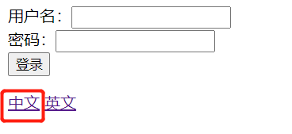

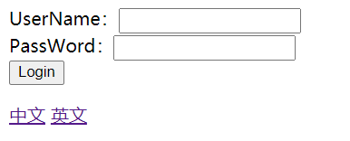

### 13.3 FixedLocaleResolver：

使用系统默认的区域信息

```java
@Override
    public Locale resolveLocale(HttpServletRequest request) {
        Locale locale = getDefaultLocale();
        if (locale == null) {
            locale = Locale.getDefault();
        }
        return locale;
    }

    @Override
    public LocaleContext resolveLocaleContext(HttpServletRequest request) {
        return new TimeZoneAwareLocaleContext() {
            @Override
            public Locale getLocale() {
                return getDefaultLocale();
            }
            @Override
            public TimeZone getTimeZone() {
                return getDefaultTimeZone();
            }
        };
    }

    @Override
    public void setLocaleContext(HttpServletRequest request, HttpServletResponse response, LocaleContext localeContext) {
        throw new UnsupportedOperationException("Cannot change fixed locale - use a different locale resolution strategy");
    }
```

### 13.4 SessionLocaleResolver：

区域信息是从session中获取，可以根据请求参数创建一个locale对象，把他放在session中。

```java
@Override
    public Locale resolveLocale(HttpServletRequest request) {
        Locale locale = (Locale) WebUtils.getSessionAttribute(request, LOCALE_SESSION_ATTRIBUTE_NAME);
        if (locale == null) {
            locale = determineDefaultLocale(request);
        }
        return locale;
    }
```

### 13.5 CookieLocaleResolver

区域信息是从cookie中获取

```java
@Override
    public Locale resolveLocale(HttpServletRequest request) {
        parseLocaleCookieIfNecessary(request);
        return (Locale) request.getAttribute(LOCALE_REQUEST_ATTRIBUTE_NAME);
    }
```


## 14. 异常处理

### 14.1 异常源码

```java
processDispatchResult(processedRequest, response, mappedHandler, 
    mv, dispatchException);
```

加了MVC异常处理，默认就是这个几个HandlerExceptionResolver

 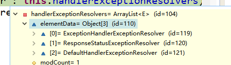 

- ExceptionHandlerExceptionResolver
- ResponseStatusExceptionResolver
- DefaultHandlerExceptionResolver

如果异常解析器都不能处理就直接抛出去；

```java
private void processDispatchResult(HttpServletRequest request, HttpServletResponse response,
            HandlerExecutionChain mappedHandler, ModelAndView mv, Exception exception) throws Exception {

        boolean errorView = false;

    	//如果有异常
        if (exception != null) {
            if (exception instanceof ModelAndViewDefiningException) {
                logger.debug("ModelAndViewDefiningException encountered", exception);
                mv = ((ModelAndViewDefiningException) exception).getModelAndView();
            }
            else {
                
                //处理异常
                Object handler = (mappedHandler != null ? mappedHandler.getHandler() : null);
                
                //===================================
                mv = processHandlerException(request, response, handler, exception);
                
                
                errorView = (mv != null);
            }
        }

        // Did the handler return a view to render?
        if (mv != null && !mv.wasCleared()) {
               //来到页面
            render(mv, request, response);
            if (errorView) {
                WebUtils.clearErrorRequestAttributes(request);
            }
        }
        else {
            if (logger.isDebugEnabled()) {
                logger.debug("Null ModelAndView returned to DispatcherServlet with name '" + getServletName() +
                        "': assuming HandlerAdapter completed request handling");
            }
        }

        if (WebAsyncUtils.getAsyncManager(request).isConcurrentHandlingStarted()) {
            
            // Concurrent handling started during a forward
            return;
        }

        if (mappedHandler != null) {
            mappedHandler.triggerAfterCompletion(request, response, null);
        }
    }
```

所有异常解析器尝试解析，解析完成进行后续，解析失败下一个解析器继续解析

```java
protected ModelAndView processHandlerException(HttpServletRequest request, HttpServletResponse response,
            Object handler, Exception ex) throws Exception {

        // Check registered HandlerExceptionResolvers...
        ModelAndView exMv = null;
        for (HandlerExceptionResolver handlerExceptionResolver : this.handlerExceptionResolvers) {
            exMv = handlerExceptionResolver.resolveException(request, response, handler, ex);
            if (exMv != null) {
                break;
            }
        }
        if (exMv != null) {
            if (exMv.isEmpty()) {
                return null;
            }
            
            // We might still need view name translation for a plain error model...
            if (!exMv.hasView()) {
                exMv.setViewName(getDefaultViewName(request));
            }
            if (logger.isDebugEnabled()) {
                logger.debug("Handler execution resulted in exception - forwarding to resolved error view: " + exMv, ex);
            }
            WebUtils.exposeErrorRequestAttributes(request, ex, getServletName());
            return exMv;
        }

        throw ex;
    }

```

### 14.2 ExceptionHandler

#### 局部异常处理

```java
@Controller
public class ExceptionTestController {
    @RequestMapping("/testException")
    public String exceptionTest(Integer integer){
        System.out.println("testException");
        System.out.println(10/integer);
        return "exception";
    }

    @ExceptionHandler(value = {ArithmeticException.class})
    public String handleException01(){
        System.out.println("handleException-Arithmetic");
        return "myError";
    }
}
```

Jsp页面：

```jsp
<%@ page contentType="text/html;charset=UTF-8" language="java" %>
<html>
<head>
    <title>Title</title>
</head>
<body>
<h1>运算出错</h1>
</body>
</html>
```

若要携带异常信息, 可以返回ModelAndView

**注意：**

- **异常信息不能给参数位置写Model**
- **同个作用域，有多个Exception异常处理器，精确优先**

```java
@ExceptionHandler(value = {ArithmeticException.class})
    public ModelAndView handleException01(Exception exception){
        System.out.println("handleException-Arithmetic");
        System.out.println("exception:"+exception);
        ModelAndView myError = new ModelAndView("myError");
        myError.addObject("ex",exception);
        return myError;
    }
```

####  全局异常处理

异常处理控制器可以放在@ControllerAdvice下，作用域是全局

```java
@ControllerAdvice
public class MyExceptionController {
    @ExceptionHandler(value = {ArithmeticException.class})
    public ModelAndView handleException01(Exception exception){
        System.out.println("handleException-Arithmetic");
        System.out.println("exception:"+exception);
        ModelAndView myError = new ModelAndView("myError");
        myError.addObject("ex",exception);
        return myError;
    }
}
```

**全局与本类都有匹配的异常处理器，本类的优先运行**

### 14.3 @ResponseStatus

编写一个异常类

```java
package com.chenhui.component;

import org.springframework.http.HttpStatus;
import org.springframework.web.bind.annotation.ResponseStatus;

@ResponseStatus(reason = "拒绝登录", value = HttpStatus.NOT_ACCEPTABLE)
public class UsernameNotFoundException extends RuntimeException {
    static final long serialVersionUID = 1L;
}

```

测试：

```java
    @RequestMapping("/testException2")
    public String exceptionTest2(String username){
        System.out.println("testException");
        if (!"admin".equals(username)){
            System.out.println("登录失败");
            //+++++抛出自己的错误信息
            throw new UsernameNotFoundException();
            
        }
        System.out.println("登陆成功");
        return "success";
    }
```

结果：

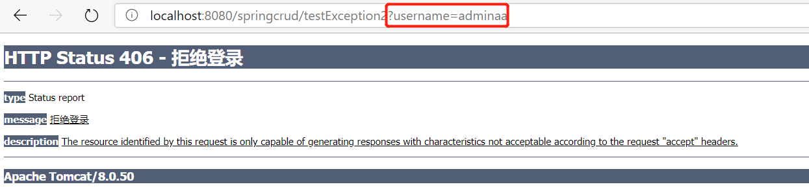

### 14.4  DefaultHandlerExceptionResolver

**DefaultHandlerExceptionResolver**:

判断是否是SpringMVC自带的异常或Spring自己的异常：

如：HttpRequestMethodNotSupportedException。如果没人处理则它自己处理

  

默认的异常有

```java
try {
            if (ex instanceof NoSuchRequestHandlingMethodException) {
                return handleNoSuchRequestHandlingMethod((NoSuchRequestHandlingMethodException) ex, request, response,
                        handler);
            }
            else if (ex instanceof HttpRequestMethodNotSupportedException) {
                return handleHttpRequestMethodNotSupported((HttpRequestMethodNotSupportedException) ex, request,
                        response, handler);
            }
            else if (ex instanceof HttpMediaTypeNotSupportedException) {
                return handleHttpMediaTypeNotSupported((HttpMediaTypeNotSupportedException) ex, request, response,
                        handler);
            }
            else if (ex instanceof HttpMediaTypeNotAcceptableException) {
                return handleHttpMediaTypeNotAcceptable((HttpMediaTypeNotAcceptableException) ex, request, response,
                        handler);
            }
            else if (ex instanceof MissingServletRequestParameterException) {
                return handleMissingServletRequestParameter((MissingServletRequestParameterException) ex, request,
                        response, handler);
            }
            else if (ex instanceof ServletRequestBindingException) {
                return handleServletRequestBindingException((ServletRequestBindingException) ex, request, response,
                        handler);
            }
            else if (ex instanceof ConversionNotSupportedException) {
                return handleConversionNotSupported((ConversionNotSupportedException) ex, request, response, handler);
            }
            else if (ex instanceof TypeMismatchException) {
                return handleTypeMismatch((TypeMismatchException) ex, request, response, handler);
            }
            else if (ex instanceof HttpMessageNotReadableException) {
                return handleHttpMessageNotReadable((HttpMessageNotReadableException) ex, request, response, handler);
            }
            else if (ex instanceof HttpMessageNotWritableException) {
                return handleHttpMessageNotWritable((HttpMessageNotWritableException) ex, request, response, handler);
            }
            else if (ex instanceof MethodArgumentNotValidException) {
                return handleMethodArgumentNotValidException((MethodArgumentNotValidException) ex, request, response, handler);
            }
            else if (ex instanceof MissingServletRequestPartException) {
                return handleMissingServletRequestPartException((MissingServletRequestPartException) ex, request, response, handler);
            }
            else if (ex instanceof BindException) {
                return handleBindException((BindException) ex, request, response, handler);
            }
            else if (ex instanceof NoHandlerFoundException) {
                return handleNoHandlerFoundException((NoHandlerFoundException) ex, request, response, handler);
            }
        }
        catch (Exception handlerException) {
            logger.warn("Handling of [" + ex.getClass().getName() + "] resulted in Exception", handlerException);
        }
        return null;
    }
```

### 14.5 SimpleMappingExceptionResolver：

通过配置的方式进行异常处理

  

```xml

<bean class="org.springframework.web.servlet.handler.SimpleMappingExceptionResolver">
        <!-- exceptionMappings：配置哪些异常去哪些页面 -->
        <property name="exceptionMappings">
            <props>
                <!-- key：异常全类名；value：要去的页面视图名；会走视图解析 -->
                <prop key="java.lang.NullPointerException">myerror</prop>
            </props>
        </property>
        <!--指定错误信息取出时使用的key  -->
        <property name="exceptionAttribute" value="ex"></property>
    </bean>
```

## 15. SpringMVC总结

```markdown
SpringMVC运行流程：

1、所有请求，前端控制器（DispatcherServlet）收到请求，调用doDispatch进行处理
2、根据HandlerMapping中保存的请求映射信息找到，处理当前请求的，处理器执行链（包含拦截器）
3、根据当前处理器找到他的HandlerAdapter（适配器）
4、拦截器的preHandle先执行
5、适配器执行目标方法，并返回ModelAndView
          1）、ModelAttribute注解标注的方法提前运行
          2）、执行目标方法的时候（确定目标方法用的参数）
                    1）、有注解
                    2）、没注解：
                             1）、 看是否Model、Map以及其他的
                              2）、如果是自定义类型
                                             1）、从隐含模型中看有没有，如果有就从隐含模型中拿
                                              2）、如果没有，再看是否SessionAttributes标注的属性，如果是从Session中拿，如果拿不到会抛异常
                                             3）、都不是，就利用反射创建对象
6、拦截器的postHandle执行
7、处理结果；（页面渲染流程）
             1）、如果有异常使用异常解析器处理异常；处理完后还会返回ModelAndView
              2）、调用render进行页面渲染
                         1）、视图解析器根据视图名得到视图对象
                         2）、视图对象调用render方法；
               3）、执行拦截器的afterCompletion；
```

  

## 16. SpringMVC与Spring整合

### 16.1 分容目的

1. SpringMVC和Spring整合的目的：分工明确

   1. SpringMVC的配置文件就来配置和网站转发逻辑以及网站功能有关的

      （视图解析器，文件上传解析器，支持ajax，xxx）

   2. Spring的配置文件来配置和业务有关的（事务控制，数据源，xxx）


### **16.2 SpringMVC和Spring分容器**

#### Spring管理业务逻辑组件

```xml
    <context:component-scan base-package="com.atguigu">
        <context:exclude-filter type="annotation" expression="org.springframework.stereotype.Controller"/>
        <context:exclude-filter type="annotation" expression="org.springframework.web.bind.annotation.ControllerAdvice"/>
    </context:component-scan>
```

#### SpringMVC管理控制器组件

```xml
    <context:component-scan base-package="com.atguigu" use-default-filters="false">
        <context:include-filter type="annotation" expression="org.springframework.stereotype.Controller"/>
        <context:include-filter type="annotation" expression="org.springframework.web.bind.annotation.ControllerAdvice"/>
    </context:component-scan>

```

Spring是一个父容器

SpringMVC是一个子容器

- **子容器还可以引用父容器的组件**
- **父容器不能引用子容器的组件**

  